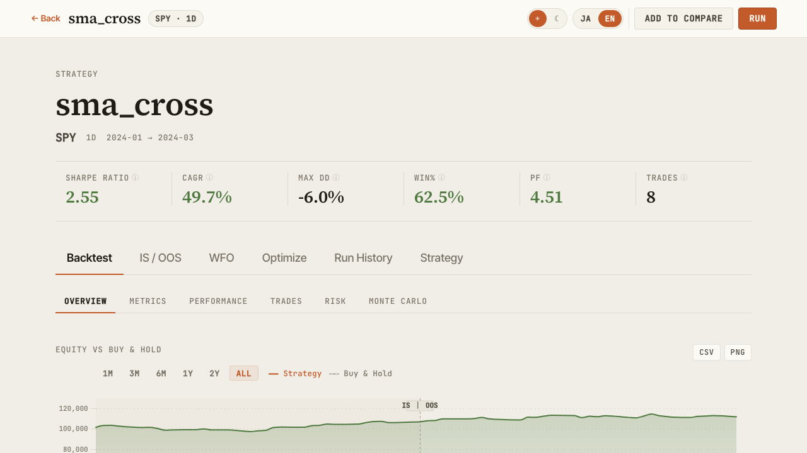
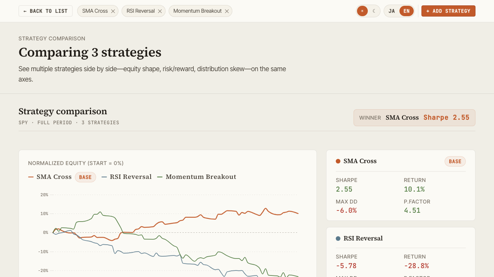
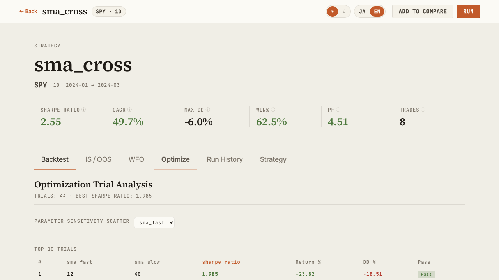
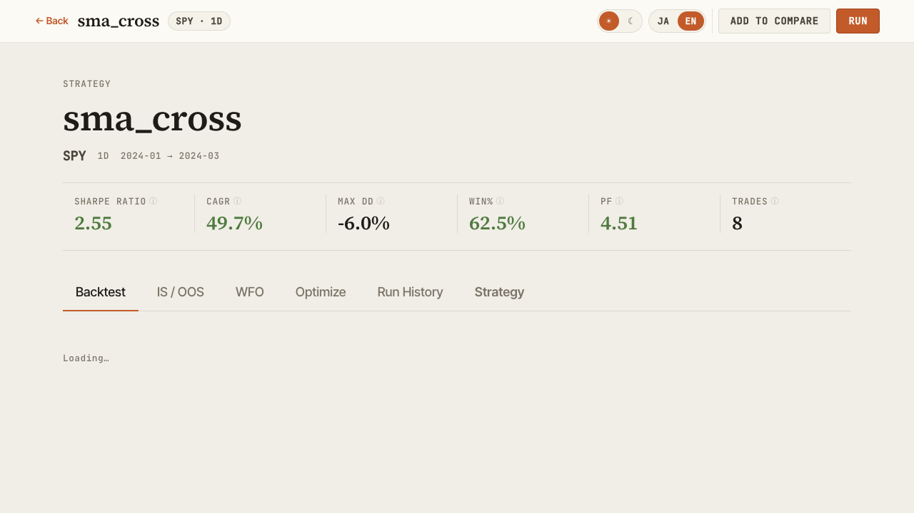
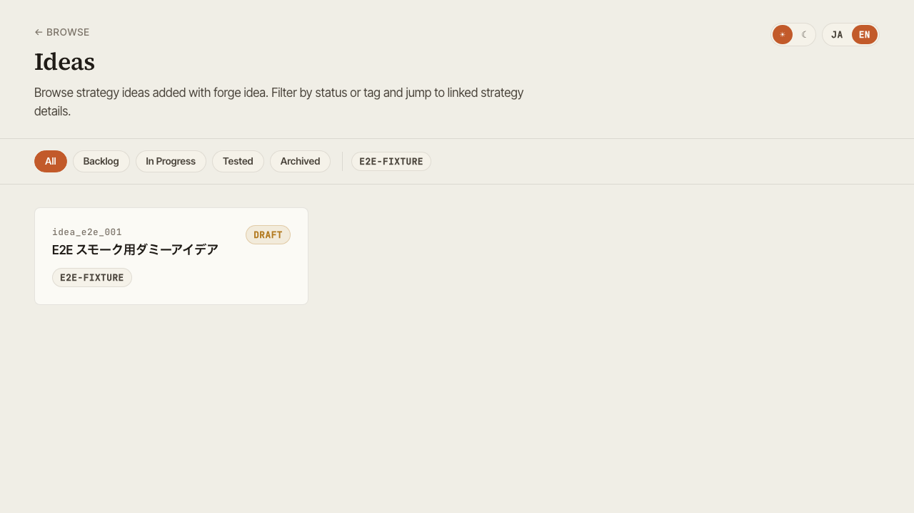

# Features

Walkthrough of each dashboard screen served by `vis serve`.

## Browse

Strategy library with search. Includes the Symbol Atlas grouped by asset class, Saved Views (preset filters), and a groupable Strategy Ledger.

{ loading=lazy }

Key actions:

- Filter by symbol / timeframe / Sharpe tier
- Save your favorite filter combinations as Saved Views
- Open the global command palette with `Cmd+K` / `Ctrl+K`
- Click a row to expand the slide panel, or jump to Detail

`selectedId` and `compareIds` are synchronized to URL query parameters, so a particular selection state can be shared via URL.

## Detail

Multi-faceted view of a single strategy's backtest.

{ loading=lazy }

Tabs:

| Tab | Contents |
|---|---|
| **Backtest** | Equity / Drawdown / Underwater / trade list / benchmark metrics (alpha, beta, IR, correlation) / annual returns |
| **IS / OOS** | In-Sample vs Out-of-Sample metric comparison |
| **WFO** | Walk-Forward composite equity and per-window results |
| **Optimize** | Grid optimization heatmaps and parameter-vs-metric scatter plots |
| **Run History** | List of past backtest runs |
| **Strategy** | Indicators, entry/exit rules, and risk management as structured tree |

## Compare

Side-by-side view of multiple strategies.

{ loading=lazy }

- Parallel metric cards (CAGR / Sharpe / Sortino / MaxDD / Profit Factor, etc.)
- Overlaid equity curves
- Pearson correlation heatmap (normalized to overlapping period)

## Optimize

Visualize optimization results.

{ loading=lazy }

- Parameter-space heatmap for grid search
- Walk-Forward Test composite equity curve
- Per-window performance trajectory

## Strategy structure

Visualize the structure of a strategy JSON.

{ loading=lazy }

- Indicators and their parameters
- Entry / exit conditions
- Risk management (stop logic, position sizing)
- Target symbols and timeframe

## Ideas

Browse exploration ideas and their state.

{ loading=lazy }

- Filter by status (pending / exploring / promoted / archived, etc.)
- Filter by tag
- Linked strategies tie ideas to their implementations

## Cross-cutting features

### Global search (Cmd+K)

`Cmd+K` (macOS) / `Ctrl+K` (Windows / Linux) opens a command palette from any screen, letting you jump by strategy name or screen name.

### Theme toggle

Top-right toggle switches between dark and light. Preference is stored in browser localStorage.

### Language toggle

Switch UI between Japanese and English — useful for screenshots or sharing with international teammates.

### Export

- **CSV** — download trade history / metric tables from any panel
- **PNG** — save charts as static images
- **URL share** — Browse / Compare selection state is synced to query string, so copying the URL shares the view
