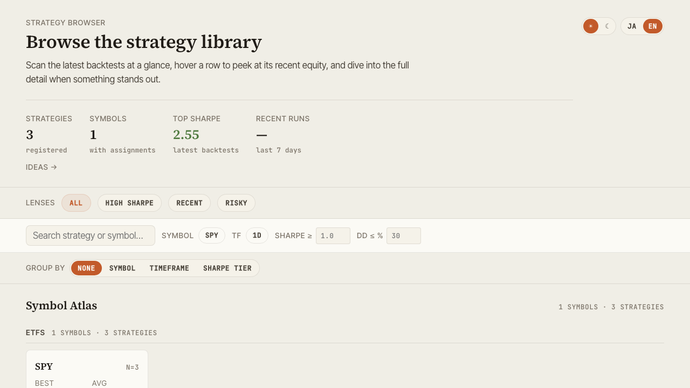

# alpha-visualizer

**alpha-visualizer** is the **OSS package that visualizes AlphaForge backtest results in your web browser** — outputs from `alpha-forge backtest run` and friends. It reads `backtest_results.db` (SQLite) and strategy JSON files directly, so it works on hosts without `alpha-forge` installed.

!!! tip "How it connects to AlphaForge"
    Run `alpha-forge backtest run <SYMBOL> --strategy <id>` and the CLI ends with "📊 You can review the chart with `alpha-vis serve`". That message is the entry point to alpha-visualizer, which renders the same result as **Equity / Drawdown / trades / metric comparisons in a browser**. AlphaForge itself is commercial, but the result-visualization layer is open source. See [Getting Started → Next steps: Visualize](../getting-started.md#next-steps-visualize) and the [End-to-End Strategy Workflow](../guides/end-to-end-workflow.md) for the first integration steps.

{ loading=lazy }

## What you can do

- Browse, search, and multi-select your strategy library
- Inspect equity / drawdown / trade history with benchmark metrics (alpha, beta, IR, correlation)
- Compare strategies side-by-side, including a Pearson correlation heatmap
- Visualize Walk-Forward composite equity and Grid optimization results
- Reconcile live trading against backtest with period-aligned diff
- Track exploration ideas with status and tag filters
- Toggle dark/light theme and Japanese/English UI
- Export CSV / PNG, share state via URL

## Documentation map

| Page | Contents |
|---|---|
| [Installation](installation.md) | uv / pip / from source — three installation paths |
| [Features](features.md) | Browse / Detail / Compare / Optimize / Live / Ideas walkthroughs |
| [Configuration](configuration.md) | CLI options, `forge.yaml`, data path resolution |
| [FAQ & Troubleshooting](faq.md) | Common issues and fixes |

## License & repository

- **License**: MIT
- **GitHub**: <https://github.com/alforge-labs/alpha-visualizer>
- **PyPI**: <https://pypi.org/project/alpha-visualizer/>
- **Code of Conduct**: [Contributor Covenant v2.1](https://github.com/alforge-labs/alpha-visualizer/blob/main/CODE_OF_CONDUCT.en.md)

`alpha-forge` itself is commercial, but `alpha-visualizer` is developed independently as open source.
