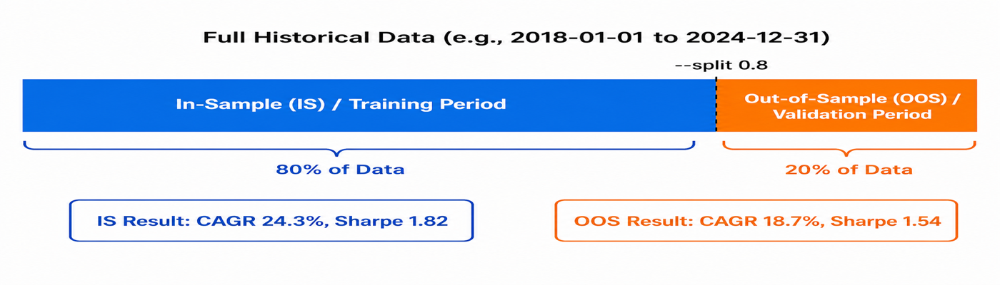
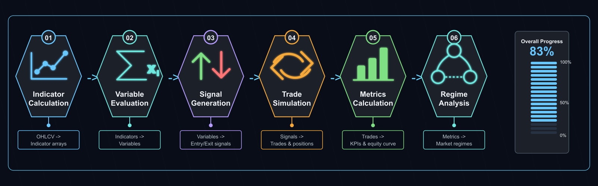

# alpha-forge backtest

Run backtests and analyze results. Provides single-strategy runs, parallel batch runs, automated diagnostics, listing/reporting/migrating saved results, multi-strategy comparison, portfolio backtests, dashboard chart navigation, Monte Carlo simulation, and signal count checks.

!!! info "About sample output"
    Sample outputs in this page are based on the formats read from the `alpha-forge` source. Actual numbers depend on the data and environment.

## Subcommands

| Command | Description |
|---------|-------------|
| [`alpha-forge backtest run`](#alpha-forge-backtest-run) | Run a backtest for the given symbol and strategy |
| [`alpha-forge backtest batch`](#alpha-forge-backtest-batch) | Run parallel backtests for multiple strategy JSON files |
| [`alpha-forge backtest diagnose`](#alpha-forge-backtest-diagnose) | Automatically diagnose performance issues in a strategy |
| [`alpha-forge backtest list`](#alpha-forge-backtest-list) | Show saved backtest results |
| [`alpha-forge backtest report`](#alpha-forge-backtest-report) | Display a saved backtest result |
| [`alpha-forge backtest migrate`](#alpha-forge-backtest-migrate) | Import existing JSON report files into the database |
| [`alpha-forge backtest compare`](#alpha-forge-backtest-compare) | Compare multiple strategies side by side on the same symbol and period |
| [`alpha-forge backtest portfolio`](#alpha-forge-backtest-portfolio) | Run a portfolio backtest across multiple symbols |
| [`alpha-forge backtest chart`](#alpha-forge-backtest-chart) | Display dashboard URL to navigate to charts |
| [`alpha-forge backtest signal-count`](#alpha-forge-backtest-signal-count) | Fast signal count check without running the full backtest |
| [`alpha-forge backtest monte-carlo`](#alpha-forge-backtest-monte-carlo) | Run a Monte Carlo simulation from an existing backtest result |

---

## alpha-forge backtest run

Run a backtest. Specify either `--strategy` or `--strategy-file`.

### Synopsis

```bash
alpha-forge backtest run <SYMBOL> (--strategy <ID> | --strategy-file <PATH>) [OPTIONS]
```

### Arguments and options

| Name | Kind | Default | Description |
|------|------|---------|-------------|
| `SYMBOL` | argument (required) | - | Symbol (e.g. SPY, AAPL, CL=F) |
| `--strategy` | option | - | Strategy ID (mutually exclusive with `--strategy-file`) |
| `--strategy-file` | option | - | Path to a strategy JSON file (no DB registration required) |
| `--json` | flag | false | Output results as JSON to stdout |
| `--start` | option | - | Start date `YYYY-MM-DD` |
| `--end` | option | - | End date `YYYY-MM-DD` |
| `--split` | flag | false | Split into in-sample / out-of-sample periods ([details](#is-oos-split)) |
| `--benchmark` | option | config | Benchmark symbol (per-`asset_type` defaults apply, see below) |
| `--no-benchmark` | flag | false | Disable benchmark comparison entirely (F-304). Useful for FX / commodities where a SPY comparison is meaningless |
| `--check-criteria` | flag | false | Run acceptance criteria check |
| `--cagr-min` | float | `20.0` | Minimum CAGR (%), used with `--check-criteria` |
| `--sharpe-min` | float | `1.0` | Minimum Sharpe ratio |
| `--max-dd` | float | `25.0` | Max drawdown limit (%); also used for `pre_filter_pass` |
| `--win-rate-min` | float | `55.0` | Minimum win rate (%) |
| `--pf-min` | float | `1.3` | Minimum profit factor |
| `--min-trades` | int | - | Minimum trade count; exits with code 1 if below |
| `--regime` | flag | false | Display per-regime statistics on the console |

### Benchmark selection logic (F-304) {#benchmark-selection}

Resolution order when `--benchmark` is omitted:

1. Explicit `--benchmark <SYM>` (highest priority)
2. `forge.yaml` `report.benchmark_symbol`, if set to anything other than the default `SPY`
3. Per-`asset_type` map on the strategy JSON (used when (2) is still default `SPY`)

| `asset_type` | Default benchmark |
|--------------|------------------|
| `stock` / `etf` | `SPY` |
| `fx` | `DX-Y.NYB` (Dollar Index) |
| `crypto` | `BTC-USD` |
| `commodity` / `future` | `DBC` (commodity ETF) |
| Other / unset | `SPY` (fallback) |

To disable benchmark comparison entirely, pass `--no-benchmark`. This is the right choice when alpha / beta / correlation against SPY is meaningless (e.g. FX or commodities strategies).

### IS / OOS Split (`--split`)  {#is-oos-split}

When `--split` is specified, the full data range is divided into an In-Sample (IS / training) period and an Out-of-Sample (OOS / validation) period. The IS performance is then independently validated on the OOS period, making it the recommended approach for evaluating strategy generalization.



### Progress bar (Rich UI)

While running in a TTY, a Rich-powered progress bar is shown on stderr. The backtest progresses through 6 phases below; with `--split`, both IS and OOS flows run, totaling 12 steps.

| Phase | Description |
|---|---|
| `指標計算` (Indicators) | Pre-compute technical indicators |
| `変数評価` (Variables) | Evaluate intermediate boolean variables |
| `シグナル生成` (Signals) | Evaluate entry/exit conditions and apply risk masks |
| `シミュレーション` (Simulate) | Run the vectorbt portfolio simulation |
| `メトリクス算出` (Metrics) | Compute Sharpe / MDD / win rate, etc. |
| `レジーム分析` (Regime) | Compute per-regime metrics (no-op when not configured) |



The progress bar is rendered on **stderr**, so combining it with `--json` keeps stdout as pure JSON (when `--json` is passed and stderr is a TTY, the dashboard is still drawn on stderr). When stderr is not a TTY (CI, pipes, redirected files), the progress bar is automatically suppressed. This way, `--json` invocations from agent loops like `/explore-strategies` show progress in interactive terminals without polluting CI logs.

### Sample output (text)

```text
Running backtest: SPY x sma_crossover_v1
✅ Backtest complete  Signal quality score: 0.78/1.0
Total Return: +52.30%  CAGR: 5.40%
SR: 0.92  Sortino: 1.15  Calmar: 0.32
MDD: -16.80%  Duration: 187d  Recovery: 92d
PF: 1.74  Win%: 50.0%  avg_win: 4.20%  avg_loss: -2.40%
Trades: 14  Avg hold: 28.5d(28bar)  Max: 65.0d(65bar)  Win streak: 4  Loss streak: 3
Win rate CI(90%): 35.2% - 64.8%
```

When the score or trade count fails the recommended thresholds, a warning and a one-line docs link are added (F-302):

```text
⚠️  Backtest complete  Signal quality score: 0.43/1.0 (0.4–0.7: caution, more validation suggested)
    → Docs: https://alforgelabs.com/en/cli-reference/backtest.html#signal-quality-score
⚠️  Warning: trade count is insufficient (trades=27, minimum 30 recommended)
    → Fewer than 30 trades is statistically noisy and may be filtered out by
      optimization / WFT pre_filter. Consider widening the data period (`--start`
      to go further back).
    → Docs: https://alforgelabs.com/en/cli-reference/backtest.html#signal-quality-score
```

### Signal Quality Score and Minimum Trades (F-302) {#signal-quality-score}

#### Signal Quality Score (`signal_quality_score`, 0.0–1.0)

```python
sample_size_score   = min(total_trades / 30, 1.0) * 0.4   # 40%
win_rate_score      = min(win_rate_pct / 100, 1.0) * 0.3  # 30%
profit_factor_score = min(profit_factor / 2.0, 1.0) * 0.3 # 30%
signal_quality_score = sample_size_score + win_rate_score + profit_factor_score
```

| Score range | Interpretation | CLI hint |
|-------------|----------------|----------|
| `≥ 0.70` | Reliable | "≥0.7 is reliable" |
| `0.40 – 0.69` | Caution. Further validation (WFT / cross-symbol) recommended | "0.4–0.7: caution, more validation suggested" |
| `< 0.40` | Low reliability, treat as reference only | "<0.4: low reliability, treat as reference only" |

#### Why a minimum of 30 trades

- Rough threshold for statistical significance: **n ≥ 30** (where the Central Limit Theorem starts to apply)
- Below that, the `total_trades < 30` flag is raised and the `sample_size_score` term is linearly penalized
- If `total_trades < 10`, the result is also marked as "statistically meaningless" with `is_valid=false`

#### What happens if not met

- `alpha-forge optimize run --goal <name>` / `alpha-forge optimize walk-forward --goal <name>` will fail the `pre_filter.min_trades` check (default 30), set `pre_filter_pass=false`, and exclude the strategy from the `/explore-strategies` shortlist
- A single backtest run is not aborted, but the result is low-confidence — extend the data window (`--start` further into the past) or rework the indicator mix toward higher signal frequency

### Sample output (`--json`)

```json
{
  "total_return_pct": 52.30,
  "cagr_pct": 5.40,
  "sharpe_ratio": 0.92,
  "max_drawdown_pct": -16.80,
  "win_rate_pct": 50.0,
  "profit_factor": 1.74,
  "total_trades": 14,
  "pre_filter_pass": false,
  "pre_filter": { "sharpe_min": 1.0, "max_dd_max": 25.0 },
  "warnings": []
}
```

### Common errors

| Message | Cause | Fix |
|---------|-------|-----|
| `Specify either --strategy or --strategy-file` | Neither given | Provide one of them |
| `--strategy and --strategy-file are mutually exclusive` | Both given | Use only one |
| `Error: Invalid start date format (YYYY-MM-DD)` | Date format invalid | Use `2024-01-15` style |
| `⚠️  {interval} data not found. Falling back to 1d data.` | Strategy `timeframe` data missing | Run `alpha-forge data fetch` for the interval |

---

## alpha-forge backtest batch

Run parallel backtests for many strategy JSON files. Strategies passing the filter (Sharpe / MaxDD) are marked as "passed".

### Synopsis

```bash
alpha-forge backtest batch <SYMBOL> (--strategy-file <FILE> ... | --strategy-dir <DIR>) [OPTIONS]
```

### Arguments and options

| Name | Kind | Default | Description |
|------|------|---------|-------------|
| `SYMBOL` | argument (required) | - | Symbol |
| `--strategy-file` | repeatable | - | Path to a strategy JSON file |
| `--strategy-dir` | option | - | Directory containing strategy JSON files |
| `--pattern` | option | `*.json` | Glob pattern for `--strategy-dir` |
| `--workers` | int | `3` | Number of parallel workers |
| `--sharpe-min` | float | `1.0` | Sharpe lower bound for `pre_filter_pass` |
| `--max-dd` | float | `25.0` | MaxDD upper bound for `pre_filter_pass` |
| `--json` | flag | false | Output results as a JSON array to stdout |

### Sample output

```text
Starting batch backtest: SPY × 5 strategies (workers=3)
  ✅ spy_sma_v1: Sharpe=1.32  MaxDD=-12.4%  CAGR=8.2%  trades=18
  ❌ spy_rsi_v1: Sharpe=0.61  MaxDD=-22.1%  CAGR=4.1%  trades=24
  ✅ spy_macd_v1: Sharpe=1.18  MaxDD=-15.6%  CAGR=7.0%  trades=15
  🔴 spy_broken_v1: ERROR - failed to load strategy JSON

Passed strategies: 2/4
  ✅ spy_sma_v1: Sharpe=1.32  MaxDD=-12.4%
  ✅ spy_macd_v1: Sharpe=1.18  MaxDD=-15.6%
```

### Common errors

| Message | Cause | Fix |
|---------|-------|-----|
| `Specify either --strategy-file or --strategy-dir` | Neither given | Provide one of them |
| `🔴 <id>: ERROR - <reason>` | Per-strategy load/run failure | Address the message |

---

## alpha-forge backtest diagnose

Automatically diagnose performance issues in a strategy (overfitting, low trade count, extreme win/loss balance, etc.).

### Synopsis

```bash
alpha-forge backtest diagnose <SYMBOL> --strategy <ID> [OPTIONS]
```

### Arguments and options

| Name | Kind | Default | Description |
|------|------|---------|-------------|
| `SYMBOL` | argument (required) | - | Symbol |
| `--strategy` | required | - | Strategy ID |
| `--start` | option | - | Start date `YYYY-MM-DD` |
| `--end` | option | - | End date `YYYY-MM-DD` |
| `--split` | flag | true | Split into in-sample / out-of-sample (default ON) |
| `--json` | flag | false | Output as JSON |

### Output

The diagnostic result lists the inferred problems and recommended actions. See `alpha-forge backtest diagnose --help` and the internal `StrategyDiagnostics` logic for details.

---

## alpha-forge backtest list

Show saved backtest results from the DB.

### Synopsis

```bash
alpha-forge backtest list [OPTIONS]
```

### Options

| Name | Kind | Default | Description |
|------|------|---------|-------------|
| `--strategy` | option | - | Filter by strategy ID |
| `--symbol` | option | - | Filter by symbol |
| `--sort` | option | `run_at` | Sort key (`sharpe_ratio` / `total_return_pct` / `cagr_pct` / `max_drawdown_pct` / `win_rate_pct` / `profit_factor` / `run_at`) |
| `--limit` | int | `20` | Number of rows to display |
| `--best` | flag | false | Show only the best record per group |
| `--by` | choice | `strategy` | Group key for `--best` (`strategy` / `symbol`) |

### Sample output

```text
Backtest Results (5 records)
run_id                               strategy_id                   symbol         Return  Sharpe      MDD  Trades
──────────────────────────────────────────────────────────────────────────────────────────────────────────────
spy_sma_v1_20260415_103021           spy_sma_v1                    SPY            +52.3%    0.92   -16.8%      14
spy_macd_v1_20260414_181522          spy_macd_v1                   SPY            +38.1%    1.18   -15.6%      12
...
```

### Common messages

| Message | Cause |
|---------|-------|
| `No saved backtest results found.` | DB empty |

---

## alpha-forge backtest report

Display a saved backtest result in detail.

### Synopsis

```bash
alpha-forge backtest report <RESULT_ID> [OPTIONS]
```

### Arguments and options

| Name | Kind | Default | Description |
|------|------|---------|-------------|
| `RESULT_ID` | argument (required) | - | DB mode: `strategy_id` or `run_id`. File mode: `result_id` |
| `--json` | flag | false | Output the full JSON |
| `--symbol` | option | - | DB mode: filter by symbol |

If `RESULT_ID` does not match a `run_id`, the latest run for that `strategy_id` is used.

### Sample output

```text
=== spy_sma_v1 / SPY (2026-04-15T10:30:21) ===
Total Return: 52.30%  CAGR: 5.40%
SR: 0.92  Sortino: 1.15  Calmar: 0.32
MDD: -16.80%  PF: 1.74  Win%: 50.0%
Trades: 14  Avg hold: 28.5d(28bar)  Max: 65.0d(65bar)
Trade log: 14 records (use --json to view all)
```

### Common errors

| Message | Cause | Fix |
|---------|-------|-----|
| `Error: Result not found - <id>` | Neither `run_id` nor `strategy_id` matches | Verify with `alpha-forge backtest list` |

---

## alpha-forge backtest migrate

Import existing `*_report.json` files into the DB.

### Synopsis

```bash
alpha-forge backtest migrate [--dry-run] [--force]
```

### Options

| Name | Kind | Default | Description |
|------|------|---------|-------------|
| `--dry-run` | flag | false | Preview without writing to the DB |
| `--force` | flag | false | Overwrite on `run_id` conflict |

`run_id` values are generated as `migrated_<file_stem>`.

### Sample output

```text
  ✅ migrated_spy_sma_v1
  ♻️  migrated_spy_macd_v1 (overwritten)
  Skipping (duplicate): migrated_spy_rsi_v1

Done: 2 imported, 1 skipped
```

### Common messages

| Message | Cause |
|---------|-------|
| `Report directory does not exist.` | `config.report.output_path` not created |
| `No JSON files found to import.` | No `*_report.json` files |

---

## alpha-forge backtest compare

Compare multiple strategies on the same symbol and period.

### Synopsis

```bash
alpha-forge backtest compare <STRATEGY1> [STRATEGY2 ...] --symbol <SYM> [--symbol <SYM> ...] [OPTIONS]
```

### Arguments and options

| Name | Kind | Default | Description |
|------|------|---------|-------------|
| `STRATEGIES` | arguments (required, repeatable) | - | Strategies to compare (space-separated) |
| `--symbol` / `-s` | repeatable (required) | - | Symbols to compare |
| `--start` | option | - | Start date `YYYY-MM-DD` |
| `--end` | option | - | End date `YYYY-MM-DD` |
| `--benchmark` | option | config | Benchmark symbol |
| `--json` | flag | false | Output as JSON |

### Sample output (text table)

```text
=== Strategy Comparison: SPY (2020-01-01 to present) (3 strategies) ===

Strategy        Return    CAGR  Sharpe     MDD   Win%      PF  Trades
spy_sma_v1     +52.3%   5.40    0.92  -16.8%   50%   1.74      14
spy_macd_v1    +38.1%   4.20    1.18  -15.6%   58%   1.92      12
spy_rsi_v1     +12.4%   1.50    0.45  -22.1%   42%   1.08      24
```

### Common errors

| Message | Cause | Fix |
|---------|-------|-----|
| `Error: Data for <SYM> not found.` | Data missing | `alpha-forge data fetch <SYM>` |
| `Warning: Failed to load strategy '<id>'` | Invalid strategy ID / JSON | `alpha-forge strategy list`, `alpha-forge strategy validate` |

---

## alpha-forge backtest portfolio

Run a portfolio backtest across multiple symbols.

### Synopsis

```bash
alpha-forge backtest portfolio <SYM1> [SYM2 ...] --strategy <ID> [OPTIONS]
```

### Arguments and options

| Name | Kind | Default | Description |
|------|------|---------|-------------|
| `SYMBOLS` | arguments (required, repeatable) | - | Space-separated list of symbols |
| `--strategy` | required | - | Strategy ID |
| `--allocation` | choice | `equal` | Allocation method (`equal` / `risk_parity` / `custom`) |
| `--weights` | option | - | Custom weights `AAPL=0.4,MSFT=0.6` (used with `--allocation custom`) |
| `--json` | flag | false | Output as JSON |
| `--save` | flag | false | Save results to a file |

### Sample output

```text
Running portfolio backtest: ['AAPL', 'MSFT', 'GOOGL'] (equal allocation)

=== Portfolio Results: tech_basket_v1 (equal) ===
Symbols: AAPL, MSFT, GOOGL
Weights: AAPL=33.3%, MSFT=33.3%, GOOGL=33.3%
Total Return: 78.40%  CAGR: 12.30%
SR: 1.45  Sortino: 1.85  Calmar: 0.62
MDD: -19.80%  CVaR(95%): -3.20%
Diversification ratio: 1.085

Symbol     Weight    Return     SR      MDD
──────────────────────────────────────────────────
AAPL          33.3%   +85.2%   1.52  -22.1%
MSFT          33.3%   +72.0%   1.41  -18.4%
GOOGL         33.3%   +78.0%   1.38  -19.5%
```

### Common errors

| Message | Cause | Fix |
|---------|-------|-----|
| `Error: Invalid --weights format.` | Format violation | Use `AAPL=0.4,MSFT=0.6` style |
| `Error: Data for <SYM> not found.` | Data missing | `alpha-forge data fetch` |
| `Error: Backtest failed - <reason>` | Engine exception | Address the message |

---

## alpha-forge backtest chart

Show the dashboard chart URL and optionally open it.

### Synopsis

```bash
alpha-forge backtest chart [RESULT_ID] [--open] [--compare <ID> ...]
```

### Arguments and options

| Name | Kind | Default | Description |
|------|------|---------|-------------|
| `RESULT_ID` | argument (optional) | - | `run_id` or `strategy_id` |
| `--open` | flag | false | Open the URL in a browser |
| `--compare` | repeatable | - | Strategy to compare. Use `strategy_id:run_id` to target a specific run |

### Sample output

```text
📊 To view charts, start `vis serve` (alpha-visualizer):
   http://localhost:8000/?run_id=spy_sma_v1_20260415_103021
```

When comparing strategies:

```text
📊 To view charts, start `vis serve` (alpha-visualizer):
   http://localhost:8000/?ids=sma_crossover,rsi_reversion
```

The command itself only prints a URL. To view charts, start `vis serve` ([alpha-visualizer](https://github.com/ysakae/alpha-visualizer)).

---

## alpha-forge backtest signal-count

Skip vectorbt and just count entry-condition signal occurrences. Useful for sanity-checking condition expressions.

### Synopsis

```bash
alpha-forge backtest signal-count <SYMBOL> --strategy <ID> [--period 5y] [--json]
```

### Arguments and options

| Name | Kind | Default | Description |
|------|------|---------|-------------|
| `SYMBOL` | argument (required) | - | Symbol |
| `--strategy` | required | - | Strategy ID |
| `--period` | option | `5y` | Data period (e.g. `5y`, `1y`, `6m`, `30d`) |
| `--json` | flag | false | Output as JSON |

### Sample output

```text
Signal count check: spy_sma_v1 × SPY (5y)
Total bars: 1258 days

Entry conditions (long AND):
  sma_fast > sma_slow              :   687 days ( 54.6%)
  ──────────────────────────────────
  All conditions AND               :   687 days ( 54.6%)

Signal days per regime:
  state=0    :   312 days ( 24.8%)
  state=1    :   375 days ( 29.8%)
```

If 0 signals, `⚠️  No signals generated` is printed.

!!! note "Strategies that reference external symbols"
    For strategies that reference external symbols (e.g. `^VIX`, `USDJPY=X`), `signal-count` now applies the same `merge_external_symbols()` step used by `alpha-forge backtest run` / `alpha-forge optimize run` before counting signals. The bug (#266) where `entry_signal_days` would always be `0` for external-symbol strategies has been fixed.

### Common errors

| Message | Cause | Fix |
|---------|-------|-----|
| `Invalid period format: <value>` | Bad `--period` | Use `5y`, `6m`, `30d` style |
| `Error: No data for <SYM> (period: <p>).` | Data missing | `alpha-forge data fetch <SYM>` |

---

## alpha-forge backtest monte-carlo

Resample trade history from a saved backtest result and run a Monte Carlo simulation to evaluate ruin probability and worst-case scenarios.

### Synopsis

```bash
alpha-forge backtest monte-carlo <RESULT_ID> [--simulations 1000] [--json]
```

### Arguments and options

| Name | Kind | Default | Description |
|------|------|---------|-------------|
| `RESULT_ID` | argument (required) | - | `run_id` or `strategy_id` |
| `--simulations` | int | `1000` | Number of simulation runs |
| `--json` | flag | false | Output as JSON |

### Sample output

```text
Running Monte Carlo simulation: spy_sma_v1_20260415_103021 (1000 runs)
✅ Simulation complete
Initial capital: 10000
Mean final equity: 14820
Median final equity: 14250
Worst final equity: 7340
Best final equity: 23150
Mean max MDD: 18.40%
95% max MDD:  31.20%
Ruin probability: 0.40%
```

### Common errors

| Message | Cause | Fix |
|---------|-------|-----|
| `Error: Result not found - <id>` | Not in DB | Check `alpha-forge backtest list` |
| `Error: No valid trade history found (minimum 10 trades required).` | Trade count < 10 | Use a longer period or a different strategy |
| `Error: Simulation failed - <reason>` | Exception during simulation | Address the message |

---

## Common behavior

- **DB / file mode**: `list`, `report`, `migrate`, `monte-carlo` use `config.report.output_path / config.report.db_filename` (SQLite) as the primary store.
- **`FORGE_CONFIG`**: The strategy / data / results locations are determined by the `forge.yaml` referenced by the `FORGE_CONFIG` environment variable.
- **Exit codes**: `0` on success, `1` when `--min-trades` is below threshold, `click.UsageError` for argument errors, fatal errors print to stderr and exit.
- **Trial plan limit**: On the Trial plan, the maximum input data date is capped at `2023-12-31`. See [Trial Limits](../guides/trial-limits.md) for details.

---

<!-- Synced from: Click decorators in `alpha-forge/src/alpha_forge/commands/backtest.py`. This page must be kept in sync when CLI arguments change. -->
