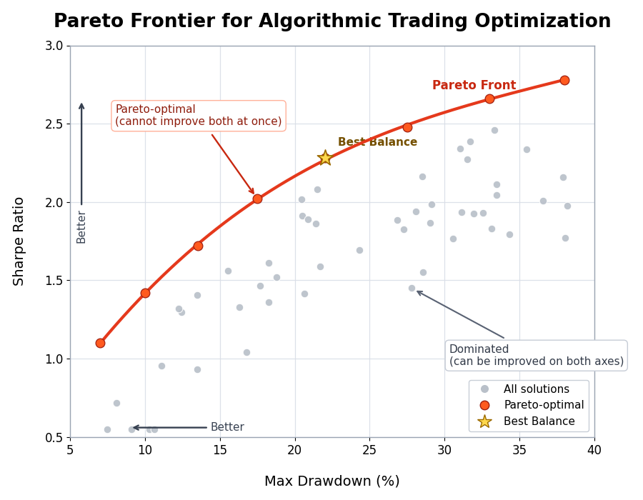
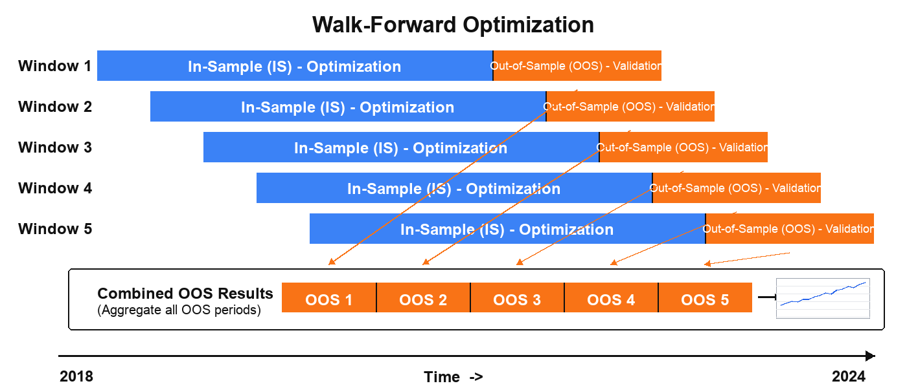

# alpha-forge optimize

Parameter search and sensitivity analysis: Bayesian optimization (Optuna), grid search, walk-forward optimization, and more.

!!! info "About sample output"
    Sample outputs in this page are based on the formats read from the `alpha-forge` source. Actual numbers depend on the data and environment.

## Subcommands

| Command | Description |
|---------|-------------|
| [`alpha-forge optimize run`](#alpha-forge-optimize-run) | Run parameter optimization using Optuna |
| [`alpha-forge optimize cross-symbol`](#alpha-forge-optimize-cross-symbol) | Run cross-symbol optimization across multiple symbols |
| [`alpha-forge optimize portfolio`](#alpha-forge-optimize-portfolio) | Search for optimal portfolio allocation weights using Optuna |
| [`alpha-forge optimize multi-portfolio`](#alpha-forge-optimize-multi-portfolio) | Optimize allocation weights with Optuna using per-asset strategies |
| [`alpha-forge optimize walk-forward`](#alpha-forge-optimize-walk-forward) | Run walk-forward optimization |
| [`alpha-forge optimize apply`](#alpha-forge-optimize-apply) | Apply optimization results to a strategy and save |
| [`alpha-forge optimize sensitivity`](#alpha-forge-optimize-sensitivity) | Run sensitivity analysis on optimized parameters |
| [`alpha-forge optimize history`](#alpha-forge-optimize-history) | List past optimization results in scoreboard format |
| [`alpha-forge optimize grid`](#alpha-forge-optimize-grid) | Cartesian Grid Search over `optimizer_config.param_ranges` |

---

## alpha-forge optimize run

Single-symbol Bayesian optimization with Optuna (TPE). Specifying two or more `--objective` flags enables multi-objective optimization (NSGAII).

### Synopsis

```bash
alpha-forge optimize run <SYMBOL> --strategy <ID> [OPTIONS]
```

### Arguments and options

| Name | Kind | Default | Description |
|------|------|---------|-------------|
| `SYMBOL` | argument (required) | - | Symbol |
| `--strategy` | required | - | Strategy name |
| `--metric` | option | `sharpe_ratio` | Metric to optimize |
| `--json` | flag | false | Output results as JSON |
| `--save` | flag | false | Save results to a file |
| `--min-trades` | int | - | Override minimum trades constraint (priority over `optimizer_config` / config) |
| `--trials` | int | - | Override the number of Optuna trials |
| `--apply` | flag | false | Save best parameters under a new strategy ID `<strategy_id>_optimized` (**the original strategy is left unchanged**) |
| `--yes` / `-y` | flag | false | Skip the overwrite confirmation when `<strategy_id>_optimized` already exists |
| `--start` | option | - | Optimization period start date `YYYY-MM-DD` |
| `--end` | option | - | Optimization period end date `YYYY-MM-DD` |
| `--max-drawdown` | float | - | Max drawdown constraint (%); over-threshold trials are penalized |
| `--objective` | repeatable | - | Multi-objective goal (e.g. `sharpe_ratio_maximize`, `max_drawdown_pct_minimize`) |

`--max-drawdown` and `--objective` cannot be used together.

### Real-time dashboard

A live dashboard is shown in your terminal during optimization. Single-objective runs (`--metric` only) display a Current/BEST scoreboard, while multi-objective runs (two or more `--objective` flags) show a dedicated Pareto-front dashboard that updates after every trial.

- **Multi-objective display**: header (strategy, symbol, objective directions), progress bar, Current Trial (current value of each objective), and a Pareto Front table with the top 10 solutions plus the total count (`Top 10 / Total = N`).
- `--json` suppresses the dashboard and outputs JSON only.



### Sample output (text)

```text
✅ Optimization complete
Best score (sharpe_ratio): 1.32
Best parameters: {'fast_period': 12, 'slow_period': 50}
DB saved: run_id=opt_20260415_103021
✅ Optimization results saved: data/results/optimize_my_v1_20260415_103021.json
```

With `--apply` (no prompt when `my_v1_optimized` does not yet exist):

```text
✅ Best parameters saved as 'my_v1_optimized' (original 'my_v1' unchanged)
```

If `my_v1_optimized` already exists, an overwrite confirmation appears:

```text
⚠️  'my_v1_optimized' already exists. Overwrite? [y/N]: y
✅ Best parameters saved as 'my_v1_optimized' (original 'my_v1' unchanged)
```

### Sample output (`--json`)

```json
{
  "best_metric": 1.32,
  "best_params": { "fast_period": 12, "slow_period": 50 }
}
```

### Common errors

| Message | Cause | Fix |
|---------|-------|-----|
| `Invalid --start format (YYYY-MM-DD)` | Date format invalid | Use `2024-01-15` style |
| `No data available after --start <date>` | Insufficient data | Run `alpha-forge data fetch <SYM>` |
| `--max-drawdown and --objective cannot be used together.` | Both given | Choose one |
| `Cancelled.` | Declined overwrite confirmation for existing `<strategy_id>_optimized` | Add `--yes` or re-confirm |

---

## alpha-forge optimize cross-symbol

Optimize the same strategy across multiple symbols and find robust parameters via aggregation (mean / median / min).

### Synopsis

```bash
alpha-forge optimize cross-symbol <SYM1> [SYM2 ...] --strategy <ID> [OPTIONS]
```

### Arguments and options

| Name | Kind | Default | Description |
|------|------|---------|-------------|
| `SYMBOLS` | arguments (required, repeatable) | - | Space-separated list of symbols |
| `--strategy` | required | - | Strategy name |
| `--metric` | option | `sharpe_ratio` | Metric to optimize |
| `--aggregation` | option | `mean` | Score aggregation method (`mean` / `median` / `min`) |
| `--json` | flag | false | Output results as JSON |
| `--save` | flag | false | Save results to a file |

### Sample output

```text
Running cross-symbol optimization: SPY, QQQ, IWM x sma_v1 (target=sharpe_ratio, agg=mean)
✅ Cross-symbol optimization complete
Aggregate score (mean of sharpe_ratio): 1.20
Best parameters: {'fast_period': 15, 'slow_period': 60}
Per-symbol scores:
  - SPY: 1.32
  - QQQ: 1.18
  - IWM: 1.10
```

### Common errors

| Message | Cause | Fix |
|---------|-------|-----|
| `Warning: Failed to load data for <SYM>` | Data missing | `alpha-forge data fetch <SYM>` |
| `Error: No symbols with valid data` | Data missing for all | Fetch data, then retry |

---

## alpha-forge optimize portfolio

Optimize the **allocation weights** for a single strategy applied to multiple symbols, using Optuna.

### Synopsis

```bash
alpha-forge optimize portfolio <SYM1> [SYM2 ...] --strategy <ID> [OPTIONS]
```

### Arguments and options

| Name | Kind | Default | Description |
|------|------|---------|-------------|
| `SYMBOLS` | arguments (required, repeatable) | - | Space-separated list of symbols |
| `--strategy` | required | - | Strategy name |
| `--metric` | option | `sharpe_ratio` | Metric to optimize |
| `--json` | flag | false | Output results as JSON |
| `--save` | flag | false | Save results to a file |

### Sample output

```text
Running portfolio weight optimization: AAPL, MSFT, GOOGL x tech_basket_v1 (target=sharpe_ratio)
✅ Weight optimization complete
Best score (sharpe_ratio): 1.45
Optimal weights:
  - AAPL: 38.0%
  - MSFT: 42.0%
  - GOOGL: 20.0%
```

### Sample output (`--json`)

```json
{
  "best_weights": { "AAPL": 0.38, "MSFT": 0.42, "GOOGL": 0.20 },
  "best_metric": 1.45,
  "portfolio_metrics": { "cagr_pct": 14.2, "sharpe_ratio": 1.45, "max_drawdown_pct": -18.0 }
}
```

---

## alpha-forge optimize multi-portfolio

Assign a **distinct strategy** to each symbol and optimize the allocation weights with Optuna.

### Synopsis

```bash
alpha-forge optimize multi-portfolio <SYMBOL:STRATEGY> [<SYMBOL:STRATEGY> ...] [OPTIONS]
```

### Arguments and options

| Name | Kind | Default | Description |
|------|------|---------|-------------|
| `SYMBOL_STRATEGY_PAIRS` | arguments (required, repeatable) | - | Pairs in `SYMBOL:STRATEGY_NAME` format |
| `--metric` | option | `cagr_pct` | Metric to optimize |
| `--trials` | int | `200` | Number of Optuna trials |
| `--save` | flag | false | Save results to a JSON file |
| `--json` | flag | false | Output results as JSON |

### Sample output

```text
Running multi-portfolio weight optimization: GC=F, NVDA (target=cagr_pct, trials=200)
✅ Multi-portfolio optimization complete
Best score (cagr_pct): 18.5234
Optimal weights:
  - GC=F: 55.0%
  - NVDA: 45.0%
Portfolio metrics:
  CAGR:         18.52%
  Sharpe:       1.38
  Max Drawdown: -22.10%
```

### Common errors

| Message | Cause | Fix |
|---------|-------|-----|
| `Invalid argument format: '<pair>'` | `SYMBOL:STRATEGY_NAME` format violation | Use colon-separated pairs like `GC=F:gc_optimized` |
| `No valid symbol-strategy pairs found.` | All pair loads failed | Check data and strategy IDs |

---

## alpha-forge optimize walk-forward

Split the time series into `--windows` consecutive windows and repeat in-sample optimization → out-of-sample evaluation in each window to measure overfitting resistance.



### Synopsis

```bash
alpha-forge optimize walk-forward <SYMBOL> --strategy <ID> [OPTIONS]
```

### Arguments and options

| Name | Kind | Default | Description |
|------|------|---------|-------------|
| `SYMBOL` | argument (required) | - | Symbol |
| `--strategy` | required | - | Strategy name |
| `--metric` | option | `sharpe_ratio` | Metric to optimize |
| `--windows` | int | `5` | Number of windows |
| `--min-window-trades` | int | - | Skip windows whose IS trade count is below N and exclude them from the mean. Useful for low-frequency strategies that would otherwise drop entire windows to `-∞` |
| `--json` | flag | false | Output results as JSON |

### Early warning for IS trade insufficiency and the `[WARNING]` mark

If every in-sample window evaluates `in_sample_metric` to `-∞`, AlphaForge prints an early warning to stderr indicating that signal coverage is insufficient. In addition, when the number of valid IS windows falls below half of the total, the summary row is annotated with a `[WARNING]` mark to flag low confidence in the results.

Pass `--min-window-trades N` to skip windows whose IS trade count is below N and exclude them from the mean.

### Live progress dashboard (Rich)

While `alpha-forge optimize walk-forward` runs, AlphaForge displays a dedicated two-tier progress dashboard.

- **Outer bar**: overall window progress (`<completed_windows>/<n_windows>`).
- **Inner bar**: the current window's in-sample Optuna trial progress.

As each window completes, its IS / OOS scores and OOS trade count are appended to the Scoreboard table, and the best window (highest OOS) is highlighted in green. Windows with zero OOS trades or NaN/±inf OOS scores are rendered as red `FAILED` rows and added to the `Failures` counter.

```text
╭─ AlphaForge Walk-Forward ─────────────────────────────────────────╮
│ Strategy: sma_v1  Symbol: SPY  Metric: sharpe_ratio (↑)            │
│ Windows: 5  In-sample: 70%                                         │
╰────────────────────────────────────────────────────────────────────╯
Windows       ████████████████░░░░░░░░░░  3/5  60%  0:01:24 < 0:00:55
  └ #4 IS trial ████████████░░░░░░░░░░░░ 12/30  40%  0:00:18 < 0:00:32
╭─ Windows ─────────────────────────────────────────────────────────╮
│ Win  OOS start   IS         OOS         Trades                     │
│   1  2024-04-01  1.4231     0.8912      41                         │
│   2  2024-07-01  1.2104     1.0307✓     37                         │
│   3  2024-10-01  0.9834     -0.1521     28                         │
╰────────────────────────────────────────────────────────────────────╯
Mean OOS: 0.5899   Best window: #2 (1.0307)   Failures: 0
```

All progress bars and dashboards are rendered on **stderr**. Even with `--json`, the dashboard is shown when stderr is a TTY, while stdout stays as pure JSON. When stderr is not a TTY (CI, pipes, redirected files), the dashboard is automatically suppressed — useful when you want CI logs to stay quiet.

### Sample output

```text
Running walk-forward optimization: SPY x sma_v1 (5 windows)
✅ Walk-forward complete
Window     IS Score  OOS Score  Best Params
-----------------------------------------------------------------
1            1.4523     1.1024  {'fast': 10, 'slow': 50}
2            1.6210     0.8932  {'fast': 12, 'slow': 55}
⚠️  Window 3 skipped: OOS trade count is 0 (statistically invalid)
4            1.3120     1.0521  {'fast': 14, 'slow': 60}
5            1.5240     0.9810  {'fast': 11, 'slow': 50}
Average OOS sharpe_ratio: 0.987 (4/5 valid windows)
```

When all windows are invalid:

```text
⚠️  No valid windows found (5 total). Adjust the data range or number of windows.
```

### Additional fields in `--json` output

In addition to per-window fields, the `--json` output includes summary fields describing IS validity.

| Field | Type | Description |
|-------|------|-------------|
| `is_total_trades` | int (per-window) | IS-period trade count |
| `is_valid_windows` | int | Number of valid IS windows |
| `all_is_invalid` | bool | `true` when every IS window evaluated to `-∞` (insufficient signals) |
| `skip_reason` | string \| null (per-window) | Reason for skipping (see below) |

`skip_reason` lets exploration agents distinguish why a window was invalidated.

| Value | Meaning |
|-------|---------|
| `null` | Valid window |
| `"is_trades_insufficient"` | IS trade count below `--min-window-trades` (frequency issue) |
| `"oos_metric_invalid"` | OOS metric was `±∞` or NaN (signal-quality issue) |
| `"oos_trades_zero"` | OOS-period trade count was 0 (no signal) |

---

## alpha-forge optimize apply

Read a result JSON saved by `alpha-forge optimize run` and apply `best_params` to the strategy, saving as **`<id>_optimized`**.

### Synopsis

```bash
alpha-forge optimize apply <RESULT_FILE> --to-strategy <ID> [--yes]
```

### Arguments and options

| Name | Kind | Default | Description |
|------|------|---------|-------------|
| `RESULT_FILE` | argument (required, file must exist) | - | Optimization result JSON |
| `--to-strategy` | required | - | Target strategy name |
| `--yes` / `-y` | flag | false | Skip confirmation prompt |

### Sample output

```text
Strategy: my_v1
Parameters to apply: {'fast_period': 12, 'slow_period': 50}
Apply these parameters to the strategy? [y/N]: y
✅ Optimization parameters applied: strategy_id=my_v1_optimized
Applied parameters: {'fast_period': 12, 'slow_period': 50}
```

The strategy ID gets an `_optimized` suffix and is saved as a new strategy. The original strategy is left untouched.

---

## alpha-forge optimize sensitivity

Sweep around an optimized parameter set and measure how much the metric changes with small perturbations. Useful for quantifying overfitting risk.

### Synopsis

```bash
alpha-forge optimize sensitivity <RESULT_FILE> [OPTIONS]
```

### Arguments and options

| Name | Kind | Default | Description |
|------|------|---------|-------------|
| `RESULT_FILE` | argument (required, file must exist) | - | Optimization result JSON |
| `--strategy` | option | from `result_file` | Strategy name |
| `--metric` | option | from `result_file` | Evaluation metric |
| `--steps` | int | `3` | Steps to test around best value |
| `--threshold` | float | `0.8` | Robustness threshold ratio |
| `--symbol` | option | from `result_file` | Symbol whose data is used |
| `--json` | flag | false | Output results as JSON |
| `--save` | flag | false | Save results to a file |

### Sample output

```text
Running sensitivity analysis: my_v1 x SPY (metric=sharpe_ratio, steps=±3)

=== Sensitivity Analysis: my_v1 ===
Best score (sharpe_ratio): 1.4523
Overall robustness score: 78.45%

Parameter                  Best Val  Robustness  Score range
----------------------------------------------------------------------
fast_period                      12       82.1%  1.20 1.32 1.42 1.45 1.40 1.31 1.18
slow_period                      50       75.3%  1.05 1.21 1.38 1.45 1.39 1.18 0.97
```

### Common errors

| Message | Cause | Fix |
|---------|-------|-----|
| `Error: --strategy is required` | Strategy name not in result file | Pass `--strategy <ID>` |
| `Error: --symbol is required` | Symbol not in result file | Pass `--symbol <SYM>` |

---

## alpha-forge optimize history

List previously saved `optimize_<strategy>_*.json` and `optimize_cross_<strategy>_*.json` files for a given strategy.

### Synopsis

```bash
alpha-forge optimize history --strategy <ID> [OPTIONS]
```

### Options

| Name | Kind | Default | Description |
|------|------|---------|-------------|
| `--strategy` | required | - | Strategy name |
| `--json` | flag | false | Output results as JSON |
| `--sort` | choice | `score` | Sort order (`score` / `date`) |

### Sample output

```text
=== Optimization History: my_v1 (3 records) ===

Timestamp         Symbol       Metric          Score   Key Parameters
────────────────────────────────────────────────────────────────────────────────
20260415_103021   SPY          sharpe_ratio    1.4523  fast_period=12, slow_period=50
20260410_181522   SPY          sharpe_ratio    1.3210  fast_period=14, slow_period=55
20260401_092030   SPY          sharpe_ratio    1.1850  fast_period=10, slow_period=45

Best: sharpe_ratio=1.4523  (20260415_103021)
      Parameters: {'fast_period': 12, 'slow_period': 50}
```

When no history files are found:

```text
No optimization history found: my_v1
  Search path: data/results/optimize_my_v1_*.json
```

---

## alpha-forge optimize grid

Run an exhaustive Cartesian Grid Search over all parameter combinations defined in `optimizer_config.param_ranges`. Skips Optuna sampling and evaluates the full grid, then displays / saves the Top-K rows.

### Synopsis

```bash
alpha-forge optimize grid <SYMBOL> --strategy <ID> [OPTIONS]
```

### Arguments and options

| Name | Kind | Default | Description |
|------|------|---------|-------------|
| `SYMBOL` | argument (required) | - | Symbol |
| `--strategy` | required | - | Strategy name |
| `--metric` | option | `sharpe_ratio` | Metric to sort by |
| `--top-k` | int | `20` | Top-K rows to show / save |
| `--chunk-size` | int | `100` | Chunk size for `ChunkedGridRunner` |
| `--max-memory-mb` | float | - | RSS monitoring threshold (MB) |
| `--max-trials` | int | `10000` | Confirm prompt threshold for grid size |
| `--save` | flag | false | Save the result DataFrame |
| `--save-format` | choice | `csv` | Save format (`csv` / `parquet` / `json`) |
| `--apply` | flag | false | Save best parameters under a new strategy ID `<strategy_id>_optimized` (**the original strategy is left unchanged**) |
| `--yes` / `-y` | flag | false | Skip the overwrite confirmation when `<strategy_id>_optimized` already exists |
| `--start` | option | - | Period filter start date `YYYY-MM-DD` |
| `--end` | option | - | Period filter end date `YYYY-MM-DD` |
| `--min-trades` | int | `optimizer_config.constraints.min_trades` (if defined) | Filter out trials below min trades. Auto-applied from strategy's `optimizer_config.constraints.min_trades` when omitted (CLI value takes priority if specified). Trials with `total_trades=0` are **always excluded** regardless of this flag |
| `--max-drawdown` | float | - | Filter out trials above MDD |
| `--json` | flag | false | Output Top-K as JSON |

!!! note "Zero-trade trials and `±inf` metrics"
    Trials that produce zero trades have no real-world value and are excluded by default, even when `--min-trades` is omitted. Cells that evaluate to `±inf` (e.g. Sharpe) are rendered as `—` in the Top-K table and are sorted as NaN to the end. This prevents `Sharpe=∞ / total_trades=0` parameters from being selected as Top-1.

### Live progress display (Rich dashboard)

While Grid Search is running, a real-time Rich dashboard is rendered to the console (the same UI pattern used by `alpha-forge backtest run` and `alpha-forge optimize run`):

- **Header**: strategy ID, symbol, metric, total trials, chunk size
- **Progress bar**: completed / total trials, elapsed time, estimated time remaining
- **Scoreboard**: the trial currently being processed (`Current`: params + score) and the running Best (`Best`: trial number + score + params). Best updates are highlighted with a `BEST ★` marker
- **Footer**: total number of failed trials (`Failures: N`)

The dashboard is rendered on **stderr**. With `--json`, the dashboard still appears when stderr is a TTY while stdout receives only the pure Top-K JSON (for CI/pipeline use). When stderr is not a TTY (CI, pipes, redirected files), the dashboard is automatically suppressed. When trials fail mid-run, the run continues; the Current row is repainted in red while the Failures counter advances.

```text
╭───────────────────────── AlphaForge Grid Search ─────────────────────────╮
│ Strategy: my_v1  Symbol: SPY  Metric: sharpe_ratio (↑)  Trials: 1500  Chunk: 100 │
╰──────────────────────────────────────────────────────────────────────────╯
Grid Search 実行中...  ━━━━━━━━━━━━━━━━━━━━━━━━━━━━━  234/1500 (15%)  0:00:42  0:04:33
╭───────────────────────────── Scoreboard ─────────────────────────────╮
│            Trial #   Score        Parameters                         │
│ Current        234   1.4537       fast_period=14  slow_period=55     │
│ BEST ★         198   1.6072       fast_period=12  slow_period=50     │
╰──────────────────────────────────────────────────────────────────────╯
Failures: 0
```

### Sample output (Top-K table after completion)

```text
Grid size: 1500 trials (chunk_size=100, max_memory_mb=None)
Grid size 12000 exceeds --max-trials 10000. Continue? [y/N]: y
... (Rich dashboard streaming) ...

=== Grid Search Top-20: my_v1 / SPY (metric=sharpe_ratio) ===
fast_period  slow_period   sharpe_ratio   max_drawdown_pct   n_trades
-----------------------------------------------------------------------
         12           50           1.45              -16.8         18
         14           55           1.41              -17.2         16
         ...
```

### Common errors

| Message | Cause | Fix |
|---------|-------|-----|
| `optimizer_config not defined` | Strategy JSON has no `optimizer_config` | Add `optimizer_config.param_ranges` |
| `param_ranges is empty` | `param_ranges` is an empty dict | Define at least one parameter range |
| `Metric '<name>' is not present in results` | Metric typo or unsupported metric | Use a supported metric like `sharpe_ratio` |
| `No trial satisfies the constraints` | All trials filtered out by `--min-trades` / `--max-drawdown` | Loosen constraints |

---

## Common behavior

- **Save location**: When `--save` is set, results are saved under `config.report.output_path` as `optimize_<strategy>_<timestamp>.json`. Cross-symbol results use `optimize_cross_*` and portfolio results use `optimize_portfolio_*` prefixes.
- **DB persistence**: `alpha-forge optimize run` always records to `SQLiteOptimizationResultRepository` regardless of `--save`, returning a `run_id`.
- **Journal integration**: When `config.journal.auto_record` is true, optimization runs are also recorded in the Journal.
- **`FORGE_CONFIG`**: The strategy / data / results locations are determined by the `forge.yaml` referenced by the `FORGE_CONFIG` environment variable.
- **Exit codes**: `0` on success, `1` for `click.ClickException`, `2` for `click.UsageError`, `1` for `click.Abort`.
- **Trial plan limit**: On the Trial plan, the maximum input data date is capped at `2023-12-31`, and the optimization trial count is capped at **50 trials** (`run` / `cross-symbol` / `portfolio` / `multi-portfolio` / `walk-forward` / `grid`; `apply` / `history` / `sensitivity` are unaffected). `grid` randomly samples 50 combinations using a fixed seed when the full Cartesian product exceeds 50. See [Trial Limits](../guides/trial-limits.md) for details.

---

<!-- Synced from: Click decorators in `alpha-forge/src/alpha_forge/commands/optimize.py`. This page must be kept in sync when CLI arguments change. -->
