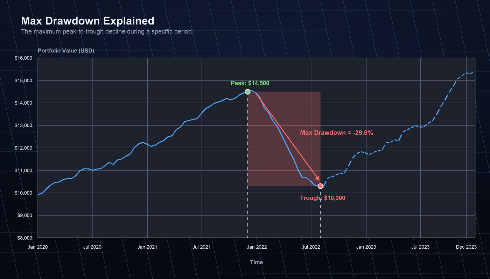
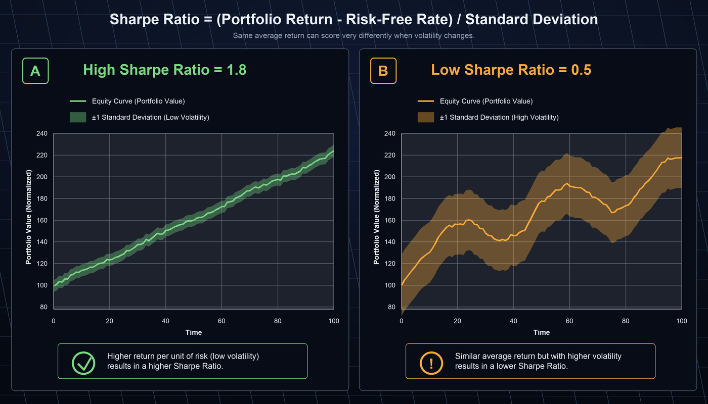
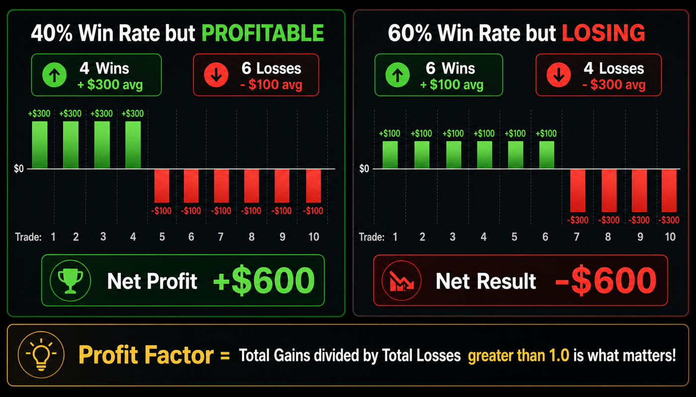

# Getting Started

A complete onboarding guide — from installing AlphaForge CLI to reading your first backtest.

- The **~13-minute Free-plan walkthrough** (Whop free registration + CLI hands-on) is at the top. No license purchase required.
- After that you'll find **detailed install instructions, Whop login, uninstall, and troubleshooting**.

---

## ~13-Minute First Backtest on the Free Plan

!!! info "What the Free plan covers"
    - Backtesting & optimization ✅ (data capped at **2023-12-31**)
    - Optimization trials: up to **50 per run**
    - Pine Script export ❌ (paid plan required)

    See [Freemium Limits](guides/freemium-limits.md) for full details.

### Step 1 — Create a Whop account (~3 min)

AlphaForge requires a Whop account for **every plan, including Free**. Register on Whop before installing the CLI.

1. Open [the AlphaForge Free plan on Whop](https://whop.com/alforge-labs/alphaforge-free/) in your browser.
2. Sign up with email (or your GitHub / Google account).
3. Subscribe to the **AlphaForge Free** plan — no payment information required.

!!! tip "Starting on a paid plan"
    Want to begin on a paid plan? Pick one from the [paid plans page](https://whop.com/alforge-labs/alphaforge/). You can also upgrade from Free later. See [Freemium Limits](guides/freemium-limits.md) for the per-plan feature matrix.

### Step 2 — Install (~2 min)

=== "macOS / Linux"

    ```bash
    curl -sSL https://alforge-labs.github.io/install.sh | bash
    ```

    After installation, **open a new terminal** before continuing.

=== "Windows"

    Run in PowerShell (no admin rights needed).

    ```powershell
    irm https://alforge-labs.github.io/install.ps1 | iex
    ```

    After installation, **open a new terminal** before continuing.

Verify the installation.

```bash
forge --version
```

```
AlphaForge CLI v1.x.x
```

If you see a version number, you're ready. For manual installation or custom install paths, see [Detailed Installation](#detailed-installation).

!!! note "Download the latest binary directly"
    Prefer a manual setup over the installer? Grab the per-platform binaries (`forge-macos-arm64` / `forge-linux-x64` / `forge-windows-x64.exe`, etc.) from [GitHub Releases (latest)](https://github.com/alforge-labs/alforge-labs.github.io/releases/latest). See "Detailed Installation → Manual Install" later on this page for placement and PATH details.

### Step 3 — Sign in with Whop (~1 min)

Use the Whop account you registered in Step 1. AlphaForge uses OAuth 2.0 PKCE authentication. The next command opens a browser automatically.

```bash
forge system auth login
```

After you complete the browser flow, credentials are cached at `$XDG_CONFIG_HOME/forge/credentials.json` (default `~/.config/forge/credentials.json`).

You can confirm the login state at any time:

```bash
forge system auth status
```

```
User ID         : user_abc123
Access token    : 2026-04-12 12:30 UTC (45 min remaining)
Last verified   : 2026-04-12 11:45 UTC (13 min ago)
Plan            : annual
```

!!! tip "Free plan works for the basics"
    Some features (e.g. Pine Script export) require a paid plan, but backtesting, optimization, and strategy management are available on Free.

### Step 4 — Prepare a strategy file (~2 min)

Create a `quickstart/` directory and save the sample strategy JSON.

```bash
mkdir quickstart && cd quickstart
```

Save the following as `sma_cross.json`.

```json
{
  "strategy_id": "sma_cross_qs",
  "name": "SMA Crossover Quickstart",
  "version": "1.0.0",
  "description": "SMA(10)/SMA(50) golden-cross strategy (quickstart sample)",
  "target_symbols": ["SPY"],
  "asset_type": "stock",
  "timeframe": "1d",
  "indicators": [
    { "id": "sma_fast", "type": "SMA", "params": { "length": 10 }, "source": "close" },
    { "id": "sma_slow", "type": "SMA", "params": { "length": 50 }, "source": "close" }
  ],
  "entry_conditions": {
    "long": {
      "logic": "AND",
      "conditions": [{ "left": "sma_fast", "op": ">", "right": "sma_slow" }]
    }
  },
  "exit_conditions": {
    "long": {
      "logic": "AND",
      "conditions": [{ "left": "sma_fast", "op": "<", "right": "sma_slow" }]
    }
  },
  "risk_management": {
    "position_size_pct": 10.0,
    "position_sizing_method": "fixed",
    "max_positions": 1,
    "leverage": 1.0
  }
}
```

### Step 5 — Run the backtest (~2 min)

Run a backtest within the Free plan's data range (up to 2023-12-31).

```bash
forge backtest run SPY \
  --strategy sma_cross_qs \
  --start 2019-01-01 \
  --end 2023-12-31
```

!!! note "Data is fetched automatically"
    On first run, `forge data fetch SPY --start 2019-01-01 --end 2023-12-31` runs automatically. This may take a few seconds.

### Step 6 — Read the results (~3 min)

When complete, you'll see output like this.

!!! warning "Sample output"
    Actual numbers vary depending on the data fetched.

```
==> SPY 2019-01-01 → 2023-12-31 (1d)
   trades: 9   win_rate: 55.6%   profit_factor: 1.82
   total_return: +38.4%   cagr: +6.7%   sharpe: 0.88
   max_drawdown: -14.2%   exposure: 41.5%
   final_equity: $13,840  (initial: $10,000)
```

A quick read of the key metrics is below. For the full metric list, see [Reading the Results in detail](#reading-the-results-detailed) or the [CLI Reference](cli-reference/index.md).

| Metric | This run | What it means |
|--------|----------|---------------|
| **CAGR** | +6.7% | Annualized return (compound). Compare against S&P 500 (~10% avg). |
| **Sharpe** | 0.88 | Risk-adjusted return. **1.0+** is the target. Getting close! |
| **Max Drawdown** | -14.2% | Worst peak-to-trough drop. Staying under 20% makes it easier to stick with a strategy. |
| **Win Rate** | 55.6% | Percentage of winning trades. 40–60% is normal for trend-following. |
| **Profit Factor** | 1.82 | Total profit ÷ total loss. **1.5+** is solid. |
| **Trades** | 9 | Total trades in the period. Aim for **30+** for statistical reliability. |

### What to do next

| Goal | Where to go |
|------|-------------|
| Pick the next page based on your role | [Use Cases by Goal](usecases/index.md) |
| Optimize parameters | [optimize command](cli-reference/optimize.md) |
| Validate against overfitting | [End-to-End Workflow](guides/end-to-end-workflow.md) |
| Try complex strategy templates | [Strategy Templates](templates.md) |
| Connect to TradingView | [Pine Script Integration Guide](guides/tradingview-pine-integration.md) |
| Understand Free plan limits | [Freemium Limits](guides/freemium-limits.md) |

---

## Detailed Installation

### Requirements

- macOS 12 (Monterey) or later / Ubuntu 22.04 or later / Windows 11
- Internet access (for Whop login and the first data fetch)
- **A Whop account** (required for Free and paid plans alike) — register via the [AlphaForge Free plan (free)](https://whop.com/alforge-labs/alphaforge-free/) or a [paid plan](https://whop.com/alforge-labs/alphaforge/) if you don't have one yet

### Install procedure

=== "macOS / Linux"

    Run the following command in your terminal. The installer extracts the latest binary bundle (`forge.dist`) into `~/.local/share/alpha-forge/` and symlinks the executable as `~/.local/bin/forge`.

    ```bash
    curl -sSL https://alforge-labs.github.io/install.sh | bash
    ```

    During install, you'll be asked `Install to /usr/local/bin? [y/N]`. Press Enter or `n` for the default (`~/.local/bin`), or `y` to install system-wide to `/usr/local/bin` (which will prompt for sudo).

    !!! tip "Non-interactive install (`INSTALL_DIR` env var)"

        For CI, Dockerfiles, or any environment where the interactive prompt can't be answered, set `INSTALL_DIR` to choose the symlink directory directly. The prompt is then skipped entirely.

        ```bash
        # Pin to ~/.local/bin without any prompt
        INSTALL_DIR=~/.local/bin bash <(curl -sSL https://alforge-labs.github.io/install.sh)

        # Custom directory (must be writable)
        INSTALL_DIR=/opt/forge/bin bash <(curl -sSL https://alforge-labs.github.io/install.sh)
        ```

        The `forge.dist` bundle is extracted under `<dirname of INSTALL_DIR>/share/alpha-forge/` (e.g. `INSTALL_DIR=/opt/forge/bin` → `/opt/forge/share/alpha-forge/`). Pass the same `INSTALL_DIR` to `uninstall.sh` when removing.

    !!! tip "Whop OAuth login"

        After install, log in to your Whop membership via browser-based OAuth:

        ```bash
        forge system auth login
        ```

=== "Windows"

    Run this in PowerShell. It installs the binary into `%USERPROFILE%\.forge\bin` and updates PATH automatically.

    ```powershell
    irm https://alforge-labs.github.io/install.ps1 | iex
    ```

    !!! tip "New terminal"
        Open a new terminal window after installation before continuing.

=== "Manual"

    1. Download the binary for your platform from [GitHub Releases](https://github.com/alforge-labs/alforge-labs.github.io/releases/latest).

    2. **macOS / Linux**: make it executable and move it to a directory on your PATH.

        ```bash
        chmod +x forge-macos-arm64
        sudo mv forge-macos-arm64 /usr/local/bin/forge
        ```

    3. **Windows**: place the binary in any folder and add that folder to PATH.

---

## Whop Login

AlphaForge uses OAuth 2.0 PKCE authentication with your Whop account. A one-time login is required for all plans.

!!! warning "No Whop account yet?"
    Make sure you've registered on Whop **before** running `forge system auth login` (required for Free and paid plans alike). Without an account the OAuth flow cannot complete. Register via the [AlphaForge Free plan (free)](https://whop.com/alforge-labs/alphaforge-free/) or a [paid plan](https://whop.com/alforge-labs/alphaforge/).

### 1. Check installation

Confirm that the binary is available.

```bash
forge --version
```

### 2. Sign in with Whop

The command launches the OAuth flow in your browser.

```bash
forge system auth login
```

Credentials are cached at `$XDG_CONFIG_HOME/forge/credentials.json` (default `~/.config/forge/credentials.json`). Internet access is required.

### 3. Verify the login state

You can inspect the cached user ID and token expiry:

```bash
forge system auth status
```

### 4. Verify commands

Confirm that backtest commands are available.

```bash
forge backtest --help
```

---

## Reading the Results (Detailed)

The six metrics you'll look at first. For the full metric list, see the [CLI Reference](cli-reference/index.md) and [Strategy Templates](templates.md).

| Metric | Meaning | Rule of thumb |
|--------|---------|---------------|
| **CAGR** | Compound annual growth rate | Compare against the market benchmark (S&P 500: ~10%). Positive but below market = limited edge. |
| **Sharpe Ratio** | Risk-adjusted return | ≥ 1.0 is "usable", ≥ 1.5 is good, ≥ 2.0 is top-tier. Negative is out. |
| **Max Drawdown** | Largest peak-to-trough equity drop | Shallower is better. Beyond −20% becomes psychologically hard to keep trading. |
| **Win Rate** | Share of profitable trades | ~50% is typical. Trend-following: 30–40%. Mean-reversion: 60–70%. |
| **Profit Factor** | Gross profit ÷ gross loss | ≥ 1.5 is good, ≥ 2.0 is excellent. < 1.0 means net loss. |
| **Total Trades** | Number of trades over the test period | Aim for 30+ for statistical significance. Too few suggests overfitting risk. |







!!! info "What to try next"
    - Parameter optimization: [`forge optimize run`](cli-reference/optimize.md) for Optuna Bayesian search
    - Walk-forward validation: [`forge optimize walk-forward`](cli-reference/optimize.md) to detect overfitting
    - Strategy templates: try [HMM × BB × RSI and others](templates.md)

---

## Uninstall

=== "macOS / Linux"

    Run the official uninstaller. It removes the `forge` symlink, the entire `forge.dist/` directory (~1,100 bundled library files), and the PATH line that was appended to your shell rc.

    ```bash
    bash <(curl -sSL https://alforge-labs.github.io/uninstall.sh)
    ```

    Your credentials (`~/.config/forge/credentials.json`) are **kept by default**. This is intentional: if you reinstall later, you can skip `forge system auth login` and the install will pick up your existing Whop OAuth session.

    !!! tip "Full wipe (delete credentials and EULA acceptance too)"

        ```bash
        bash <(curl -sSL https://alforge-labs.github.io/uninstall.sh) --purge
        ```

        `--purge` additionally removes `~/.config/forge/` (Whop OAuth token + EULA state) and the legacy `~/.forge/` path if it exists.

    !!! info "Preview before deleting"

        ```bash
        bash <(curl -sSL https://alforge-labs.github.io/uninstall.sh) --dry-run
        ```

        Shows exactly which paths would be removed without touching anything.

    !!! tip "Uninstall from a custom path (`INSTALL_DIR` env var)"

        If you installed via `INSTALL_DIR=...`, pass the same value to the uninstaller so it can locate the symlink:

        ```bash
        INSTALL_DIR=/opt/forge/bin bash <(curl -sSL https://alforge-labs.github.io/uninstall.sh)
        ```

        Without it, both `~/.local/bin` and `/usr/local/bin` are auto-discovered.

    **What is NOT removed:**

    - Your **project working directories** created by `forge system init` (`forge.yaml`, `data/`, etc.) — these are your data
    - Shared parent directories like `~/.local/share/` and `~/.config/` (used by other apps)

=== "Windows"

    Official Windows binaries are not currently published. If you installed via the legacy `install.ps1`, remove it manually:

    ```powershell
    Remove-Item -Recurse $env:USERPROFILE\.forge
    # Manually remove %USERPROFILE%\.forge\bin from PATH
    ```

---

## Troubleshooting

| Symptom | Cause & Fix |
|---------|-------------|
| `command not found: forge` | Open a new terminal or run `source ~/.bashrc`. If that doesn't help, check your PATH. |
| `No data found for SPY` | Run `forge data fetch SPY --start 2019-01-01 --end 2023-12-31` first. |
| `Free plan: date clipped to 2023-12-31` | Expected behavior. Data beyond the Free plan cap is automatically excluded. |
| `Strategy not found: sma_cross_qs` | Check that the `strategy_id` in your JSON is exactly `sma_cross_qs`. |
| Authentication error | Verify your network connection and rerun `forge system auth login`. Confirm your Whop membership is active. |
| macOS security warning | System Settings → Privacy & Security → click "Open forge". |

For other issues and detailed FAQ, see [`/en/install.html`](https://alforgelabs.com/en/install.html).

- For usage questions and conversations with other users, head to [GitHub Discussions](https://github.com/alforge-labs/alforge-labs.github.io/discussions).
- For individual support, contact [support@alforgelabs.com](mailto:support@alforgelabs.com).

---

## Next Steps

- [Visualize results — alpha-visualizer](alpha-visualizer/installation.md) — OSS package that renders forge's backtest results in your browser (`uv tool install alpha-visualizer` / `pip install alpha-visualizer`)
- [Use Cases by Goal](usecases/index.md) — Pick the most relevant next page based on your role (TradingView user / Python developer / Quant / Auto-trading / AI agent user)
- [CLI Reference](cli-reference/index.md) — Every `forge` command, parameters, and output format
- [Strategy Templates](templates.md) — Compound strategies like HMM × BB × RSI
- [AI-Driven Strategy Exploration Workflow](guides/ai-exploration-workflow.md) — Autonomous exploration with Claude Code / Codex × AlphaForge

---

<!-- Synced from: `en/install.html` (install / Whop login / troubleshooting). The backtest example follows the alpha-forge strategy JSON schema (based on `spy_sma_crossover_v1.json`). Issue #117 merged the former `quickstart.md` into this page. -->
