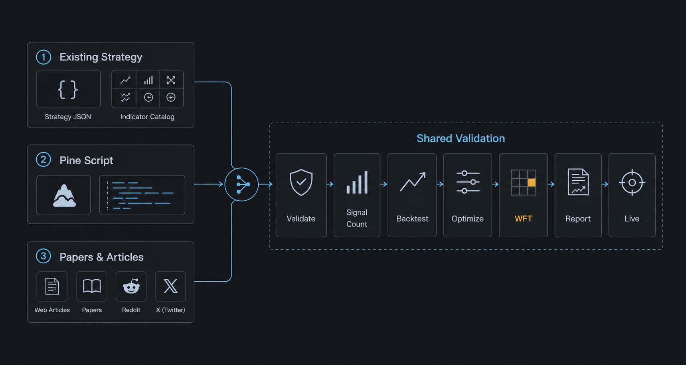
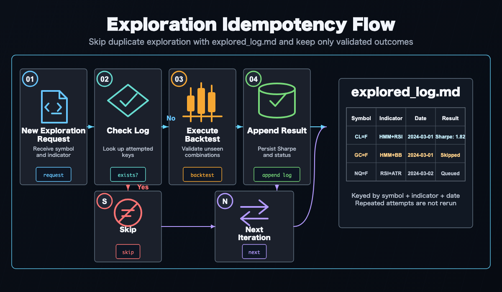

# AI-Driven Strategy Exploration Workflow

Combining Claude Code, Codex, and similar AI coding agents with AlphaForge as the "brain" lets you autonomously drive **idea → implementation → backtest → optimization → validation → live tuning**.

!!! info "Prerequisite"
    The commands and flows shown here assume the `alpha-trade` monorepo (a combination of `alpha-forge` and `alpha-strategies`). **Binary** users should substitute internal commands like `op run --env-file=...` with `forge` directly.

## Why AI agents × AlphaForge

AlphaForge is designed so that **all configuration, strategies, and execution flow through JSON / YAML / CLI**. This means:

- AI agents can **generate, edit, and validate** strategy JSON
- Backtest and optimization results return as **structured data** an agent can analyze
- Slash commands let you replay the **same workflow** idempotently
- You can run **autonomous overnight exploration** without depending on rate limits or human time

The result: humans focus on "directional decisions" and "pass/fail judgment", while exploration and parameter tuning are delegated to the agent.

## Manual vs. AI-driven: when to use which

| Goal | Recommended flow |
|------|-----------------|
| Understand every step of AlphaForge | [End-to-End Strategy Development Workflow](end-to-end-workflow.md) (manual CLI) |
| Quickly explore new indicator × symbol combinations | This page (AI-driven autonomous exploration) |
| Already have a promising strategy and want to fine-tune | Start from Step 3 [`/grid-tune`](#step-3-grid-tune) |
| Monitor drift in live strategies | Step 4 [`/tune-live-strategies`](#step-4-tune-live-strategies) |

## Recommended coding agents

A comparison of agents that pair well with alpha-forge as of April 2026:

| Agent | Strengths | Rate / cost (rough) | Slash-command support |
|-------|-----------|---------------------|------------------------|
| **Claude Code** (recommended) | File-edit precision, long-running tasks, Sonnet/Opus mix | Subscription or API metered | ✅ Native `.claude/commands/*.md` |
| **Codex CLI** | Strong baseline, OpenAI models | API metered (e.g., GPT-5) | △ Custom prompts via config |
| **Cursor** | IDE integration, efficient interactive flow | Subscription | △ Composer / Rules workaround |
| **Aider** | OSS, multi-model, git integration | Model cost only | △ Manual `/<command>` aliases |

The rest of this page assumes **Claude Code**. With other agents, point them at `.claude/commands/*.md` to reproduce the same flow.

---

## Setting up Claude Code for unattended runs {#unattended-setup}

To run `/explore-strategies --runs 0` (or any long continuous run) without stopping for permission prompts, you need to pre-authorize the required operations in Claude Code's allow list. Without this, Claude Code will pause and ask for confirmation every time it encounters an unlisted operation.

Add the following patterns to `permissions.allow` in `.claude/settings.local.json` (your personal settings — gitignored):

```json
{
  "permissions": {
    "allow": [
      "Write(alpha-strategies/data/strategies/*.json)",
      "Bash(uv --directory alpha-forge run forge *)",
      "Bash(FORGE_CONFIG=* uv --directory alpha-forge run forge *)",
      "Bash(git -C */alpha-strategies add data/)",
      "Bash(git -C */alpha-strategies commit *)",
      "Bash(git -C */alpha-strategies push)",
      "Bash(rm */alpha-strategies/data/strategies/*.json)",
      "Bash(rm */data/strategies/*.json)"
    ]
  }
}
```

All paths are relative to `alpha-trade/` as the working root.

| Pattern | What it authorizes |
|---------|-------------------|
| `Write(alpha-strategies/data/strategies/*.json)` | Writing strategy JSON files (one per strategy) |
| `Bash(uv --directory alpha-forge run forge *)` | Direct forge execution |
| `Bash(FORGE_CONFIG=* uv --directory alpha-forge run forge *)` | Forge commands with any FORGE_CONFIG (relative or absolute) |
| `Bash(git -C */alpha-strategies add data/)` | Staging exploration results |
| `Bash(git -C */alpha-strategies commit *)` | Committing exploration results |
| `Bash(git -C */alpha-strategies push)` | Pushing to alpha-strategies |
| `Bash(rm */alpha-strategies/data/strategies/*.json)` | Deleting temp files for failed strategies |
| `Bash(rm */data/strategies/*.json)` | Same, handling different working directory contexts |

!!! note "About settings.local.json"
    `settings.local.json` is listed in `.gitignore` and is never shared with teammates. Each developer must configure it individually in their own environment. Do not add these entries to the tracked `settings.json`.

!!! tip "If you already have a permissions.allow section"
    Merge the new entries into your existing array — do not overwrite the entire file, or you will lose your existing permissions.

!!! info "Using 1Password"
    If you run forge via `op run`, add these patterns as well:
    ```json
    "Bash(op run --env-file=alpha-forge/.env.op -- uv --directory alpha-forge run forge *)",
    "Bash(FORCE_COLOR=* FORGE_CONFIG=* op run * uv --directory alpha-forge run forge explore run *)",
    "Bash(FORGE_CONFIG=* op run * uv --directory alpha-forge run forge strategy *)",
    "Bash(FORGE_CONFIG=* op run * uv --directory alpha-forge run forge data fetch *)",
    "Bash(FORGE_CONFIG=* op run * uv --directory alpha-forge run forge explore *)"
    ```

!!! warning "FORCE_COLOR=1 prefix is required"
    The `/explore-strategies` skill mandates that `forge backtest run` / `forge optimize run` / `forge optimize walk-forward` / `forge explore run` be prefixed with `FORCE_COLOR=1` so that progress bars render correctly ([alpha-forge issue #410](https://github.com/ysakae/alpha-forge/issues/410)). Because the command line begins with `FORCE_COLOR=1 `, it does not match existing patterns that start with `FORGE_CONFIG=...` and may trigger a permission prompt that blocks unattended runs. Add the following patterns:
    ```json
    "Bash(FORCE_COLOR=1 FORGE_CONFIG=* op run *)",
    "Bash(FORCE_COLOR=1 FORGE_CONFIG=* uv --directory alpha-forge run forge *)",
    "Bash(FORCE_COLOR=1 uv --directory alpha-forge run forge *)"
    ```

### Detecting 1Password session expiry early (unattended runs) {#op-session-precheck}

For unattended runs (overnight batches, etc.), an expired `op` session causes every subsequent `op run` invocation to fail with an authentication error. The `/explore-strategies` skill runs `forge auth check op` at the start of each loop iteration and stops the loop with exit code 2 when the session is invalid ([alpha-forge issue #411](https://github.com/ysakae/alpha-forge/issues/411)).

```bash
# Verify session validity
uv --directory alpha-forge run forge auth check op
echo "exit: $?"   # 0 = valid, 2 = session expired / op missing / timeout
```

| Exit code | Meaning | Recommended action |
|-----------|---------|-------------------|
| `0` | Session valid | Continue the loop |
| `2` | Auth error (expired session, op CLI missing, etc.) | Stop the loop immediately, append a note to `<goal_dir>/explored_log.md`, and prompt the user to run interactive `op signin` |

The skill performs this check automatically — no extra configuration is needed. If you build a long-running loop manually, insert the same check at the head of each iteration.

## Setting up Codex CLI for unattended runs {#codex-unattended-setup}

To run the same kind of long job with Codex CLI, configure the **approval policy** and **sandbox scope** instead of a command-by-command allow list like Claude Code's `permissions.allow`.

First, add an unattended profile to `~/.codex/config.toml`:

```toml
[profiles.alforge-labs-unattended]
approval_policy = "never"
sandbox_mode = "workspace-write"
```

Then start `codex exec` with that profile, pinning the working root and any additional writable directories:

```bash
codex exec \
  --profile alforge-labs-unattended \
  --cd /absolute/path/alpha-trade \
  --add-dir /absolute/path/alpha-trade/alpha-strategies \
  "Use the explore-strategies skill to explore the default goal with the equivalent of --runs 0."
```

Replace `/absolute/path/` with your actual path (e.g., `/Users/yourname/dev/alpha-trade`). If `--cd` points at the `alpha-trade` monorepo root, most operations already stay inside the workspace. Add `--add-dir` when your strategy JSON output lives in a separate worktree or an external `alpha-strategies` checkout.

| Setting / option | Purpose |
|------------------|---------|
| `approval_policy = "never"` | Prevent approval prompts during the run; failures are returned to Codex directly |
| `sandbox_mode = "workspace-write"` | Limit writes to the workspace and explicitly added directories |
| `--cd /.../alpha-trade` | Fix Codex's working root to the monorepo |
| `--add-dir /.../alpha-strategies` | Allow writes to a strategy JSON directory outside the working root |

!!! warning "Avoid full bypass by default"
    `--dangerously-bypass-approvals-and-sandbox` disables both approvals and sandboxing. Do not use it for normal local exploration unless you are running inside an externally isolated throwaway environment.

!!! tip "Prefetch data first"
    Codex's `workspace-write` sandbox may restrict network access depending on your environment. For symbols that need `forge data fetch` / `forge data update`, run `/update-market-data` or `forge data fetch <SYMBOL>` manually before starting the unattended run.

---

## Overall flow

```
Prepare: /update-market-data — bring data up to date
  ↓
Choose a starting point (pick one of 3 exploration scenarios)
  ↓
Step 1: /explore-strategies [--goal <name>] [--runs N]
  └─ Auto backtest → optimize → WFT for each symbol × indicator combo
     Pre-filter: Sharpe ≥ 1.0 AND MaxDD ≤ 25%
  ↓
Step 2: /analyze-exploration
  └─ Aggregate all logs; output next recommended candidates to recommendations.yaml
  ↓
Step 3: /grid-tune
  └─ Exhaustive grid search on promising strategies + WFT re-validation
  ↓
Step 4: /tune-live-strategies
  └─ Drift detection and re-tuning for live strategies
```

---

## Preparation: Fetch historical data

Before starting exploration, make sure the target symbol data is up to date.

```bash
# Bulk incremental update of stored data (binary: forge data update <SYMBOL>)
> /update-market-data
```

`/update-market-data` runs `forge data list` to find registered symbols and calls `forge data update` on each. For brand-new symbols, run `forge data fetch <SYMBOL>` manually first.

---

## Three exploration scenarios

AI agent × AlphaForge usage falls into three categories based on **what you're starting from**.



### Scenario 1: Combinations from existing strategies / indicators

**Starting point**: Your existing strategy JSON files and the `forge indicator list` catalog.

**Typical flow**:

1. Tell Claude Code: "Take `forge strategy show multi_asset_hmm_bb_rsi_v1_qqq` as the base and add MACD to create a derivative."
2. The agent edits the JSON and creates `multi_asset_hmm_bb_rsi_macd_v1_qqq.json`
3. `forge strategy validate` → `forge strategy save` → `forge backtest run`
4. If Sharpe improves, run `forge optimize run` to fine-tune

**Tip**: With `/explore-strategies`, you can fully delegate combination selection through reporting to the agent.

### Scenario 2: Apply a TradingView Pine Script

**Starting point**: A public TradingView strategy or indicator (`.pine` file).

**Typical flow**:

1. Save an interesting Pine Script locally (`tv_<name>.pine`)
2. **Import**: `forge pine import tv_<name>.pine --id imported_v1`
3. Tell the agent: "Reorganize this strategy's `parameters` and `indicators`, and add an `optimizer_config`."
4. The agent reshapes the JSON and surfaces optimization targets
5. `forge backtest run` → `forge optimize run` to validate AlphaForge-style
6. If good, regenerate via `forge pine generate` and verify on TradingView

**Tip**: Bringing Pine Script logic into **JSON form** unlocks all of AlphaForge's analysis (optimize, WFT, Monte Carlo).

### Scenario 3: Mine forums / papers from the web

**Starting point**: X (Twitter), Reddit `/r/algotrading`, SSRN papers, QuantConnect / QuantStart articles.

**Typical flow**:

1. Hand Claude Code a **URL or PDF** and ask: "Extract the core logic of this strategy into `indicators` and `entry_conditions`."
2. The agent summarizes the article and drafts a strategy JSON
3. `forge strategy validate` to catch logical errors → fix
4. `forge backtest signal-count` to verify signal count (conditions not too restrictive)
5. `forge backtest run` → optimize as needed
6. Compare the article's claimed results vs the actual backtest (**often unreproducible**)

**Tip**: Paper strategies often fail to reproduce when "data period", "symbol", or "transaction costs" differ. Letting the agent **soberly compare** "claimed" vs "real" results acts as a reality filter.

---

## Step 1: Exploration phase (`/explore-strategies`) {#step-1-explore}

**Purpose**: Find a strategy meeting target metrics from `goals/<goal_name>/goals.yaml` (e.g., Sharpe ≥ 1.5) by trying **untried indicator × symbol combinations**.

### Steps (summary)

1. **Pre-flight**: Read `goals/<goal_name>/goals.yaml`, `goals/<goal_name>/explored_log.md`, and existing strategy JSON files; identify untried combinations
2. **Strategy generation**: Pick one indicator × symbol combo, generate the strategy JSON, and save under `data/strategies/<name>.json`
3. **Register → validate**: `forge strategy save` → `forge strategy validate` for logical consistency (rollback on failure)
4. **Data fetch**: `forge data fetch <SYMBOL> --period 5y` (only if not already cached)
5. **Run the full pipeline in one command**: `forge explore run <SYMBOL> --strategy <name> --goal <goal_name> --json`
   Signal check → backtest → optimize → walk-forward → coverage update → DB registration — all in one step
6. **Record outcome**: Read `passed` / `skip_reason` from the output JSON, then append to `goals/<goal_name>/explored_log.md` and `goals/<goal_name>/reports/YYYY-MM-DD.md`. When `passed: false` and `cleanup_done: true`, strategy JSON and result JSON have already been removed automatically

```
> /explore-strategies                          # One run (default goal)
> /explore-strategies --goal stocks            # Specify goal
> /explore-strategies --runs 3                 # 3 runs in sequence
> /explore-strategies --goal crypto --runs 0   # Loop until rate limit or all combinations exhausted
```

### Pass/fail criteria

| Phase | Criterion |
|-------|-----------|
| Pre-filter | Sharpe ≥ 1.0 **AND** MaxDD ≤ 25% |
| WFT final pass | All-window mean WFT Sharpe ≥ `target_metrics.sharpe_ratio` in `goals/<goal_name>/goals.yaml` |

### Idempotency

`goals/<goal_name>/explored_log.md` acts as the checkpoint, so re-runs never re-explore the same combination within a goal. Safe to interrupt and resume at any time.



### Continuous runs and rate limit handling

Use `--runs 0` to loop until a rate limit is hit or all combinations are exhausted.

| Agent | Main limit | Mitigation |
|-------|-----------|------------|
| Claude Code | 5-hour token window (plan-dependent) | Spread across night → morning → noon (3 windows) |
| Codex | RPM / TPM (per model) | Lower parallelism; serialize to one iteration at a time |
| Cursor | Monthly / daily request limit | Composer Agent is heavy; reserve for strategy generation |

!!! tip "Parallel execution with multiple goals"
    Goals are independent — each has its own `explored_log.md` under `goals/<name>/`. You can run different goals simultaneously in separate Claude Code sessions without conflicts. Backtest results are shared via `exploration.db`, so the same symbol × indicator combination is never backtested twice across goals.

### Scaffold supported indicators and behavior (post issue #427)

`forge strategy scaffold` supports the following indicators:

- **mean-reversion**: BB (required), RSI, MACD, ADX, SUPERTREND, STOCH, HMM, SMA (long-term trend filter), EMA (mid-term trend filter)
- **trend-following**: EMA (required), ADX, MACD, RSI, SUPERTREND, STOCH, HMM, BB (volatility / trend confirmation filter), SMA (long-term bull/bear filter)
- ATR is auto-added for all types (use `--no-atr` to disable)

Requesting an indicator that is incompatible with the chosen strategy type raises an explicit `ValueError`; indicators are never silently dropped. See [alpha-forge issue #427](https://github.com/ysakae/alpha-forge/issues/427) for details.

### Both long and short entries (issue #469)

scaffold now generates **both long and short** `entry_conditions` / `exit_conditions`. In symmetric markets such as FX this doubles the opportunity surface and lets the strategy capture profit on the down leg as well.

| Strategy type | long | short |
|---------------|------|-------|
| mean-reversion | BB lower touch → exit on bb_mid cross up | BB upper touch → exit on bb_mid cross down |
| trend-following | EMA fast cross up → exit on cross down | EMA fast cross down → exit on cross up |

Filters are mirrored across directions:
- RSI: oversold → overbought (long) / overbought → oversold (short)
- MACD histogram: `< 0` (long) / `> 0` (short)
- ADX: identical (range detection is direction-agnostic)
- SuperTrend / SMA / EMA: price above (long) / price below (short)

When HMM is enabled, the range regime (mean-reversion state 1) or the high-return state (trend-following state 0) allows both directions. For long-only stock strategies, delete `entry_conditions.short` after scaffolding.

### Reversal confirmation bar (issue #470)

For mean-reversion strategies, `--confirm-bars 1` requires that **the bar after a BB touch closes as a reversal candle** before an entry fires. This avoids the "knife-catch" problem of entering at the moment of a BB break.

| confirm_bars | long entry |
|--------------|-----------|
| 0 (default) | `close < bb_lower` (instant) |
| 1 | `close.shift(1) < bb_lower.shift(1) & close > open` (prev-bar break + current-bar bullish candle) |

Short is mirrored (prev-bar BB upper break + current-bar bearish candle). Set the default per goal with `goals.yaml.exploration.scaffold_defaults.confirm_bars: 1`.

**Current limit**: only 0 / 1 are supported (N≥2 sequential reversal will follow). The `close > open` check looks only at candle color; stronger confirmation (consecutive reversal bars, wick length) is a future enhancement.

### Per-goal scaffold defaults (issue #461)

Goal-specific leverage / position size / stop can be set in the `exploration.scaffold_defaults` section of `goals.yaml`, and `forge strategy scaffold --goal <name>` applies them automatically. `exploration.initial_capital` overrides the `forge.yaml` capital assumption.

```yaml
# Example: oanda_gold/goals.yaml
exploration:
  initial_capital: 6800              # USD-denominated capital assumption (forge.yaml override)
  scaffold_defaults:
    position_size_pct: 100
    leverage: 5
    type_overrides:
      mean-reversion:
        stop_loss_pct: 1.5
        take_profit_pct: 3.0
      trend-following:
        stop_loss_pct: null          # null = keep scaffold's existing default
```

CLI:

```bash
# Goal reference
forge strategy scaffold --symbol USDJPY=X --indicators BB,RSI \
  --type mean-reversion --strategy-id usdjpy_bb_rsi_v1 \
  --goal oanda_gold --save

# Explicit flags (override)
forge strategy scaffold ... \
  --position-size-pct 100 --leverage 5 \
  --stop-loss-pct 1.5 --take-profit-pct 3.0 --save
```

**Priority**: explicit CLI flag > `goals.yaml.scaffold_defaults` (+ `type_overrides`) > existing defaults

`forge backtest run --goal <name>` and `forge explore run --goal <name>` also read `goals.yaml.exploration.initial_capital` and override the `BacktestConfig` (no need to edit `forge.yaml`).

**Typical use cases**:

- `oanda_gold` (maintain OANDA Gold): 1M JPY (~6,800 USD) × 5x leverage
- `commodities`: 5-10x leverage for futures
- `default`/`stocks`: no leverage / 10-15% sizing (existing defaults)

### Per-goal timeframe / backtest_period (issue #463)

To support shorter timeframes (e.g. 1h), `exploration.timeframe` and `exploration.backtest_period` can be specified as goal-level defaults in `goals.yaml`.

```yaml
# Example: oanda_gold/goals.yaml (high-frequency FX setup)
exploration:
  timeframe: "1h"           # strategy timeframe produced by scaffold (default: "1d")
  backtest_period: "2y"     # data fetch period for explore run (default: "5y")
```

These values flow into the `timeframe` of strategies generated by `forge strategy scaffold --goal <name>` and the data fetch period used by `forge explore run --goal <name>`. Use `--timeframe` to override per invocation:

```bash
forge strategy scaffold --symbol USDJPY=X --indicators BB,RSI \
  --type mean-reversion --strategy-id usdjpy_bb_rsi_1h_v1 \
  --timeframe 1h --save
```

**Priority**: explicit `--timeframe` > `goals.yaml.exploration.timeframe` > default `"1d"`

**yfinance constraint**: The yfinance provider hits Yahoo Finance's 730-day cap, so **1h × 5y is not retrievable** (measured: 1h × 2y yields ~12,000 bars). When using 1h, shorten to `backtest_period: "2y"` or switch to an alternative provider such as Dukascopy or OANDA.

### Early cutoff via pre_filter min_trades (issue #429)

Adding `min_trades` to the `pre_filter` section of `goals.yaml` makes `forge explore run` abort strategies whose backtest trade count is below the threshold immediately after the backtest, skipping the Optuna optimization (tens of seconds to minutes) and WFT to save compute resources.

```yaml
pre_filter:
  sharpe_ratio:        ">= 1.0"
  max_drawdown:        "<= 25%"
  min_trades:          ">= 15"          # issue #429: roughly half of target_metrics.min_trades is recommended
  monthly_volume_usd:  ">= 500000"
```

**Behavior**:

- When `total_trades` after the backtest is below `pre_filter.min_trades`, `pre_filter_pass=false` and the run is aborted with `status="pre_filter_failed"`
- `pre_filter_diagnostics.failed_criteria` includes `"trades"`, and `trades.threshold` matches the `goals.yaml` value
- When `min_trades` is omitted (or set to `>= 0`), the trade count check is disabled (backwards compatibility)
- Genuinely promising strategies (Sharpe>1.0 with insufficient trades) are still rescued by the **auto-relaxation variants (#428)** described below, which broaden the search space

### pre_filter.near_pass rescue zone (issue #452 / #456)

Mechanism that lets "almost-passing" strategies proceed to the optimizer. Configure under `pre_filter.near_pass` in `goals.yaml`; eligibility is decided in 3 stages.

```yaml
pre_filter:
  sharpe_ratio: ">= 1.0"
  max_drawdown: "<= 30%"
  near_pass:
    # Stage 1: factors (independent coefficient evaluation / issue #452)
    sharpe_ratio: 0.9
    max_drawdown: 1.1
    min_trades: 0.8

    # Stage 2: cross_compensation (issue #456)
    cross_compensation:
      max_drawdown_floor: 0.1     # MDD <= 30% × 0.1 = 3% triggers sharpe relaxation
      sharpe_relax_factor: 0.7    # sharpe acceptable down to 1.0 × 0.7 = 0.7
      # optional: min_trades_floor: 5.0  # trades >= 30 × 5 = 150 also triggers

    # Stage 3: composite (issue #456)
    composite:
      calmar_ratio: 5.0           # CAGR/MDD >= 5.0 rescues sharpe shortfall
```

**Order**: factors → cross_compensation → composite. The first stage that returns eligible runs the optimizer. `cross_compensation` and `composite` only apply when **sharpe is the only failed criterion** (multi-metric failures are not rescued).

`pre_filter_diagnostics.near_pass` records `eligible_via` (`factors`/`cross_compensation`/`composite`/`null`) and `compensation_evidence` (rescue rationale) for observability.

**Typical rescue cases** (issue #456):

- QQQ ADX+EMA+SuperTrend: sharpe 0.771 / MDD 0.91% / trades 705 → MDD is 1/33 of the threshold → rescued via cross_compensation
- CL=F BB+RSI: sharpe 0.758 / MDD 1.84% / trades 36 → same pattern, rescued

### pre_filter.monthly_volume_usd evaluation (issue #459)

`monthly_volume_usd` (monthly USD turnover) is computed by `MetricsCalculator._calc_monthly_volume_usd`. Setting `pre_filter.monthly_volume_usd >= N` in `goals.yaml` actively evaluates the value at pre_filter time, and shortfall strategies have `monthly_volume_usd` added to `failed_criteria`.

Useful for enforcing OANDA Gold status (monthly turnover ≥ 500,000 USD):

```yaml
pre_filter:
  monthly_volume_usd: ">= 500000"
```

When unset or `>= 0`, evaluation is skipped (backwards compatible).

### target_metrics arbitrary-metric evaluation (issue #458)

The `target_metrics` section of `goals.yaml` accepts the following arbitrary metrics. `forge explore run` Step 5 evaluates every entry, and the structured outcome is stored in DB under `target_metrics_diagnostics`.

| Metric | Meaning | Source |
|--------|---------|--------|
| `sharpe_ratio` | Sharpe ratio | **WFT average** (existing behavior) |
| `max_drawdown` | Max drawdown (%) | backtest |
| `cagr` | Annual return (%) | backtest |
| `win_rate_pct` | Trade win rate (%) | backtest |
| `profit_factor` | Profit / loss | backtest |
| `min_trades` | Lower bound on trade count | backtest |
| `calmar_ratio` | CAGR / MDD | backtest |
| `positive_months_ratio` | Fraction of profitable months (0–1) | backtest |
| `worst_month_pnl_pct` | Worst-month P&L (%) | backtest |
| `best_month_pnl_pct` | Best-month P&L (%) | backtest |
| `consecutive_negative_months` | Max consecutive negative months | backtest |

Example targeting "almost surely positive every month":

```yaml
target_metrics:
  positive_months_ratio: ">= 0.9"
  worst_month_pnl_pct: ">= -1.5"
  consecutive_negative_months: "<= 2"
  max_drawdown: "<= 5%"
  profit_factor: ">= 1.3"
```

Unsupported metric names or operators are skipped with a warning (the strategy is not marked failed because of them).

### Auto-relaxation of failed variants (issue #428)

`forge explore run` automatically generates a relaxed v(N+1) variant JSON for any strategy that **passed pre_filter but failed WFT** (`status="wft_failed"`), and registers it as rank: 1 in `recommendations.yaml`. The agent no longer needs to craft v(N+1) variants by hand.

**Trigger**: `status="wft_failed"` (covers `skip_reason` of `wft_insufficient_oos_data` / `wft_no_valid_oos_windows` / `wft_failed`) **and** pre_filter passed.

**Relaxation rules** (up to 2 per variant, in priority order):

| Parameter pattern | Mutation |
|---|---|
| `rsi*_th` / `rsi*entry*` / `rsi2_entry_th` | `max += 10` (loosen entry threshold) |
| `adx_threshold` | `min -= 5` (loosen ADX filter) |
| `*length` / `*period` | `max *= 0.7` (shorten lookback period) |

Example CLI output:

```
❌ SPY / spy_atr_ema_macd_v1 — failed (wft_insufficient_oos_data)
  ✓ Sharpe=1.17; quality is acceptable. Auto-generated relaxed variant spy_atr_ema_macd_v2 (rsi_th.max=80→90)
  ✓ Registered in recommendations.yaml as rank: 1
```

`forge explore result show <name> --json` exposes an `auto_relax` field. `skipped_reason="duplicate_id"` means the variant already exists; `"no_relaxable_params"` means no parameter in `param_ranges` matched the relaxation rules. Disable the feature with `forge explore run --no-auto-relax`.

### Health-check gate (auto-escalation on consecutive failures)

When running unattended with `--runs 0`, a scaffold bug or `goals.yaml` drift can quietly produce a loop where every trial fails. To catch this early, `/explore-strategies` invokes `forge explore health --strict` at the start of every iteration and inspects the most recent five trials (alpha-forge issue #408).

Trigger conditions and behavior:

- All last 5 trials failed **and** scaffold transformation rate is `>= 50%` → `escalation: true` (`escalation_type: "scaffold_degradation"`) — hard stop
- All last 5 trials share the same `indicator_combo` →
  - scaffold transformation rate `<= 10%` → `warning: true` / `escalation: false` (`escalation_type: "agent_selection_bias"`, the agent is intentionally repeating the same combo) — **loop continues** (issue #467)
  - mid-range (10% < rate < 50%) → conservatively treated as `escalation: true` / `"scaffold_degradation"`
- Fewer than 5 trials in the DB (shallow history) → observe-only, never blocks

When `escalation: true` fires the command exits with code `1`, and the skill stops the loop and surfaces `recommended_actions` to the human operator. With `warning: true` (agent_selection_bias) the command still exits `0`; the skill prints `recommended_actions` and the agent is expected to **pick a different indicator combo** in the next iteration (the `recent_selections` diversity guard then auto-resolves the warning). `escalation_type` tells you whether to investigate scaffold (alpha-forge) or adjust agent behavior (alpha-forge issues #436 / #467). See the [`forge explore health` reference](../cli-reference/other.md#forge-explore-health) for full details.

---

## Step 2: Analysis & narrowing down (`/analyze-exploration`) {#step-2-analyze}

**Purpose**: Aggregate all past exploration logs and **scientifically recommend** the next set of combinations to try.

```
> /analyze-exploration
```

### Processing

1. Read all of `goals/*/explored_log.md` + `goals/*/reports/*.md`
2. Build a **per-symbol performance table** (trials, max/avg Sharpe, min MaxDD, pass count)
3. Build a **per-indicator-set performance table** (trials, avg/max Sharpe, pass rate)
4. **Score untried combinations** (0–10):
    - Average Sharpe of similar indicators (+0–4)
    - Symbol with few trials = more room to explore (+0–2)
    - Indicator novelty (+0–2)
    - Listed in the previous run's recommendations (+2)
5. Save the report to `data/explorer/analysis/YYYY-MM-DD_HH-MM.md`
6. **Write top-5 candidates to `recommendations.yaml`** (read by the next `/explore-strategies`)

### Sample output (recommendations.yaml)

```yaml
candidates:
  - rank: 1
    asset: QQQ
    indicators: [HMM, BBANDS, RSI, MACD]
    score: 8.5
    rationale: "HMM × BBANDS shows high avg Sharpe; QQQ has few trials; MACD adds novelty."
    basis_sharpe: 1.32
    basis_maxdd: 18.4
    variant_of: multi_asset_hmm_bb_rsi_v1_qqq
```

---

## Step 3: Precision tuning (`/grid-tune`) {#step-3-grid-tune}

**Purpose**: For a strategy that passed Step 1, **expand `optimizer_config.param_ranges` into a Cartesian grid** and run an exhaustive search; on pass, save automatically as `<name>_optimized`.

```
> /grid-tune <strategy_name> <SYMBOL>
```

### Steps

1. Inspect the strategy: `forge strategy show <strategy_name>` to confirm `param_ranges` and grid size
2. Signal count check (mandatory): `forge backtest signal-count`
3. Capture baseline: `forge backtest run` to record the original strategy's Sharpe
4. **Exhaustive grid search**: `forge optimize grid <symbol> --strategy <name> --metric sharpe_ratio --top-k 20 --chunk-size 100 --max-memory-mb 4096 --min-trades 30 --save --save-format csv --yes`
5. Review Top-20 (overfitting smell, clustering of top trials)
6. Apply best: `forge optimize grid ... --top-k 1 --apply --yes`
7. **WFT validation**: `forge optimize walk-forward <symbol> --strategy <name>_optimized --windows 5`
8. **Decision**: If WFT mean Sharpe **exceeds the original strategy's Sharpe**, pass
    - Pass → `forge journal verdict <name>_optimized <run_id> pass`
    - Fail → `forge strategy delete <name>_optimized --force` + add a `note` to the original strategy's journal

### Memory / OOM guidance

- 1 symbol × 5 years × 1,000-cell grid → `--chunk-size 100 --max-memory-mb 4096` runs without OOM
- Larger grids → drop to `--chunk-size 50 --max-memory-mb 2048`
- Coarsening `step` in `param_ranges` is also effective

---

## Step 4: Live monitoring (`/tune-live-strategies`) {#step-4-tune-live-strategies}

**Purpose**: For strategies running live, detect drift between live performance and backtest, and **automatically re-tune** the affected strategies.

```
> /tune-live-strategies
```

### Steps

1. **Detect drift**: `forge live list` → for each strategy ID, run `forge live compare <strategy_id>` and pick those exceeding `live_tuning.sharpe_drift_threshold` in `goals/<goal_name>/goals.yaml`
2. **Re-optimize**: For each drifting strategy:
    - `forge optimize run <SYMBOL> --strategy <name> --metric sharpe_ratio --save`
    - `forge optimize walk-forward <SYMBOL> --strategy <name> --windows 5`
3. **Adoption decision**: Update `<name>_optimized.json` only if WFT mean Sharpe **improves**; keep current otherwise
4. Append the report to `data/explorer/reports/tuning-YYYY-MM-DD.md`

A weekly cron or manual periodic run is sufficient. If drift persists for N consecutive weeks, consider rethinking the strategy (replace indicators, switch scenario).

---

## Key files

```text
alpha-strategies/data/explorer/
├── goals/
│   ├── default/                       # Default goal (used when --goal is omitted)
│   │   ├── goals.yaml                 # Target metrics and exploration scope
│   │   ├── explored_log.md            # Idempotent checkpoint for this goal
│   │   └── reports/
│   │       ├── YYYY-MM-DD.md          # /explore-strategies daily report
│   │       └── tuning-YYYY-MM-DD.md   # /tune-live-strategies report
│   ├── stocks/                        # US stocks / ETF goal
│   │   ├── goals.yaml
│   │   ├── explored_log.md
│   │   └── reports/
│   ├── commodities/                   # Commodities goal
│   │   └── ...
│   └── crypto/                        # Crypto goal
│       └── ...
├── exploration.db                     # Shared backtest result cache (all goals)
├── recommendations.yaml               # Next-candidate output from /analyze-exploration
└── analysis/
    └── YYYY-MM-DD_HH-MM.md           # /analyze-exploration output
```

**`goals/<goal_name>/goals.yaml`**: Defines target Sharpe, MaxDD, the set of symbols and indicator candidates, and `strategies_per_run` for each goal. Pass `--goal <name>` to `/explore-strategies` to select a goal; defaults to `goals/default/`.

**`goals/<goal_name>/explored_log.md`**: Checkpoint recording every combination tried within a goal. As long as this file exists, the same combination will never be re-explored for that goal.

**`exploration.db`**: Shared SQLite cache across all goals. If the same symbol × indicator combination has already been backtested by any goal, the cached result is reused — no duplicate backtest runs.

**`recommendations.yaml`**: Next-candidate output from `/analyze-exploration`. `/explore-strategies` reads this file and prioritizes high-scoring combinations.

---

## Why run WFT after optimization?

Each step requires a **Walk-Forward Test (WFT)** to prevent overfitting.

Evaluating only on the in-sample period (the data used for optimization) risks parameters that over-fit that historical data. WFT addresses this by:

1. Splitting the full period into multiple windows
2. Running "optimize → Out-of-Sample validation" in each window
3. Using the **OOS mean Sharpe** as the final evaluation metric

This design filters out strategies that perform well on past data but are unlikely to work going forward.

---

## End-to-end example (explore → optimize → validate → live)

A worked example: validating and adopting "Add MACD to QQQ HMM × BB × RSI".

```bash
# 1. Record the idea (optional; can be linked later)
forge idea add "Add MACD to QQQ HMM×BB×RSI" \
  --type improvement --tag hmm --tag qqq

# 2. Try one cycle with /explore-strategies (inside Claude Code)
> /explore-strategies
# → Auto-generates strategy JSON; runs validate, signal-count, backtest
# → Sharpe=0.95 fails the pre-filter (requires Sharpe ≥ 1.0)

# 3. Try a derivative (ask the agent to tweak parameters)
> Reduce HMM n_components to 2 for the strategy above and retry
# → Agent generates the revised JSON, re-registers, and backtests (Sharpe=1.18 passes pre-filter)
# → Auto-runs optimize run + walk-forward
# → WFT mean Sharpe=1.32 passes

# 4. Run /grid-tune for exhaustive optimization
> /grid-tune multi_asset_hmm_bb_rsi_macd_v1_qqq QQQ
# → Grid Top-1 → apply → WFT validation reaches 1.45
# → Records pass via forge journal verdict

# 5. Sensitivity / overfitting check
forge optimize sensitivity \
  /path/to/data/results/optimize_multi_asset_hmm_bb_rsi_macd_v1_qqq_optimized_20260415_103021.json
# → overall_robustness_score=0.82 (passes)

# 6. Final approval in journal
forge journal verdict multi_asset_hmm_bb_rsi_macd_v1_qqq_optimized <run_id> pass
forge journal note multi_asset_hmm_bb_rsi_macd_v1_qqq_optimized "OOS pass + sensitivity 0.82. Live candidate."

# 7. Generate Pine Script for TradingView
forge pine generate --strategy multi_asset_hmm_bb_rsi_macd_v1_qqq_optimized --with-training-data

# 8. Begin live operation (deploy execution engine to VPS — out of scope here)

# 9. After a week, compare live vs backtest
forge live import-events multi_asset_hmm_bb_rsi_macd_v1_qqq_optimized
forge live compare multi_asset_hmm_bb_rsi_macd_v1_qqq_optimized

# 10. If drift is large, run /tune-live-strategies for auto re-tuning
> /tune-live-strategies
```

In this entire flow, **humans only judge in 3 places**:

1. Direction of the idea (add MACD to HMM × BB × RSI)
2. Top-20 review of grid-tune (sniff overfitting)
3. Decision to go live

Everything else runs autonomously through the agent.

---

## Related documentation

- [End-to-End Strategy Development Workflow](end-to-end-workflow.md) — Manual CLI walkthrough for every step
- [Getting Started](../getting-started.md) — Tutorial through the first backtest
- [CLI Reference](../cli-reference/index.md) — Every `forge` command parameter
- [Strategy Templates](../templates.md) — Bundled strategies like HMM × BB × RSI

---

<!-- Synced from: slash-command definitions in `alpha-trade/.claude/commands/{explore-strategies,analyze-exploration,grid-tune,tune-live-strategies,update-market-data}.md`. Agent comparison reflects April 2026. -->
