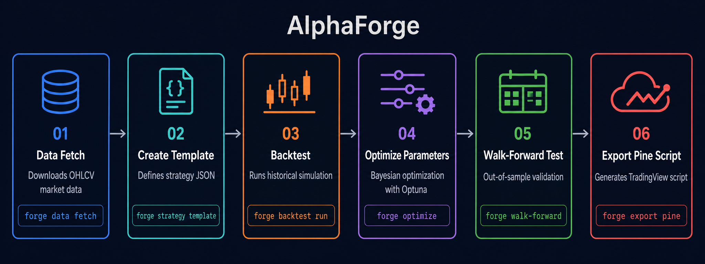
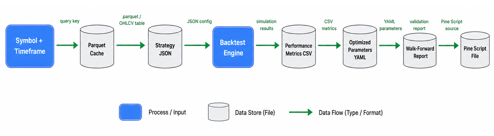

# End-to-End Strategy Development Workflow

A typical flow from raw data to live execution. This pairs naturally with a coding agent (e.g. Claude Code) for automated parameter exploration and strategy generation.





!!! note "Prerequisite"
    All commands below assume you are running from `alpha-strategies/` with `FORGE_CONFIG=forge.yaml uv run` prepended.

## 1. Fetch historical data

Save historical OHLCV data for a target symbol locally.

```bash
forge data fetch USDJPY
```

## 2. Create a strategy from a template

Generate a JSON scaffold, edit parameters, and register it.

```bash
forge strategy create --template sma_crossover_v1 \
  --out data/strategies/usdjpy_sma_v1.json

# Edit the JSON's strategy_id and parameters, then register
forge strategy save data/strategies/usdjpy_sma_v1.json
```

## 3. Run a backtest

Validate the strategy against historical data.

```bash
forge backtest run USDJPY --strategy usdjpy_sma_v1

# Show the chart URL and open it in your browser
forge backtest chart usdjpy_sma_v1 --open
```

## 4. Optimize parameters

Bayesian search with Optuna (TPE), then apply the best result.

```bash
forge optimize run USDJPY --strategy usdjpy_sma_v1 \
  --metric sharpe_ratio --trials 300 --save

# Apply the saved result file (optimize_usdjpy_sma_v1_<timestamp>.json) as a new strategy
forge optimize apply data/results/optimize_usdjpy_sma_v1_<timestamp>.json \
  --to-strategy usdjpy_sma_v1_optimized
```

## 5. Walk-forward validation

Detect overfitting with out-of-sample testing.

```bash
forge optimize walk-forward USDJPY \
  --strategy usdjpy_sma_v1_optimized --windows 5

# Sensitivity analysis (point at the optimization result JSON file)
forge optimize sensitivity data/results/optimize_usdjpy_sma_v1_<timestamp>.json
```

## 6. Generate Pine Script

Export a TradingView alert script from the optimized strategy.

```bash
forge pine generate --strategy usdjpy_sma_v1_optimized
```

Output: `output/pinescript/usdjpy_sma_v1_optimized.pine`

!!! tip "Related commands"
    See [CLI Reference](../cli-reference/index.md) for the complete option lists. Next step: [Bringing Pine Scripts into TradingView](tradingview-pine-integration.md).

!!! tip "See actual output samples"
    For output formats, equity curve examples, optimization results, and Pine Script samples, see [Output Examples](output-examples.md).
