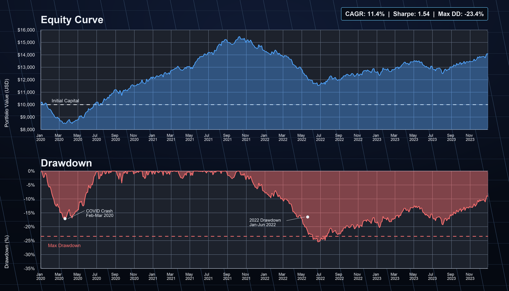

# Output Examples

What you get when you run AlphaForge CLI — representative commands and their outputs.

!!! info "About sample output"
    Numbers on this page are samples based on formats read from the `alpha-forge` source. Actual values will vary by data and strategy.

---

## Backtest Results

### Command

```bash
forge backtest run SPY --strategy sma_crossover_v1 --start 2019-01-01 --end 2023-12-31
```

### Text Output

```text
Running backtest: SPY x sma_crossover_v1
✅ Backtest complete  Signal quality score: 0.78/1.0
Total return: +52.30%  CAGR: 5.40%
SR: 0.92  Sortino: 1.15  Calmar: 0.32
MDD: -16.80%  Duration: 187d  Recovery: 92d
PF: 1.74  Win%: 50.0%  avg win: 4.20%  avg loss: -2.40%
Trades: 14  Avg hold: 28.5d(28bar)  Max: 65.0d(65bar)  Win streak: 4  Loss streak: 3
Win rate CI(90%): 35.2% - 64.8%
```

### Key Metrics

| Metric | Value | Meaning |
|--------|-------|---------|
| CAGR | 5.40% | Compound annual growth rate |
| Sharpe Ratio | 0.92 | Risk-adjusted return (target: ≥ 1.0) |
| Max Drawdown | -16.80% | Largest peak-to-trough loss (187d to recover) |
| Profit Factor | 1.74 | Gross profit ÷ gross loss (target: ≥ 1.3) |
| Win Rate | 50.0% | Percentage of winning trades |

### JSON Output (with `--json` flag)

```bash
forge backtest run SPY --strategy sma_crossover_v1 --start 2019-01-01 --end 2023-12-31 --json
```

```json
{
  "total_return_pct": 52.30,
  "cagr_pct": 5.40,
  "sharpe_ratio": 0.92,
  "sortino_ratio": 1.15,
  "calmar_ratio": 0.32,
  "max_drawdown_pct": -16.80,
  "max_drawdown_duration_days": 187,
  "max_drawdown_recovery_days": 92,
  "profit_factor": 1.74,
  "win_rate_pct": 50.0,
  "total_trades": 14,
  "avg_holding_days": 28.5,
  "pre_filter_pass": false,
  "pre_filter": { "sharpe_min": 1.0, "max_dd_max": 25.0 },
  "warnings": []
}
```

---

## Detailed Report (reviewing saved results)

```bash
forge backtest report sma_crossover_v1
```

```text
=== sma_crossover_v1 / SPY (2026-04-15T10:30:21) ===
Total return: 52.30%  CAGR: 5.40%
SR: 0.92  Sortino: 1.15  Calmar: 0.32
MDD: -16.80%  PF: 1.74  Win%: 50.0%
Trades: 14  Avg hold: 28.5d(28bar)  Max: 65.0d(65bar)
Trade log: 14 entries (use --json to view all)
```

Use `--json` for the full trade log:

```bash
forge backtest report sma_crossover_v1 --json
```

---

## Equity Curve and Dashboard

After a backtest, use the local dashboard to visually inspect the equity curve, drawdown, and individual trades.

```bash
# Show chart URL
forge backtest chart sma_crossover_v1

# Open directly in browser (requires vis serve running)
forge backtest chart sma_crossover_v1 --open
```

```text
📊 Start `vis serve` (alpha-visualizer) to view the chart:
   http://localhost:8000/?run_id=sma_crossover_v1_20260415_103021
```

The dashboard (`vis serve`) provides these tabs:

| Tab | Contents |
|-----|---------|
| Equity Curve | P&L curve, Buy & Hold comparison, monthly return bars |
| Drawdown | Max drawdown periods, recovery curve, drawdown distribution |
| Trades | Individual trade list (entry/exit date, P&L, holding period) |
| Statistics | Annual/monthly stats, key risk metrics |




---

## Batch Backtest (compare multiple strategies)

```bash
forge backtest batch SPY --strategy-dir data/strategies/ --workers 3
```

```text
Batch backtest started: SPY × 3 strategies (workers=3)
  ✅ sma_crossover_v1: Sharpe=1.32  MaxDD=-12.4%  CAGR=8.2%  trades=18
  ❌ rsi_reversion_v1: Sharpe=0.61  MaxDD=-22.1%  CAGR=4.1%  trades=24
  ✅ macd_trend_v1:    Sharpe=1.18  MaxDD=-15.6%  CAGR=7.0%  trades=15

Passed: 2/3 strategies
  ✅ sma_crossover_v1: Sharpe=1.32  MaxDD=-12.4%
  ✅ macd_trend_v1:    Sharpe=1.18  MaxDD=-15.6%
```

---

## Parameter Optimization Results

```bash
forge optimize run SPY --strategy sma_crossover_v1 --metric sharpe_ratio --trials 300 --save
```

```text
✅ Optimization complete
Best score (sharpe_ratio): 1.32
Best params: {'fast_period': 12, 'slow_period': 50}
DB saved: run_id=opt_20260415_103021
✅ Results saved: data/results/optimize_sma_crossover_v1_20260415_103021.json
```

Machine-readable output with `--json`:

```bash
forge optimize run SPY --strategy sma_crossover_v1 --metric sharpe_ratio --trials 300 --json
```

```json
{
  "best_metric": 1.32,
  "best_params": { "fast_period": 12, "slow_period": 50 }
}
```

### Apply optimized parameters to a strategy

```bash
forge optimize apply data/results/optimize_sma_crossover_v1_20260415_103021.json \
  --to-strategy sma_crossover_v1_optimized
```

---

## Strategy JSON Validation

```bash
# Register and validate a strategy
forge strategy save data/strategies/sma_crossover_v1.json
forge strategy validate sma_crossover_v1
```

```text
✅ Strategy JSON format is valid: sma_crossover_v1
```

---

## Pine Script Generation (Paid Plans)

!!! warning "Paid plans only"
    `forge pine generate` is available on **Lifetime, Annual, and Monthly plans** only. Not available on the Free plan. See [Freemium Limits](freemium-limits.md) for details.

```bash
forge pine generate --strategy sma_crossover_v1
```

```text
✅ Pine Script saved: output/pinescript/sma_crossover_v1.pine
```

Sample generated Pine Script (SMA crossover strategy):

```pine
//@version=6
strategy("sma_crossover_v1", overlay=true,
         default_qty_type=strategy.percent_of_equity, default_qty_value=100)

// === Parameters ===
fast_period = input.int(12, "Fast Period", minval=1, maxval=200)
slow_period = input.int(50, "Slow Period", minval=1, maxval=500)

// === Indicators ===
sma_fast = ta.sma(close, fast_period)
sma_slow = ta.sma(close, slow_period)

// === Signals ===
long_entry = ta.crossover(sma_fast, sma_slow)
long_exit  = ta.crossunder(sma_fast, sma_slow)

// === Position management ===
if long_entry
    strategy.entry("Long", strategy.long)
if long_exit
    strategy.close("Long")

// === Plots ===
plot(sma_fast, color=color.blue, title="SMA Fast")
plot(sma_slow, color=color.red,  title="SMA Slow")
```

### Applying to TradingView

1. Open TradingView's Pine Editor
2. Paste the contents of the generated `.pine` file → Save → Add to chart
3. Configure an alert to forward signals to alpha-strike ([see integration guide](tradingview-alpha-strike.md))

See [TradingView Pine Script Integration](tradingview-pine-integration.md) for full details.

---

## Next Steps

- [End-to-End Strategy Development Workflow](end-to-end-workflow.md) — full workflow walkthrough
- [CLI Reference: backtest](../cli-reference/backtest.md) — all commands and options in detail
- [CLI Reference: optimize](../cli-reference/optimize.md) — advanced optimization options
- [Strategy Gallery](../strategy-gallery.md) — real strategy JSONs with command examples
