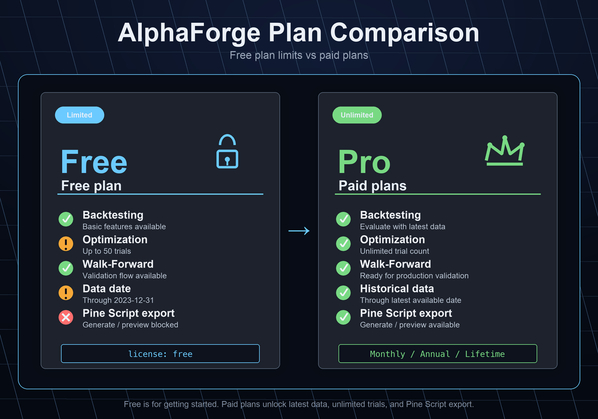
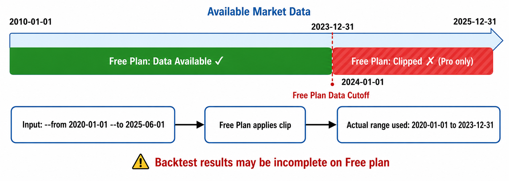

# Trial Limits

AlphaForge operates on two tiers: the **Trial plan** (no Whop registration, indefinite duration) and the **paid plans** (one of **Lifetime / Annual / Monthly** purchased on Whop). The Trial plan is permanently free and caps the maximum data date passed to the evaluation engine (backtest / optimization) at **2023-12-31**, limits the optimization trial count to **50 trials**, and **hard-blocks** Pine Script export. This page summarizes the behavior and how to verify it locally.

!!! note "Targeted commands"
    Limits are applied along the following code paths:

    - **Data acquisition**: `alpha-forge data fetch` / `alpha-forge data update` / `alpha-forge pine generate --with-training-data` / automatic external symbol fetching by strategies (`merge_external_symbols`)
    - **Evaluation engine entry**: `alpha-forge backtest run` / `alpha-forge optimize` (`run` / `grid` / `walk-forward` / `cross-symbol`)
    - **Optimization trial count**: `alpha-forge optimize run` / `cross-symbol` / `portfolio` / `multi-portfolio` / `walk-forward` / `grid`
    - **Pine Script export (hard block)**: `alpha-forge pine generate` / `alpha-forge pine preview` (`alpha-forge pine import` is unaffected)

    Both fetch and evaluation share **2023-12-31** as the cap, and the optimization commands share **50 trials** as the cap. Pine Script export is **fully blocked** on the Trial plan.

## Plan structure

| Plan | Whop registration | Data fetch / evaluation date cap | Optimization trial cap | Pine Script | Notes |
|---|---|---|---|---|---|
| **Trial** | **Not required** | up to 2023-12-31 | up to 50 trials | **Fully blocked** | Usable immediately after install. No time limit. Just run `alpha-forge` |
| **Lifetime** (one-time) | Required (one-time purchase) | None | None | Unlocked | One-time purchase on Whop. Authenticate via `alpha-forge system auth login` |
| **Annual** (yearly) | Required (annual subscription) | None | None | Unlocked | Annual subscription on Whop. Always on the latest version |
| **Monthly** (monthly) | Required (monthly subscription) | None | None | Unlocked | Monthly subscription on Whop. Use it for as long as you need |



For pricing and the latest plan details, refer to the landing page. Lifetime, Annual, and Monthly all unlock the same feature set (latest data, unlimited trials, Pine Script export).

!!! info "About JSON field names"
    The `--json` output still embeds structured notices under the field name `freemium_limit_notices`, and each notice still uses `code` values like `free_tier_*`. This is an implementation-level holdover preserved for backwards compatibility through the v0.3.x line. **Semantically these mean "Trial plan limits".** We may rename the field to `trial_limit_notices` in a future release; if so, it will be announced in the CHANGELOG.

## Behavior

### Trial plan

#### Data acquisition (`alpha-forge data fetch` / `alpha-forge data update` / `alpha-forge pine generate --with-training-data` / external symbol auto-fetch)



- When the `end` argument (explicit or the `today` fallback) is later than 2023-12-31, the fetch is forcibly capped at 2023-12-31.
- `alpha-forge data update` skips items whose latest cached date is 2023-12-31 or later, citing the Trial plan limit.
- Regular CLI output shows a yellow Panel warning along with an upgrade prompt to a paid plan (Lifetime / Annual / Monthly).
- `--json` output includes a structured `freemium_limit_notices` field (`code = "free_tier_data_fetch_clipped"`).

#### Evaluation engine entry (`alpha-forge backtest run` / `alpha-forge optimize`)
- If the input data contains rows newer than 2023-12-31, they are automatically truncated immediately before evaluation. This acts as a safety net when an external CSV is loaded directly (typically a no-op because the fetch path already cuts these off).
- Regular CLI output shows a yellow Panel warning.
- `--json` output uses `code = "free_tier_evaluation_date_clipped"`.

Example `freemium_limit_notices` from the fetch path:
```json
{
  "freemium_limit_notices": [
    {
      "code": "free_tier_data_fetch_clipped",
      "message": "Trial plan only fetches data up to 2023-12-31. Purchase a paid plan (Lifetime / Annual / Monthly) to fetch newer data.",
      "original_value": "2025-06-30",
      "applied_value": "2023-12-31"
    }
  ]
}
```

Example `freemium_limit_notices` from the evaluation path:
```json
{
  "freemium_limit_notices": [
    {
      "code": "free_tier_evaluation_date_clipped",
      "message": "Trial plan only evaluates data up to 2023-12-31. Purchase a paid plan (Lifetime / Annual / Monthly) to evaluate newer data.",
      "original_value": "2025-01-15",
      "applied_value": "2023-12-31"
    }
  ]
}
```

#### Optimization trial count (`alpha-forge optimize` family)
- Every variant of `alpha-forge optimize` (`run` / `cross-symbol` / `portfolio` / `multi-portfolio` / `walk-forward` / `grid`) caps the trial count at **50** on the Trial plan. The run does not abort; it proceeds with the capped value.
- `alpha-forge optimize grid` randomly samples 50 entries (with a fixed seed for reproducibility) when the combinatorial space exceeds 50. The sample is not a head slice, preserving search-space coverage.
- `alpha-forge optimize walk-forward` runs optimization per window internally but consolidates notices into a single CLI message.
- `alpha-forge optimize multi-portfolio` aligns the displayed trial count to the effective value (50).
- `alpha-forge optimize apply` / `history` / `sensitivity` use a different notion of trials and are exempt.
- Regular CLI output shows a yellow Panel warning.
- `--json` output uses `code = "free_tier_optimization_trial_capped"`. For `grid`, the JSON additionally carries `total_trials` (combinatorial total) and `executed_trials` (executed = 50).

Example `freemium_limit_notices` for the optimization trial cap:
```json
{
  "freemium_limit_notices": [
    {
      "code": "free_tier_optimization_trial_capped",
      "message": "Trial plan caps optimization trials at 50. Purchase a paid plan (Lifetime / Annual / Monthly) for unlimited optimization.",
      "original_value": 1000,
      "applied_value": 50
    }
  ]
}
```

#### Pine Script export (`alpha-forge pine generate` / `alpha-forge pine preview`)

- The Trial plan **hard-blocks** Pine Script export. Both commands stop immediately—no file output, no stdout payload.
- The exit code is `1`, accompanied by a red Panel and the purchase URL ([https://alforgelabs.com/en/index.html#pricing](https://alforgelabs.com/en/index.html#pricing)).
- The structured notice `freemium_limit_notices` uses `code = "free_tier_pine_export_blocked"` (`original_value` / `applied_value` are `null`).
- `alpha-forge pine import` is an import-only feature and remains available on the Trial plan.

Example Pine Script hard-block display (Trial plan / CLI):
```text
╭────────── 🔒 Premium-only feature ──────────╮
│ Pine Script export is available for paid    │
│ plans only (Lifetime / Annual / Monthly).   │
│ Upgrade your license to seamlessly run on   │
│ TradingView.                                 │
│ Upgrade: https://alforgelabs.com/en/index.html#pricing │
╰──────────────────────────────────────────────╯
```

Example `freemium_limit_notices` for Pine Script hard block:
```json
{
  "freemium_limit_notices": [
    {
      "code": "free_tier_pine_export_blocked",
      "message": "Pine Script export is available for paid plans only (Lifetime / Annual / Monthly).",
      "original_value": null,
      "applied_value": null
    }
  ]
}
```

### Paid plans (Lifetime / Annual / Monthly)

No limits trigger. The latest data, unlimited optimization trials, and full Pine Script export are all available. The output does not carry `freemium_limit_notices` warnings. Lifetime, Annual, and Monthly all unlock the same feature set.

## How to remove the limits

To remove the Trial limits, purchase one of the **paid plans** (Lifetime, Annual, or Monthly). Manually trimming a CSV down to 2023-12-31 does not help (the evaluation engine still applies the truncation regardless).

- Paid-plan purchase: complete the checkout for Lifetime / Annual / Monthly on the AlphaForge sales page.
- After purchase, run `alpha-forge system auth login` to authenticate via Whop OAuth in your browser.
- If the cache does not reflect your membership, run `alpha-forge system auth login` again.

## Related pages

- [Trust, safety, and limits](../legal/trust-safety-limits.md)
- [Disclaimers](../legal/disclaimers.md)
- [Privacy policy](../legal/privacy.md)
