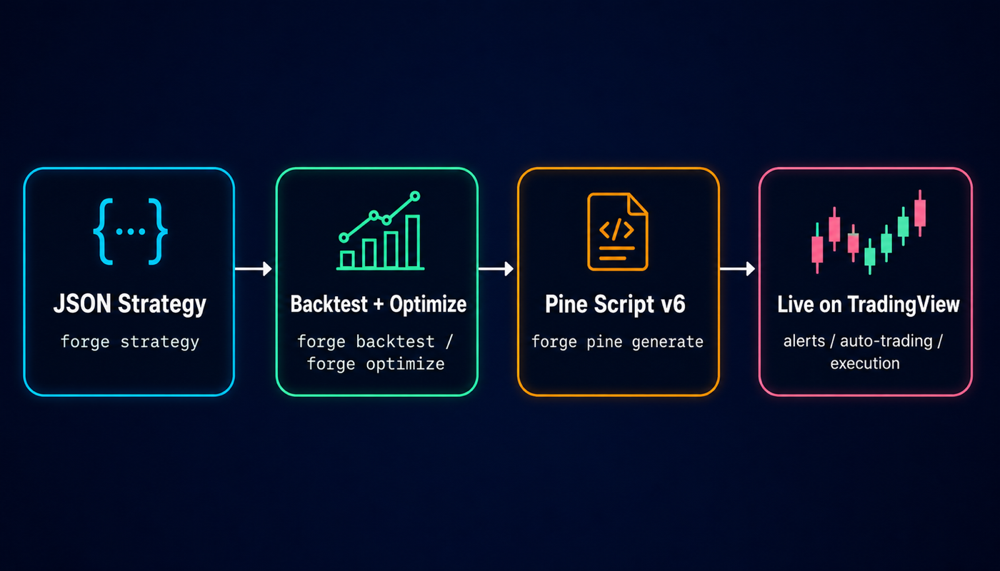
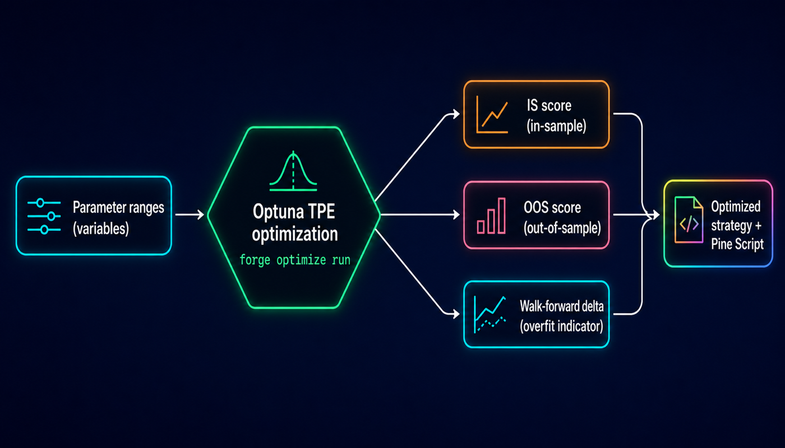

# AlphaForge Documentation

**AlphaForge is a local CLI for quantitative research that turns JSON-defined strategies into Pine Script v6 you can run on TradingView right away.** Optuna TPE optimization plus walk-forward validation guards against overfitting, while strategy data, trade history, and API keys all stay on your own machine — from research to live execution (via TradingView) in a single pipeline.

This documentation walks through installation, strategy development, and integration with AI coding agents.

## Two things that set AlphaForge apart

### 1. JSON strategy → one command → Pine Script v6 → live on TradingView

Write your strategy in JSON, then run `forge pine generate` to compile it into **TradingView Pine Script v6**. Unlike all-in-one Web UI platforms that lock you into a specific server and exchange adapters, AlphaForge lets you reuse your existing TradingView setup for alerts, automation, and chart visualization.

{ loading=lazy }

### 2. Optuna TPE + walk-forward validation to fight overfitting

`forge optimize run` triggers Optuna Bayesian optimization (TPE) out of the box, and `--split` adds walk-forward analysis (WFT) so you can compare in-sample vs out-of-sample performance in one step. This is the optimization and generalization layer that Web-UI-centric platforms typically lack.

{ loading=lazy }

## How AlphaForge compares to other quant tools

| Dimension | **AlphaForge** | All-in-one Web UI platforms | Frameworks (vectorbt / Backtrader / …) |
|---|---|---|---|
| Strategy authoring | **JSON DSL** (easy to version-control) | Python classes inside a UI editor | Python classes |
| TradingView integration | **Auto-generates Pine Script v6** | Typically none | Typically none |
| Built-in optimization | **Optuna TPE + WFT as standard** | Weak or manual | Possible by adding libraries |
| Data & keys location | **Fully local** | Server-resident | Local |
| Runtime form | Binary CLI (a single file, a few hundred MB) | Docker / SaaS stack | Python scripts |
| AI agent integration | Ships Claude Code / Codex skills | Partial | Roll your own |
| Live execution path | **Through TradingView** (broker-neutral) | Direct exchange / broker | Roll your own |

## Who this is for

- **TradingView users** who want trustworthy Pine Script backed by rigorous backtests and optimization
- Engineers and quant researchers looking for an alternative to Backtrader, vectorbt, and similar frameworks
- Developers who want to **version-control strategies as code** (JSON)
- Users who want to combine Claude Code, Codex, and other coding agents with AlphaForge to **autonomously explore and optimize strategies**
- People who want Bayesian optimization and walk-forward validation in a **single command**

## Topics

- [Getting Started](getting-started.md) — Installation, license activation, and your first backtest (10-minute Free-plan walkthrough included)
- [Use Cases by Goal](usecases/index.md) — Pick the most relevant next page based on your role (TradingView user / Python developer / Quant / Auto-trading / AI agent user)
- [CLI Reference](cli-reference/index.md) — Every `forge` command with parameters and output examples
- [Strategy Templates](templates.md) — Combination strategies like HMM × BB × RSI with concrete JSON
- [AI-Driven Strategy Exploration Workflow](guides/ai-exploration-workflow.md) — A how-to for autonomous strategy development with Claude Code / Codex × AlphaForge
- [Legal & Disclaimers](legal/disclaimers.md) — Disclaimers, EULA, and Privacy Policy

## Related links

- [Alforge Labs official site](https://alforgelabs.com/en/index.html) — Product overview and install guide
- [Tutorial](https://alforgelabs.com/en/tutorial-strategy.html) — Build and run a strategy JSON
- [GitHub Discussions](https://github.com/alforge-labs/alforge-labs.github.io/discussions) — Community for questions, ideas, and strategy showcases
- [Support](mailto:support@alforgelabs.com) — Technical inquiries
