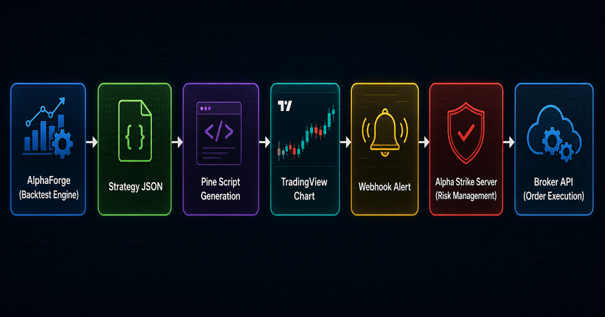
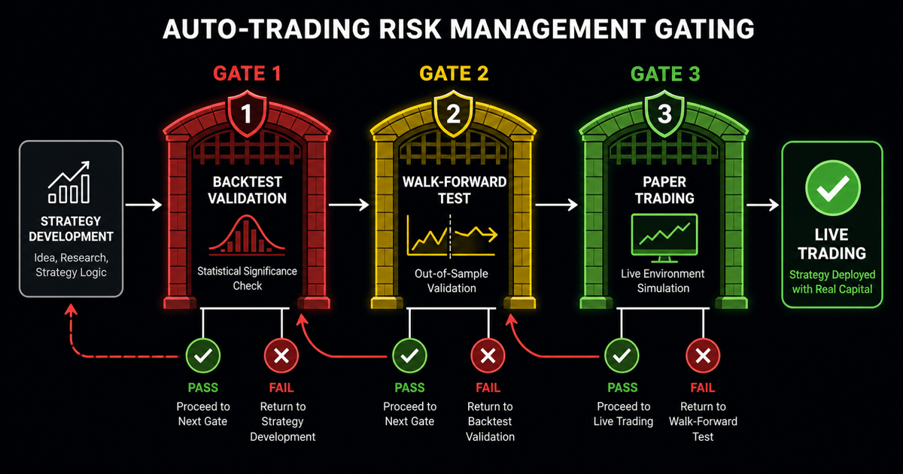

# Automated Trading

For traders who want a complete end-to-end environment — from strategy development all the way to live order execution.

## End-to-End System Architecture



```
AlphaForge (strategy development & validation)
      ↓  Pine Script generation
TradingView (alert triggering)
      ↓  Webhook
Alpha Strike (order processing)
      ↓
Broker API (actual orders)
```

## Role of Each Component

| Component | Role |
|-----------|------|
| **AlphaForge** | Strategy backtesting, optimization, walk-forward validation |
| **Pine Script** | Real-time signal generation in TradingView |
| **TradingView Alert** | Fires webhook when signal triggers |
| **Alpha Strike** | Receives webhook and submits orders to broker API |

## Pre-Production Checklist



!!! warning "Verify Before Going Live"
    - [ ] IS/OOS degradation rate within acceptable range (guideline: below 50%) in walk-forward validation
    - [ ] Maximum drawdown is within your risk tolerance
    - [ ] Risk management settings for margin and position sizing confirmed
    - [ ] Complete a paper trading period with small size first

## Getting Started

```bash
# 1. Finalize strategy via backtesting
alpha-forge backtest run QQQ --strategy my_strategy

# 2. Generate Pine Script
alpha-forge pine generate my_strategy --output my_strategy.pine

# 3. Import to TradingView and configure alerts
# (done in TradingView UI)

# 4. Test order execution via Alpha Strike
# (see Alpha Strike setup guide)
```

## Related Docs

- [TradingView × Alpha Strike Integration Guide](../guides/tradingview-alpha-strike.md) — Connecting webhooks to order execution
- [TradingView × Pine Script Integration Guide](../guides/tradingview-pine-integration.md) — Pine Script generation and adjustment
- [End-to-End Strategy Development Workflow](../guides/end-to-end-workflow.md) — Full pipeline overview
- [Trial Limits](../guides/trial-limits.md) — What's available on the Trial plan
