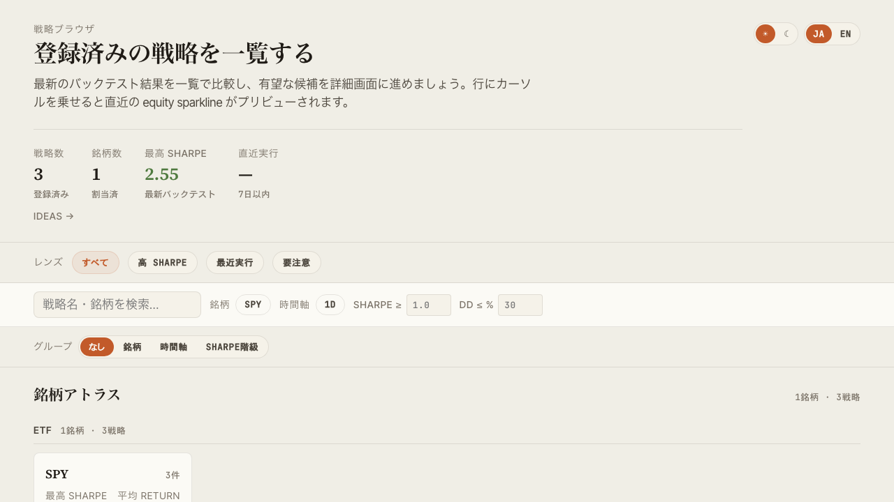
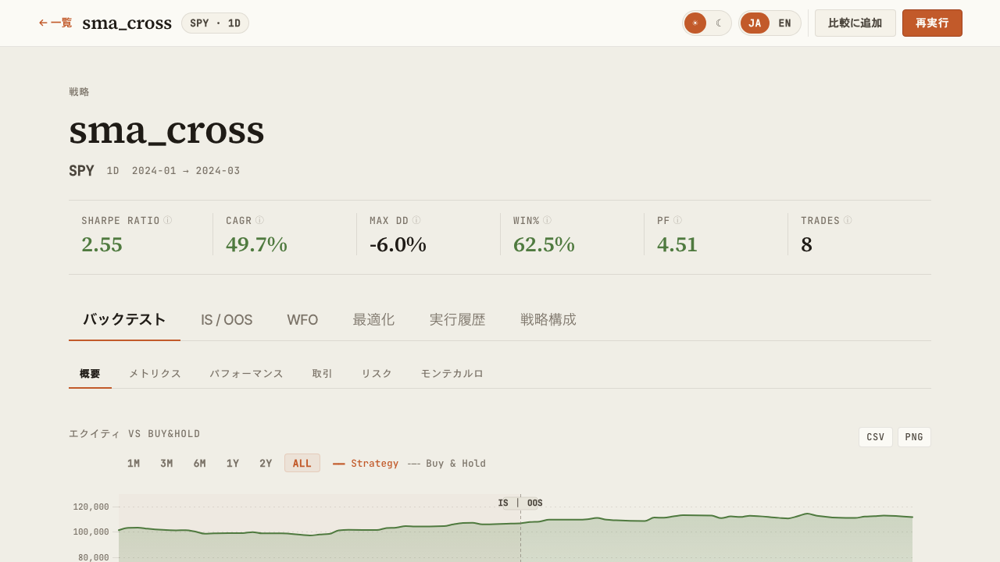
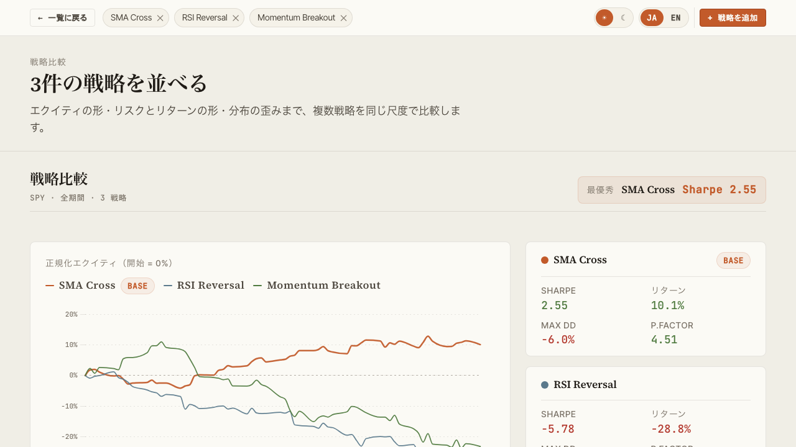
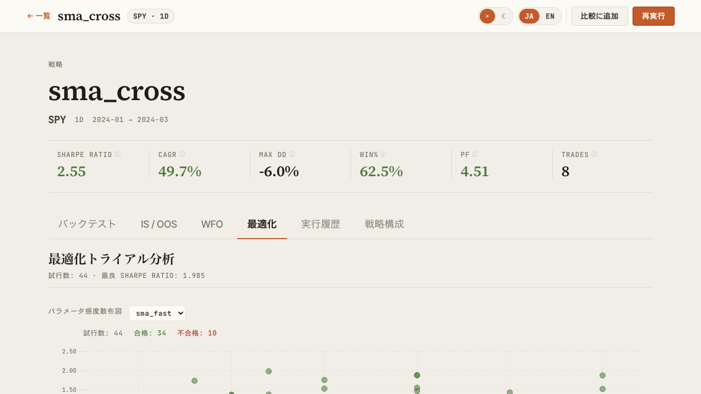
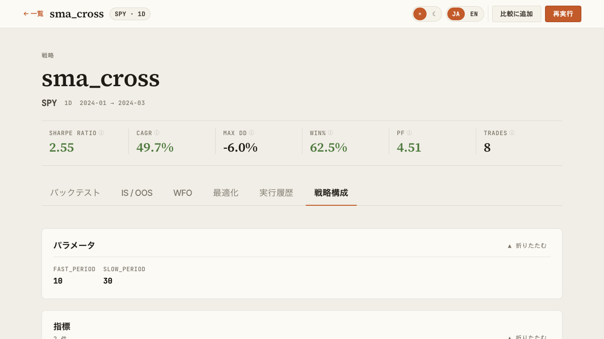

# 機能詳細

`vis serve` で起動するダッシュボードの各画面の役割を解説します。

## Browse 画面

戦略ライブラリの一覧と検索。資産クラス別の Symbol Atlas、プリセットレンズ（Saved Views）、グルーピング可能な Strategy Ledger を備えます。

{ loading=lazy }

主な操作:

- 戦略の絞り込み（Symbol / Timeframe / Sharpe Tier 等）
- Saved Views でよく使うフィルタを保存
- グローバル検索（`Cmd+K` / `Ctrl+K`）でコマンドパレットを開く
- 行クリックでスライドパネル展開、または Detail 画面に遷移

URL クエリで `selectedId` / `compareIds` が同期されるため、特定の戦略選択状態を共有できます。

## Detail 画面

個別戦略のバックテスト結果を多面的に表示します。

{ loading=lazy }

タブ構成:

| タブ | 内容 |
|---|---|
| **バックテスト** | Equity / Drawdown / Underwater / トレード一覧・ベンチマーク指標（alpha / beta / IR / Correlation）・年次リターン |
| **IS / OOS** | In-Sample / Out-of-Sample 別のメトリクス比較 |
| **WFO** | Walk-Forward 合成エクイティカーブとウィンドウ別結果 |
| **最適化** | Grid 最適化結果のヒートマップ・パラメータ vs 指標散布図 |
| **実行履歴** | 過去のバックテストラン一覧 |
| **戦略構成** | 指標・条件式・リスク管理ルールの構造的表示 |

## Compare 画面

複数戦略を横並びで比較します。

{ loading=lazy }

- 指標カード（CAGR / Sharpe / Sortino / MaxDD / Profit Factor 等）の並列表示
- エクイティカーブの重畳描画
- Pearson 相関のヒートマップ（同期間データに正規化）

## Optimize 画面

最適化結果の可視化。

{ loading=lazy }

- Grid サーチのパラメータ空間ヒートマップ
- Walk-Forward Test の合成エクイティカーブ
- 各ウィンドウのパフォーマンス推移

## 戦略構成ビュー

戦略 JSON の構造を可視化します。

{ loading=lazy }

- 使用指標とパラメータ
- エントリー / イグジット条件式
- リスク管理（ストップ・ポジションサイジング）
- ターゲット銘柄・タイムフレーム

## Ideas 画面

探索アイデアの一覧と状態管理。

{ loading=lazy }

- ステータス別フィルタ（pending / exploring / promoted / archived 等）
- タグフィルタ
- 戦略リンクでアイデアと実装の対応を追跡

## 横断機能

### グローバル検索（Cmd+K）

任意の画面で `Cmd+K`（macOS）/ `Ctrl+K`（Windows・Linux）でコマンドパレットを開き、戦略名・画面名から即座に遷移できます。

### テーマ切替

ヘッダー右上のトグルでダーク/ライトモードを切替。設定はブラウザの localStorage に保存されます。

### 言語切替

UI を日本語 / 英語に切替可能。スクリーンショット撮影や国際チームとの共有時に便利です。

### エクスポート

- CSV: 各テーブルから取引履歴・指標一覧をダウンロード
- PNG: チャートをそのまま画像保存
- URL 共有: Browse / Compare の選択状態がクエリ同期されるため、URL コピーで共有可能
