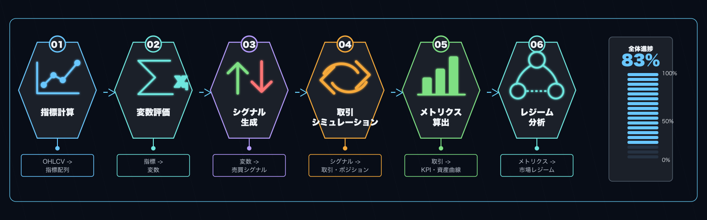

# alpha-forge backtest

戦略のバックテスト実行と関連分析を行うコマンドグループ。バックテスト実行・並列バッチ実行・診断・結果一覧/表示/移行・戦略比較・ポートフォリオ・チャート誘導・モンテカルロ・シグナル件数チェックなどを提供します。

!!! info "サンプル出力について"
    本ページの出力例は `alpha-forge` のソースから読み取ったフォーマットを元にしたサンプルです。実際の数値はデータと環境によって異なります。

## サブコマンド一覧

| コマンド | 説明 |
|---------|------|
| [`alpha-forge backtest run`](#alpha-forge-backtest-run) | バックテストを実行する |
| [`alpha-forge backtest batch`](#alpha-forge-backtest-batch) | 複数の戦略 JSON を並列バックテストする |
| [`alpha-forge backtest diagnose`](#alpha-forge-backtest-diagnose) | 戦略のパフォーマンス問題を自動診断する |
| [`alpha-forge backtest list`](#alpha-forge-backtest-list) | 保存済みのバックテスト結果一覧を表示する |
| [`alpha-forge backtest report`](#alpha-forge-backtest-report) | 保存済みのバックテスト結果を表示する |
| [`alpha-forge backtest migrate`](#alpha-forge-backtest-migrate) | 既存の JSON レポートファイルを DB にインポートする |
| [`alpha-forge backtest compare`](#alpha-forge-backtest-compare) | 複数戦略を同一シンボル・期間で並べてバックテスト比較する |
| [`alpha-forge backtest portfolio`](#alpha-forge-backtest-portfolio) | 複数銘柄のポートフォリオバックテストを実行する |
| [`alpha-forge backtest chart`](#alpha-forge-backtest-chart) | ダッシュボードの URL を表示してチャートへ誘導する |
| [`alpha-forge backtest signal-count`](#alpha-forge-backtest-signal-count) | エントリー条件のシグナル発生件数を高速チェック |
| [`alpha-forge backtest monte-carlo`](#alpha-forge-backtest-monte-carlo) | 既存のバックテスト結果からモンテカルロシミュレーションを実行する |

---

## alpha-forge backtest run

戦略をバックテスト実行する。`--strategy` または `--strategy-file` のいずれかを指定。

### 構文

```bash
alpha-forge backtest run <SYMBOL> (--strategy <ID> | --strategy-file <PATH>) [OPTIONS]
```

### 引数とオプション

| 名前 | 種別 | デフォルト | 説明 |
|------|------|----------|------|
| `SYMBOL` | 引数（必須） | - | 銘柄シンボル（例: SPY、AAPL、CL=F） |
| `--strategy` | オプション | - | 戦略 ID（`--strategy-file` と排他） |
| `--strategy-file` | オプション | - | 戦略 JSON ファイルパス（DB 登録不要） |
| `--json` | フラグ | false | 結果を JSON 形式で標準出力 |
| `--start` | オプション | - | 開始日 `YYYY-MM-DD` |
| `--end` | オプション | - | 終了日 `YYYY-MM-DD` |
| `--split` | フラグ | false | イン/アウトサンプル分割（[詳細](#is-oos-split)） |
| `--benchmark` | オプション | config 値 | ベンチマークシンボル（asset_type に応じた既定値あり、下記参照） |
| `--no-benchmark` | フラグ | false | ベンチマーク比較を完全に無効化（F-304）。FX / コモディティ等で SPY 比較が無意味な場合に使う |
| `--check-criteria` | フラグ | false | 受け入れ基準チェックを行う |
| `--cagr-min` | float | `20.0` | CAGR 最低基準（%、`--check-criteria` と併用） |
| `--sharpe-min` | float | `1.0` | Sharpe 最低基準 |
| `--max-dd` | float | `25.0` | MaxDD 上限（%）。`pre_filter_pass` の判定にも使用 |
| `--win-rate-min` | float | `55.0` | 勝率 最低基準（%） |
| `--pf-min` | float | `1.3` | PF 最低基準 |
| `--min-trades` | int | - | 最低取引数。閾値未満で終了コード 1 |
| `--regime` | フラグ | false | レジーム別統計をコンソールに表示 |

### ベンチマーク選択ロジック（F-304） {#benchmark-selection}

`--benchmark` を省略したときの解決順序：

1. `--benchmark <SYM>` の明示指定（最優先）
2. `forge.yaml` の `report.benchmark_symbol` がデフォルト `SPY` 以外なら採用
3. 戦略 JSON の `asset_type` 別マップで切替（既定 `SPY` のとき）

| `asset_type` | 既定ベンチマーク |
|--------------|----------------|
| `stock` / `etf` | `SPY` |
| `fx` | `DX-Y.NYB`（ドルインデックス） |
| `crypto` | `BTC-USD` |
| `commodity` / `future` | `DBC`（コモディティ ETF） |
| その他 / 未設定 | `SPY`（フォールバック） |

完全にベンチマーク比較を無効化したい場合は `--no-benchmark` を指定。FX / コモディティ戦略で SPY との Alpha / Beta / 相関が無意味なケースなどに有効。

### IS / OOS 分割（`--split`）  {#is-oos-split}

`--split` を指定すると、全データ期間をインサンプル（IS / 訓練）とアウトオブサンプル（OOS / 検証）に分割してバックテストを実行します。IS での過学習を OOS 期間で独立検証できるため、戦略の汎化性能を評価する際に推奨されます。


### 進捗表示（Rich プログレスバー）

実行中、ターミナルが TTY であれば Rich によるプログレスバーが標準エラー出力に表示されます。バックテストは以下の 6 フェーズで進行し、`--split` 指定時は IS / OOS の 2 フローで合計 12 ステップとなります。

| フェーズ | 内容 |
|---|---|
| `指標計算` | テクニカル指標の事前計算 |
| `変数評価` | 中間変数（variables）の評価 |
| `シグナル生成` | エントリー / エグジット条件の評価＋リスクマスクの適用 |
| `シミュレーション` | vectorbt によるポートフォリオ実行 |
| `メトリクス算出` | Sharpe / MDD / 勝率などの計算 |
| `レジーム分析` | レジーム別メトリクス分析（設定が無い場合は即時完了） |



プログレスバーは **stderr** に描画されるため、`--json` を併用しても stdout は純粋な JSON のみが出力されます（`--json` 指定時かつ stderr が TTY のときは進捗バーを stderr に出します）。stderr が非 TTY（CI、パイプ、ファイルへリダイレクト）の場合は自動で抑制されます。これにより `/explore-strategies` などのエージェント経由の `--json` 実行でも、対話端末では進捗が可視化されつつ、CI ではログが汚染されません。

### 出力例（テキスト）

```text
バックテストを実行中: SPY x sma_crossover_v1
✅ バックテスト完了  信号品質スコア: 0.78/1.0
総リターン: +52.30%  CAGR: 5.40%
SR: 0.92  Sortino: 1.15  Calmar: 0.32
MDD: -16.80%  期間: 187日  回復: 92日
PF: 1.74  Win%: 50.0%  avg勝: 4.20%  avg負: -2.40%
取引数: 14  平均保有: 28.5日(28bar)  最大: 65.0日(65bar)  連勝: 4  連敗: 3
勝率CI(90%): 35.2% - 64.8%
```

### 出力例（`--json`）

```json
{
  "total_return_pct": 52.30,
  "cagr_pct": 5.40,
  "sharpe_ratio": 0.92,
  "max_drawdown_pct": -16.80,
  "win_rate_pct": 50.0,
  "profit_factor": 1.74,
  "total_trades": 14,
  "pre_filter_pass": false,
  "pre_filter": { "sharpe_min": 1.0, "max_dd_max": 25.0 },
  "warnings": []
}
```

### 主なエラー

| メッセージ | 原因 | 対処 |
|----------|------|------|
| `--strategy または --strategy-file のいずれかを指定してください` | 両方未指定 | どちらか一方を指定 |
| `--strategy と --strategy-file は同時に指定できません` | 両方指定 | どちらか一方のみに |
| `エラー: 開始日の形式が不正です (YYYY-MM-DD)` | 日付形式不正 | `2024-01-15` 形式で指定 |
| `⚠️ {interval} データが見つかりません。1d データにフォールバックします。` | 戦略の `timeframe` データが未取得 | `alpha-forge data fetch` で対象 interval のデータを取得 |

---

## alpha-forge backtest batch

複数の戦略 JSON を並列にバックテストする。フィルタ条件（Sharpe / MaxDD）を満たした戦略を「合格」として表示。

### 構文

```bash
alpha-forge backtest batch <SYMBOL> (--strategy-file <FILE> ... | --strategy-dir <DIR>) [OPTIONS]
```

### 引数とオプション

| 名前 | 種別 | デフォルト | 説明 |
|------|------|----------|------|
| `SYMBOL` | 引数（必須） | - | 銘柄シンボル |
| `--strategy-file` | 複数指定可 | - | 戦略 JSON ファイルパス |
| `--strategy-dir` | オプション | - | 戦略 JSON を含むディレクトリ |
| `--pattern` | オプション | `*.json` | `--strategy-dir` 使用時のファイルパターン |
| `--workers` | int | `3` | 並列実行数 |
| `--sharpe-min` | float | `1.0` | `pre_filter_pass` 判定の Sharpe 下限 |
| `--max-dd` | float | `25.0` | `pre_filter_pass` 判定の MaxDD 上限 |
| `--json` | フラグ | false | 結果を JSON 配列で標準出力 |

### 出力例

```text
バッチバックテスト開始: SPY × 5戦略 (workers=3)
  ✅ spy_sma_v1: Sharpe=1.32  MaxDD=-12.4%  CAGR=8.2%  trades=18
  ❌ spy_rsi_v1: Sharpe=0.61  MaxDD=-22.1%  CAGR=4.1%  trades=24
  ✅ spy_macd_v1: Sharpe=1.18  MaxDD=-15.6%  CAGR=7.0%  trades=15
  🔴 spy_broken_v1: ERROR - 戦略 JSON 読み込み失敗

合格戦略: 2/4件
  ✅ spy_sma_v1: Sharpe=1.32  MaxDD=-12.4%
  ✅ spy_macd_v1: Sharpe=1.18  MaxDD=-15.6%
```

### 主なエラー

| メッセージ | 原因 | 対処 |
|----------|------|------|
| `--strategy-file か --strategy-dir のいずれかを指定してください` | 両方未指定 | どちらか一方を指定 |
| `🔴 <id>: ERROR - <理由>` | 個別戦略のロード/実行失敗 | エラーメッセージに従い修正 |

---

## alpha-forge backtest diagnose

戦略のパフォーマンス問題（過学習・低取引数・極端な勝敗バランス等）を自動診断する。

### 構文

```bash
alpha-forge backtest diagnose <SYMBOL> --strategy <ID> [OPTIONS]
```

### 引数とオプション

| 名前 | 種別 | デフォルト | 説明 |
|------|------|----------|------|
| `SYMBOL` | 引数（必須） | - | 銘柄シンボル |
| `--strategy` | 必須 | - | 戦略 ID |
| `--start` | オプション | - | 開始日 `YYYY-MM-DD` |
| `--end` | オプション | - | 終了日 `YYYY-MM-DD` |
| `--split` | フラグ | true | イン/アウトサンプル分割（デフォルト ON） |
| `--json` | フラグ | false | 結果を JSON で出力 |

### 出力例

戦略診断結果（推定される問題と推奨アクション）が表示されます。詳細は `alpha-forge backtest diagnose --help` と内部の `StrategyDiagnostics` ロジックを参照。

---

## alpha-forge backtest list

保存済みのバックテスト結果（DB）を一覧表示する。

### 構文

```bash
alpha-forge backtest list [OPTIONS]
```

### オプション

| 名前 | 種別 | デフォルト | 説明 |
|------|------|----------|------|
| `--strategy` | オプション | - | 戦略 ID で絞り込む |
| `--symbol` | オプション | - | シンボルで絞り込む |
| `--sort` | オプション | `run_at` | ソートキー（`sharpe_ratio` / `total_return_pct` / `cagr_pct` / `max_drawdown_pct` / `win_rate_pct` / `profit_factor` / `run_at`） |
| `--limit` | int | `20` | 表示件数 |
| `--best` | フラグ | false | グループ別のベストレコードのみ表示 |
| `--by` | choice | `strategy` | `--best` のグループキー（`strategy` / `symbol`） |

### 出力例

```text
バックテスト結果 (5件)
run_id                               strategy_id                   symbol         Return  Sharpe      MDD  取引数
──────────────────────────────────────────────────────────────────────────────────────────────────────────────
spy_sma_v1_20260415_103021           spy_sma_v1                    SPY            +52.3%    0.92   -16.8%      14
spy_macd_v1_20260414_181522          spy_macd_v1                   SPY            +38.1%    1.18   -15.6%      12
...
```

### 主なメッセージ

| メッセージ | 原因 |
|----------|------|
| `保存済みのバックテスト結果がありません。` | DB が空 |

---

## alpha-forge backtest report

保存済みのバックテスト結果を詳細表示する。

### 構文

```bash
alpha-forge backtest report <RESULT_ID> [OPTIONS]
```

### 引数とオプション

| 名前 | 種別 | デフォルト | 説明 |
|------|------|----------|------|
| `RESULT_ID` | 引数（必須） | - | DB モード: `strategy_id` または `run_id`。ファイルモード: `result_id` |
| `--json` | フラグ | false | JSON 全体を出力 |
| `--symbol` | オプション | - | DB モード: シンボルで絞り込む |

`run_id` として直接ヒットしない場合、`strategy_id` の最新ランへフォールバックします。

### 出力例

```text
=== spy_sma_v1 / SPY (2026-04-15T10:30:21) ===
総リターン: 52.30%  CAGR: 5.40%
SR: 0.92  Sortino: 1.15  Calmar: 0.32
MDD: -16.80%  PF: 1.74  Win%: 50.0%
取引数: 14  平均保有: 28.5日(28bar)  最大: 65.0日(65bar)
トレードログ: 14件 (--json で全体を確認可能)
```

### 主なエラー

| メッセージ | 原因 | 対処 |
|----------|------|------|
| `エラー: 結果が見つかりません - <id>` | `run_id` も `strategy_id` も該当なし | `alpha-forge backtest list` で確認 |

---

## alpha-forge backtest migrate

既存の `*_report.json` ファイルを DB にインポートする。

### 構文

```bash
alpha-forge backtest migrate [--dry-run] [--force]
```

### オプション

| 名前 | 種別 | デフォルト | 説明 |
|------|------|----------|------|
| `--dry-run` | フラグ | false | DB への書き込みを行わず確認のみ |
| `--force` | フラグ | false | `run_id` 重複時も上書き |

`run_id` は `migrated_<file_stem>` 形式で生成されます。

### 出力例

```text
  ✅ migrated_spy_sma_v1
  ♻️  migrated_spy_macd_v1 (上書き)
  スキップ (重複): migrated_spy_rsi_v1

完了: 2 件インポート、1 件スキップ
```

### 主なメッセージ

| メッセージ | 原因 |
|----------|------|
| `レポートディレクトリが存在しません。` | `config.report.output_path` が未作成 |
| `インポート対象の JSON ファイルが見つかりません。` | `*_report.json` が無い |

---

## alpha-forge backtest compare

複数戦略を同一シンボル・同一期間で比較する。

### 構文

```bash
alpha-forge backtest compare <STRATEGY1> [STRATEGY2 ...] --symbol <SYM> [--symbol <SYM> ...] [OPTIONS]
```

### 引数とオプション

| 名前 | 種別 | デフォルト | 説明 |
|------|------|----------|------|
| `STRATEGIES` | 引数（必須、複数） | - | 比較対象の戦略 ID（スペース区切り） |
| `--symbol` / `-s` | 複数指定可（必須） | - | 比較対象のシンボル |
| `--start` | オプション | - | 開始日 `YYYY-MM-DD` |
| `--end` | オプション | - | 終了日 `YYYY-MM-DD` |
| `--benchmark` | オプション | config 値 | ベンチマークシンボル |
| `--json` | フラグ | false | 結果を JSON 形式で出力 |

### 出力例（テキスト表）

```text
=== 戦略比較: SPY (2020-01-01 〜 現在) (3 戦略) ===

戦略             Return    CAGR  Sharpe     MDD   Win%      PF  取引数
spy_sma_v1     +52.3%   5.40    0.92  -16.8%   50%   1.74      14
spy_macd_v1    +38.1%   4.20    1.18  -15.6%   58%   1.92      12
spy_rsi_v1     +12.4%   1.50    0.45  -22.1%   42%   1.08      24
```

### 主なエラー

| メッセージ | 原因 | 対処 |
|----------|------|------|
| `エラー: <SYM> のデータが見つかりません` | データ未取得 | `alpha-forge data fetch <SYM>` |
| `警告: 戦略 '<id>' の読み込みに失敗しました` | 戦略 ID 不正 / JSON 不正 | `alpha-forge strategy list` で確認、`alpha-forge strategy validate` |

---

## alpha-forge backtest portfolio

複数銘柄のポートフォリオバックテストを実行する。

### 構文

```bash
alpha-forge backtest portfolio <SYM1> [SYM2 ...] --strategy <ID> [OPTIONS]
```

### 引数とオプション

| 名前 | 種別 | デフォルト | 説明 |
|------|------|----------|------|
| `SYMBOLS` | 引数（必須、複数） | - | 銘柄シンボルのスペース区切りリスト |
| `--strategy` | 必須 | - | 戦略 ID |
| `--allocation` | choice | `equal` | 資金配分方式（`equal` / `risk_parity` / `custom`） |
| `--weights` | オプション | - | カスタムウェイト `AAPL=0.4,MSFT=0.6`（`--allocation custom` 用） |
| `--json` | フラグ | false | 結果を JSON 形式で出力 |
| `--save` | フラグ | false | 結果をファイルに保存 |

### 出力例

```text
ポートフォリオバックテストを実行中: ['AAPL', 'MSFT', 'GOOGL'] (equal 配分)

=== ポートフォリオ結果: tech_basket_v1 (equal) ===
銘柄: AAPL, MSFT, GOOGL
配分: AAPL=33.3%, MSFT=33.3%, GOOGL=33.3%
総リターン: 78.40%  CAGR: 12.30%
SR: 1.45  Sortino: 1.85  Calmar: 0.62
MDD: -19.80%  CVaR(95%): -3.20%
分散効果比率: 1.085

銘柄         ウェイト    Return     SR      MDD
──────────────────────────────────────────────────
AAPL          33.3%   +85.2%   1.52  -22.1%
MSFT          33.3%   +72.0%   1.41  -18.4%
GOOGL         33.3%   +78.0%   1.38  -19.5%
```

### 主なエラー

| メッセージ | 原因 | 対処 |
|----------|------|------|
| `エラー: --weights の形式が不正です。例: AAPL=0.4,MSFT=0.6` | 形式違反 | カンマ・等号で区切る |
| `エラー: <SYM> のデータが見つかりません` | データ未取得 | `alpha-forge data fetch` |
| `エラー: バックテストに失敗しました - <理由>` | エンジン例外 | エラーメッセージに従い対処 |

---

## alpha-forge backtest chart

ダッシュボード上のチャート URL を表示し、必要なら開く。

### 構文

```bash
alpha-forge backtest chart [RESULT_ID] [--open] [--compare <ID> ...]
```

### 引数とオプション

| 名前 | 種別 | デフォルト | 説明 |
|------|------|----------|------|
| `RESULT_ID` | 引数（任意） | - | `run_id` または `strategy_id` |
| `--open` | フラグ | false | URL をブラウザで開く |
| `--compare` | 複数指定可 | - | 比較対象戦略（`strategy_id:run_id` 形式で特定ラン指定可） |

### 出力例

```text
📊 チャートを表示するには `vis serve`（alpha-visualizer）を起動してください:
   http://localhost:8000/?run_id=spy_sma_v1_20260415_103021
```

複数戦略比較時:

```text
📊 チャートを表示するには `vis serve`（alpha-visualizer）を起動してください:
   http://localhost:8000/?ids=sma_crossover,rsi_reversion
```

このコマンド自体は URL を表示するだけです。チャート閲覧には `vis serve`（[alpha-visualizer](https://github.com/ysakae/alpha-visualizer)）を起動する必要があります。

---

## alpha-forge backtest signal-count

vectorbt をスキップし、エントリー条件のシグナル発生件数だけを高速で集計する。条件式の妥当性確認用。

### 構文

```bash
alpha-forge backtest signal-count <SYMBOL> --strategy <ID> [--period 5y] [--json]
```

### 引数とオプション

| 名前 | 種別 | デフォルト | 説明 |
|------|------|----------|------|
| `SYMBOL` | 引数（必須） | - | 銘柄シンボル |
| `--strategy` | 必須 | - | 戦略 ID |
| `--period` | オプション | `5y` | データ期間（例: `5y`, `1y`, `6m`, `30d`） |
| `--json` | フラグ | false | JSON 形式で出力 |

### 出力例

```text
シグナル件数チェック: spy_sma_v1 × SPY (5y)
総バー数: 1258 日

エントリー条件 (long AND):
  sma_fast > sma_slow              :   687 日 ( 54.6%)
  ──────────────────────────────────
  全条件 AND                       :   687 日 ( 54.6%)

レジーム別シグナル件数:
  state=0    :   312 日 ( 24.8%)
  state=1    :   375 日 ( 29.8%)
```

シグナルが 0 件の場合 `⚠️  シグナルが発生していません` の警告が表示されます。

!!! note "外部シンボルを参照する戦略について"
    `^VIX` や `USDJPY=X` などの外部シンボルを参照する戦略でも、`alpha-forge backtest run` / `alpha-forge optimize run` と同等の `merge_external_symbols()` 処理を内部で適用してからシグナルを集計します。これにより、外部シンボル戦略で `entry_signal_days: 0` が誤って返るバグ（#266）は解消されています。

### 主なエラー

| メッセージ | 原因 | 対処 |
|----------|------|------|
| `期間の形式が不正です: <value>` | `--period` 形式不正 | `5y`, `6m`, `30d` 形式で指定 |
| `エラー: <SYM> のデータが空です（期間: <p>）` | データ未取得 | `alpha-forge data fetch <SYM>` |

---

## alpha-forge backtest monte-carlo

既存のバックテスト結果のトレード履歴をリサンプリングし、モンテカルロシミュレーションで破産確率や最悪ケースを評価する。

### 構文

```bash
alpha-forge backtest monte-carlo <RESULT_ID> [--simulations 1000] [--json]
```

### 引数とオプション

| 名前 | 種別 | デフォルト | 説明 |
|------|------|----------|------|
| `RESULT_ID` | 引数（必須） | - | `run_id` または `strategy_id` |
| `--simulations` | int | `1000` | シミュレーション試行回数 |
| `--json` | フラグ | false | 結果を JSON 形式で出力 |

### 出力例

```text
モンテカルロシミュレーションを実行中: spy_sma_v1_20260415_103021 (1000回試行)
✅ シミュレーション完了
初期資産: 10000
平均最終資産: 14820
中央最終資産: 14250
最悪最終資産: 7340
最高最終資産: 23150
平均最大MDD: 18.40%
95%最大MDD:  31.20%
破産確率:    0.40%
```

### 主なエラー

| メッセージ | 原因 | 対処 |
|----------|------|------|
| `エラー: 結果が見つかりません - <id>` | DB に該当なし | `alpha-forge backtest list` で確認 |
| `エラー: 有効なトレード履歴がありません（最低10件必要です）` | トレード件数 < 10 | より長い期間または別戦略でバックテスト |
| `エラー: シミュレーションに失敗しました - <理由>` | 計算過程で例外 | エラーメッセージに従い対処 |

---

## 共通の挙動

- **DB / ファイルモード**: `list` `report` `migrate` `monte-carlo` は `config.report.output_path / config.report.db_filename`（SQLite）を主ストアとします。
- **`FORGE_CONFIG`**: 戦略・データ・結果の保管場所は環境変数 `FORGE_CONFIG` が指す `forge.yaml` で決まります。
- **終了コード**: 通常 `0`、`--min-trades` 違反時は `1`、引数エラーは `click.UsageError`、致命的エラーは標準エラー出力に出して終了。
- **Trial プラン制限**: Trial プランでは入力データの上限日が `2023-12-31` に強制されます。詳細は [Trial 制限](../guides/trial-limits.md) を参照。

---

<!-- 同期元: `alpha-forge/src/alpha_forge/commands/backtest.py` の Click decorator から抽出。alpha-forge 側で引数追加・変更があった場合、本ページも追従更新が必要。 -->
