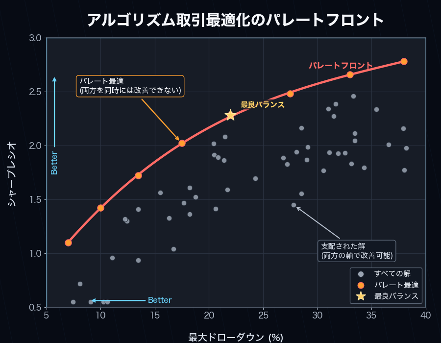
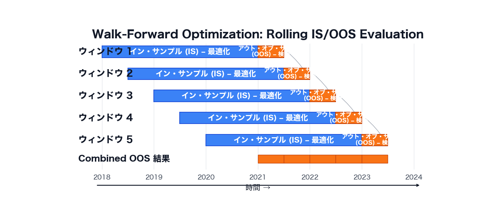

# alpha-forge optimize

ベイズ最適化（Optuna）・グリッドサーチ・ウォークフォワード最適化など、戦略パラメータの探索と感度分析を行うコマンドグループ。

!!! info "サンプル出力について"
    本ページの出力例は `alpha-forge` のソースから読み取ったフォーマットを元にしたサンプルです。実際の数値はデータと環境によって異なります。

## サブコマンド一覧

| コマンド | 説明 |
|---------|------|
| [`alpha-forge optimize run`](#alpha-forge-optimize-run) | Optuna によるパラメータ最適化を実行する |
| [`alpha-forge optimize cross-symbol`](#alpha-forge-optimize-cross-symbol) | 複数銘柄に対するクロスシンボル最適化を実行する |
| [`alpha-forge optimize portfolio`](#alpha-forge-optimize-portfolio) | ポートフォリオの最適配分ウェイトを Optuna で探索する |
| [`alpha-forge optimize multi-portfolio`](#alpha-forge-optimize-multi-portfolio) | 銘柄別戦略のウェイトを Optuna で最適化する |
| [`alpha-forge optimize walk-forward`](#alpha-forge-optimize-walk-forward) | ウォークフォワード最適化を実行する |
| [`alpha-forge optimize apply`](#alpha-forge-optimize-apply) | 最適化結果を戦略に適用して保存する |
| [`alpha-forge optimize sensitivity`](#alpha-forge-optimize-sensitivity) | 最適化済みパラメータの感度分析を行う |
| [`alpha-forge optimize history`](#alpha-forge-optimize-history) | 過去の最適化結果をスコアボード形式で一覧表示 |
| [`alpha-forge optimize grid`](#alpha-forge-optimize-grid) | `optimizer_config.param_ranges` の網羅 Grid Search |

---

## alpha-forge optimize run

Optuna による単一銘柄のパラメータ最適化（TPE）。`--objective` を 2 つ以上指定すると NSGAII による多目的最適化に切り替わります。

### 構文

```bash
alpha-forge optimize run <SYMBOL> --strategy <ID> [OPTIONS]
```

### 引数とオプション

| 名前 | 種別 | デフォルト | 説明 |
|------|------|----------|------|
| `SYMBOL` | 引数（必須） | - | 銘柄シンボル |
| `--strategy` | 必須 | - | 戦略名 |
| `--metric` | オプション | `sharpe_ratio` | 最適化対象の指標 |
| `--json` | フラグ | false | 結果を JSON 形式で標準出力 |
| `--save` | フラグ | false | 結果をファイルに保存 |
| `--min-trades` | int | - | 最低取引数制約を上書き（`optimizer_config` / 設定より優先） |
| `--trials` | int | - | Optuna トライアル数を上書き |
| `--apply` | フラグ | false | 最適化後にベストパラメータを `<strategy_id>_optimized` という新しい戦略 ID で保存（**元戦略は変更されない**） |
| `--yes` / `-y` | フラグ | false | `<strategy_id>_optimized` が既存の場合の上書き確認プロンプトをスキップ |
| `--start` | オプション | - | 最適化期間の開始日 `YYYY-MM-DD` |
| `--end` | オプション | - | 最適化期間の終了日 `YYYY-MM-DD` |
| `--max-drawdown` | float | - | 最大ドローダウン制約（%）。超過トライアルをペナルティ除外 |
| `--objective` | 複数指定可 | - | 多目的最適化の目標（例: `sharpe_ratio_maximize`、`max_drawdown_pct_minimize`） |

`--max-drawdown` と `--objective` は同時指定できません。

### リアルタイムダッシュボード

実行中はターミナルにライブダッシュボードが表示されます。単目的（`--metric` のみ）では Current/BEST のスコアボードが、多目的（`--objective` を 2 つ以上）では専用の Pareto Front ダッシュボードが、トライアル毎にリアルタイム更新されます。

- **多目的時の表示要素**: ヘッダー（戦略・銘柄・目的関数の方向）、プログレスバー、Current Trial（各目的関数の現在値）、Pareto Front テーブル（上位 10 件 + 全件数 `Top 10 / Total = N`）
- `--json` を指定するとダッシュボードは表示されず JSON のみ出力されます。



### サンプル出力（テキスト）

```text
✅ 最適化完了
ベストスコア (sharpe_ratio): 1.32
ベストパラメータ: {'fast_period': 12, 'slow_period': 50}
DB 保存: run_id=opt_20260415_103021
✅ 最適化結果を保存しました: data/results/optimize_my_v1_20260415_103021.json
```

`--apply` 指定時（`my_v1_optimized` が未存在の場合は確認なしで作成）：

```text
✅ ベストパラメータを 'my_v1_optimized' として保存しました（元戦略 'my_v1' は変更されません）
```

`my_v1_optimized` が既存の場合は上書き確認プロンプトが表示されます：

```text
⚠️  'my_v1_optimized' は既に存在します。上書きしますか？ [y/N]: y
✅ ベストパラメータを 'my_v1_optimized' として保存しました（元戦略 'my_v1' は変更されません）
```

### サンプル出力（`--json`）

```json
{
  "best_metric": 1.32,
  "best_params": { "fast_period": 12, "slow_period": 50 }
}
```

### 主なエラー

| メッセージ | 原因 | 対処 |
|----------|------|------|
| `--start の形式が不正です (YYYY-MM-DD)` | 日付形式不正 | `2024-01-15` 形式で指定 |
| `--start <date> 以降のデータが存在しません` | データ不足 | `alpha-forge data fetch <SYM>` でデータ拡張 |
| `--max-drawdown と --objective は同時に指定できません。` | 両方指定 | どちらか一方を選択 |
| `キャンセルしました。` | `<strategy_id>_optimized` 既存上書き確認で No | `--yes` を付けるか、改めて承認 |

---

## alpha-forge optimize cross-symbol

複数銘柄で同じ戦略を最適化し、銘柄横断で頑健なパラメータを探索する（集計方式: 平均 / 中央値 / 最小）。

### 構文

```bash
alpha-forge optimize cross-symbol <SYM1> [SYM2 ...] --strategy <ID> [OPTIONS]
```

### 引数とオプション

| 名前 | 種別 | デフォルト | 説明 |
|------|------|----------|------|
| `SYMBOLS` | 引数（必須、複数） | - | 銘柄シンボルのスペース区切り |
| `--strategy` | 必須 | - | 戦略名 |
| `--metric` | オプション | `sharpe_ratio` | 最適化対象の指標 |
| `--aggregation` | オプション | `mean` | スコア集計方法（`mean` / `median` / `min`） |
| `--json` | フラグ | false | 結果を JSON 形式で標準出力 |
| `--save` | フラグ | false | 結果をファイルに保存 |

### サンプル出力

```text
クロスシンボル最適化を実行中: SPY, QQQ, IWM x sma_v1 (target=sharpe_ratio, agg=mean)
✅ クロスシンボル最適化完了
総合スコア (mean of sharpe_ratio): 1.20
ベストパラメータ: {'fast_period': 15, 'slow_period': 60}
個別銘柄スコア:
  - SPY: 1.32
  - QQQ: 1.18
  - IWM: 1.10
```

### 主なエラー

| メッセージ | 原因 | 対処 |
|----------|------|------|
| `警告: <SYM> のデータ読み込みに失敗しました` | データ未取得 | `alpha-forge data fetch <SYM>` |
| `エラー: 有効なデータを持つ銘柄がありません` | 全銘柄データ未取得 | データ取得後に再実行 |

---

## alpha-forge optimize portfolio

単一戦略を複数銘柄に適用したときの **配分ウェイト** を Optuna で最適化する。

### 構文

```bash
alpha-forge optimize portfolio <SYM1> [SYM2 ...] --strategy <ID> [OPTIONS]
```

### 引数とオプション

| 名前 | 種別 | デフォルト | 説明 |
|------|------|----------|------|
| `SYMBOLS` | 引数（必須、複数） | - | 銘柄シンボルのスペース区切り |
| `--strategy` | 必須 | - | 戦略名 |
| `--metric` | オプション | `sharpe_ratio` | 最適化対象の指標 |
| `--json` | フラグ | false | 結果を JSON 形式で標準出力 |
| `--save` | フラグ | false | 結果をファイルに保存 |

### サンプル出力

```text
ポートフォリオウェイト最適化を実行中: AAPL, MSFT, GOOGL x tech_basket_v1 (target=sharpe_ratio)
✅ ウェイト最適化完了
ベストスコア (sharpe_ratio): 1.45
最適ウェイト:
  - AAPL: 38.0%
  - MSFT: 42.0%
  - GOOGL: 20.0%
```

### サンプル出力（`--json`）

```json
{
  "best_weights": { "AAPL": 0.38, "MSFT": 0.42, "GOOGL": 0.20 },
  "best_metric": 1.45,
  "portfolio_metrics": { "cagr_pct": 14.2, "sharpe_ratio": 1.45, "max_drawdown_pct": -18.0 }
}
```

---

## alpha-forge optimize multi-portfolio

各銘柄に **個別の戦略** を割り当て、配分ウェイトを Optuna で最適化する。

### 構文

```bash
alpha-forge optimize multi-portfolio <SYMBOL:STRATEGY> [<SYMBOL:STRATEGY> ...] [OPTIONS]
```

### 引数とオプション

| 名前 | 種別 | デフォルト | 説明 |
|------|------|----------|------|
| `SYMBOL_STRATEGY_PAIRS` | 引数（必須、複数） | - | `SYMBOL:STRATEGY_NAME` 形式のペア |
| `--metric` | オプション | `cagr_pct` | 最適化対象の指標 |
| `--trials` | int | `200` | Optuna トライアル数 |
| `--save` | フラグ | false | 結果を JSON ファイルに保存 |
| `--json` | フラグ | false | 結果を JSON 形式で標準出力 |

### サンプル出力

```text
マルチポートフォリオウェイト最適化を実行中: GC=F, NVDA (target=cagr_pct, trials=200)
✅ マルチポートフォリオ最適化完了
ベストスコア (cagr_pct): 18.5234
最適ウェイト:
  - GC=F: 55.0%
  - NVDA: 45.0%
ポートフォリオメトリクス:
  CAGR:         18.52%
  Sharpe:       1.38
  Max Drawdown: -22.10%
```

### 主なエラー

| メッセージ | 原因 | 対処 |
|----------|------|------|
| `引数の形式が不正です: '<pair>'` | `SYMBOL:STRATEGY_NAME` 形式違反 | `GC=F:gc_optimized` のようにコロン区切り |
| `有効なシンボル・戦略ペアが1つも存在しません。` | 全ペアでロード失敗 | データ取得・戦略 ID を確認 |

---

## alpha-forge optimize walk-forward

時系列を `--windows` 個の連続ウィンドウに分割し、各ウィンドウで IS（イン・サンプル）最適化 → OOS（アウト・オブ・サンプル）評価を繰り返して、過学習耐性を計測する。



### 構文

```bash
alpha-forge optimize walk-forward <SYMBOL> --strategy <ID> [OPTIONS]
```

### 引数とオプション

| 名前 | 種別 | デフォルト | 説明 |
|------|------|----------|------|
| `SYMBOL` | 引数（必須） | - | 銘柄シンボル |
| `--strategy` | 必須 | - | 戦略名 |
| `--metric` | オプション | `sharpe_ratio` | 最適化対象の指標 |
| `--windows` | int | `5` | ウィンドウ数 |
| `--min-window-trades` | int | - | IS 期間の取引数が N 件未満のウィンドウをスキップして平均から除外する。シグナル発生回数が少ない戦略でウィンドウ全体が `-∞` に陥るのを防ぐ |
| `--json` | フラグ | false | 結果を JSON 形式で標準出力 |

### IS 取引不足の早期警告と `[WARNING]` マーク

すべての IS（イン・サンプル）ウィンドウで `in_sample_metric` が `-∞` になった場合、stderr に「シグナル不足」を示す早期警告が表示されます。また、IS 有効ウィンドウ数が全体の過半数を下回ると、サマリ行に `[WARNING]` マークが付与され、結果の信頼性が低い可能性を強調します。

`--min-window-trades N` を指定すると、IS 期間の取引数が N 件未満のウィンドウをスキップして平均から除外できます。

### 進捗表示（Rich プログレスバー）

`alpha-forge optimize walk-forward` の実行中は、ウォークフォワード専用の 2 段プログレスバーが表示されます。

- **外側バー**: ウィンドウ全体の進捗（`<完了ウィンドウ>/<n_windows>`）
- **内側バー**: 現ウィンドウのインサンプル Optuna 最適化の trial 進捗

各ウィンドウ完了ごとに Scoreboard テーブルへ IS / OOS スコアと OOS 取引数が追記され、ベストウィンドウ（OOS 最高）は緑色で強調表示されます。OOS 取引数が 0 件、または OOS スコアが NaN/±inf のウィンドウは `FAILED` 行として赤色化され、`Failures` カウンタに加算されます。

```text
╭─ AlphaForge Walk-Forward ─────────────────────────────────────────╮
│ Strategy: sma_v1  Symbol: SPY  Metric: sharpe_ratio (↑)            │
│ Windows: 5  In-sample: 70%                                         │
╰────────────────────────────────────────────────────────────────────╯
Windows       ████████████████░░░░░░░░░░  3/5  60%  0:01:24 < 0:00:55
  └ #4 IS trial ████████████░░░░░░░░░░░░ 12/30  40%  0:00:18 < 0:00:32
╭─ Windows ─────────────────────────────────────────────────────────╮
│ Win  OOS start   IS         OOS         Trades                     │
│   1  2024-04-01  1.4231     0.8912      41                         │
│   2  2024-07-01  1.2104     1.0307✓     37                         │
│   3  2024-10-01  0.9834     -0.1521     28                         │
╰────────────────────────────────────────────────────────────────────╯
Mean OOS: 0.5899   Best window: #2 (1.0307)   Failures: 0
```

プログレスバーとダッシュボードはすべて **stderr** に描画されます。`--json` を指定しても stderr が TTY であれば進捗が表示され、stdout の純粋な JSON 出力は維持されます。stderr が非 TTY（CI、パイプ、ファイルへリダイレクト）の場合は自動で抑制されます。CI で確実に静音化したい場合はこの挙動が利用できます。

### サンプル出力

```text
ウォークフォワード最適化を実行中: SPY x sma_v1 (5ウィンドウ)
✅ ウォークフォワード完了
Window     IS Score  OOS Score  ベストパラメータ
-----------------------------------------------------------------
1            1.4523     1.1024  {'fast': 10, 'slow': 50}
2            1.6210     0.8932  {'fast': 12, 'slow': 55}
⚠️  Window 3 スキップ: OOS 期間のトレード数が 0 件（統計的に無効）
4            1.3120     1.0521  {'fast': 14, 'slow': 60}
5            1.5240     0.9810  {'fast': 11, 'slow': 50}
平均 OOS sharpe_ratio: 0.987（4/5 有効ウィンドウ）
```

すべてのウィンドウが無効な場合：

```text
⚠️  有効なウィンドウが 0 件でした（5 ウィンドウ中）。 データ量またはウィンドウ数を調整してください。
```

### `--json` 出力に追加されるフィールド

WFT の `--json` 出力には、ウィンドウ単位のフィールドに加えて、IS 側の妥当性を示すサマリフィールドが含まれます。

| フィールド | 型 | 説明 |
|----------|-----|------|
| `is_total_trades` | int (各 window 内) | IS 期間の取引数 |
| `is_valid_windows` | int | 有効な IS ウィンドウ数 |
| `all_is_invalid` | bool | 全 IS ウィンドウが `-∞`（取引不足）になった場合に `true` |
| `skip_reason` | string \| null (各 window 内) | スキップ要因（後述） |

`skip_reason` は探索エージェントがウィンドウ無効の原因を判別するために使えます。

| 値 | 意味 |
|----|------|
| `null` | 有効なウィンドウ |
| `"is_trades_insufficient"` | IS 期間の取引数が `--min-window-trades` 未満（取引頻度不足） |
| `"oos_metric_invalid"` | OOS メトリクスが `±∞` または NaN（シグナル品質の問題） |
| `"oos_trades_zero"` | OOS 期間の取引数が 0（シグナルなし） |

---

## alpha-forge optimize apply

`alpha-forge optimize run` などで保存された結果 JSON を読み込み、`best_params` を戦略に適用して **`<id>_optimized`** として保存する。

### 構文

```bash
alpha-forge optimize apply <RESULT_FILE> --to-strategy <ID> [--yes]
```

### 引数とオプション

| 名前 | 種別 | デフォルト | 説明 |
|------|------|----------|------|
| `RESULT_FILE` | 引数（必須、ファイル必須） | - | 最適化結果 JSON ファイル |
| `--to-strategy` | 必須 | - | 適用先の戦略名 |
| `--yes` / `-y` | フラグ | false | 確認プロンプトをスキップ |

### サンプル出力

```text
戦略: my_v1
適用パラメータ: {'fast_period': 12, 'slow_period': 50}
このパラメータを戦略に適用しますか？ [y/N]: y
✅ 最適化パラメータを適用しました: strategy_id=my_v1_optimized
適用後パラメータ: {'fast_period': 12, 'slow_period': 50}
```

`--to-strategy` の戦略 ID に `_optimized` サフィックスが付き、新規戦略として保存されます。元戦略は変更されません。

---

## alpha-forge optimize sensitivity

最適化済みパラメータの周辺をスイープし、わずかなパラメータ変動でメトリクスがどれだけ変わるかを評価する。過学習リスクの定量化に使用。

### 構文

```bash
alpha-forge optimize sensitivity <RESULT_FILE> [OPTIONS]
```

### 引数とオプション

| 名前 | 種別 | デフォルト | 説明 |
|------|------|----------|------|
| `RESULT_FILE` | 引数（必須、ファイル必須） | - | 最適化結果 JSON ファイル |
| `--strategy` | オプション | `result_file` から自動 | 戦略名 |
| `--metric` | オプション | `result_file` から自動 | 評価指標 |
| `--steps` | int | `3` | 最良値の前後にテストするステップ数 |
| `--threshold` | float | `0.8` | ロバスト判定の閾値比率 |
| `--symbol` | オプション | `result_file` から自動 | データを取得する銘柄 |
| `--json` | フラグ | false | 結果を JSON 形式で標準出力 |
| `--save` | フラグ | false | 結果をファイルに保存 |

### サンプル出力

```text
感度分析を実行中: my_v1 x SPY (metric=sharpe_ratio, steps=±3)

=== 感度分析結果: my_v1 ===
ベストスコア (sharpe_ratio): 1.4523
総合ロバスト性スコア: 78.45%

パラメータ                       最良値   ロバスト性  スコア推移
----------------------------------------------------------------------
fast_period                          12      82.1%  1.20 1.32 1.42 1.45 1.40 1.31 1.18
slow_period                          50      75.3%  1.05 1.21 1.38 1.45 1.39 1.18 0.97
```

### 主なエラー

| メッセージ | 原因 | 対処 |
|----------|------|------|
| `エラー: --strategy を指定してください` | 結果ファイルから戦略名取得不可 | `--strategy <ID>` を明示 |
| `エラー: --symbol を指定してください` | 結果ファイルから銘柄取得不可 | `--symbol <SYM>` を明示 |

---

## alpha-forge optimize history

ある戦略について、過去に保存された `optimize_<strategy>_*.json` および `optimize_cross_<strategy>_*.json` を読み込んで一覧表示する。

### 構文

```bash
alpha-forge optimize history --strategy <ID> [OPTIONS]
```

### オプション

| 名前 | 種別 | デフォルト | 説明 |
|------|------|----------|------|
| `--strategy` | 必須 | - | 戦略名 |
| `--json` | フラグ | false | 結果を JSON 形式で標準出力 |
| `--sort` | choice | `score` | ソート順（`score` / `date`） |

### サンプル出力

```text
=== 最適化履歴: my_v1 (3 件) ===

日時              シンボル     指標            スコア  主要パラメータ
────────────────────────────────────────────────────────────────────────────────
20260415_103021   SPY          sharpe_ratio    1.4523  fast_period=12, slow_period=50
20260410_181522   SPY          sharpe_ratio    1.3210  fast_period=14, slow_period=55
20260401_092030   SPY          sharpe_ratio    1.1850  fast_period=10, slow_period=45

Best: sharpe_ratio=1.4523  (20260415_103021)
      パラメータ: {'fast_period': 12, 'slow_period': 50}
```

履歴ファイルが見つからない場合：

```text
最適化履歴がありません: my_v1
  検索パス: data/results/optimize_my_v1_*.json
```

---

## alpha-forge optimize grid

`optimizer_config.param_ranges` の全パラメータ組み合わせ（直積）を網羅的にバックテストする Grid Search。Optuna のサンプリングを使わず、全探索した上で Top-K を表示・保存する。

### 構文

```bash
alpha-forge optimize grid <SYMBOL> --strategy <ID> [OPTIONS]
```

### 引数とオプション

| 名前 | 種別 | デフォルト | 説明 |
|------|------|----------|------|
| `SYMBOL` | 引数（必須） | - | 銘柄シンボル |
| `--strategy` | 必須 | - | 戦略名 |
| `--metric` | オプション | `sharpe_ratio` | ソート基準のメトリクス |
| `--top-k` | int | `20` | 表示・保存する上位件数 |
| `--chunk-size` | int | `100` | `ChunkedGridRunner` のチャンクサイズ |
| `--max-memory-mb` | float | - | RSS 監視閾値（MB） |
| `--max-trials` | int | `10000` | Grid サイズがこれを超えたら確認プロンプト |
| `--save` | フラグ | false | 結果 DataFrame を保存 |
| `--save-format` | choice | `csv` | 保存フォーマット（`csv` / `parquet` / `json`） |
| `--apply` | フラグ | false | ベストパラメータを `<strategy_id>_optimized` という新しい戦略 ID で保存（**元戦略は変更されない**） |
| `--yes` / `-y` | フラグ | false | `<strategy_id>_optimized` 既存時の上書き確認プロンプトをスキップ |
| `--start` | オプション | - | 期間フィルタ開始日 `YYYY-MM-DD` |
| `--end` | オプション | - | 期間フィルタ終了日 `YYYY-MM-DD` |
| `--min-trades` | int | `optimizer_config.constraints.min_trades`（あれば） | 最低取引数で trial 除外。未指定時は戦略の `optimizer_config.constraints.min_trades` を自動適用（`--min-trades` 明示時は CLI 値が優先）。なお `total_trades=0` の trial は `--min-trades` の有無に関わらず**常に除外**される |
| `--max-drawdown` | float | - | MDD 上限で trial 除外 |
| `--json` | フラグ | false | Top-K を JSON で出力 |

!!! note "ゼロ取引 trial と `±inf` メトリクスの取り扱い"
    取引が 1 件も発生しなかった trial は実運用価値がないため、`--min-trades` を指定していなくてもデフォルトで除外されます。また、Sharpe など `±inf` を返したセルは Top-K 表で `—`（ダッシュ）として表示され、ソート順では NaN として最後尾に配置されます。これにより「`Sharpe=∞ / total_trades=0`」のパラメータが Top-1 に紛れ込む不具合は発生しません。

### 進捗表示（Rich プログレスバー）

Grid Search 実行中は Rich のリアルタイムダッシュボードがコンソールに描画されます（`alpha-forge backtest run` / `alpha-forge optimize run` と同じ UI パターン）。

- **ヘッダー**: 戦略 ID・シンボル・指標・総 trial 数・チャンクサイズ
- **プログレスバー**: 完了 trial 数 / 総 trial 数、経過時間、推定残り時間
- **Scoreboard**: 現在処理中の trial（`Current` 行: params + score）と、ここまでの最良値（`Best` 行: trial 番号 + score + params）。ベスト更新時は `BEST ★` の強調表示
- **フッター**: 失敗 trial の累計（`Failures: N`）

ダッシュボードは **stderr** に描画されます。`--json` を指定しても stderr が TTY であれば進捗が表示され、stdout には Top-K の純粋な JSON のみが書き出されます（CI/パイプライン用途）。stderr が非 TTY（CI、パイプ、ファイルへリダイレクト）の場合はダッシュボードが自動で抑制されます。失敗 trial が混在しても run は中断せず、Current 行は赤色で上書きされ Failures カウントが進みます。

```text
╭───────────────────────── AlphaForge Grid Search ─────────────────────────╮
│ Strategy: my_v1  Symbol: SPY  Metric: sharpe_ratio (↑)  Trials: 1500  Chunk: 100 │
╰──────────────────────────────────────────────────────────────────────────╯
Grid Search 実行中...  ━━━━━━━━━━━━━━━━━━━━━━━━━━━━━  234/1500 (15%)  0:00:42  0:04:33
╭───────────────────────────── Scoreboard ─────────────────────────────╮
│            Trial #   Score        Parameters                         │
│ Current        234   1.4537       fast_period=14  slow_period=55     │
│ BEST ★         198   1.6072       fast_period=12  slow_period=50     │
╰──────────────────────────────────────────────────────────────────────╯
Failures: 0
```

### サンプル出力（完了後の Top-K テーブル）

```text
Grid size: 1500 trials (chunk_size=100, max_memory_mb=None)
Grid size 12000 exceeds --max-trials 10000. Continue? [y/N]: y
... (Rich ダッシュボード表示中) ...

=== Grid Search Top-20: my_v1 / SPY (metric=sharpe_ratio) ===
fast_period  slow_period   sharpe_ratio   max_drawdown_pct   n_trades
-----------------------------------------------------------------------
         12           50           1.45              -16.8         18
         14           55           1.41              -17.2         16
         ...
```

### 主なエラー

| メッセージ | 原因 | 対処 |
|----------|------|------|
| `optimizer_config が定義されていません` | 戦略 JSON に `optimizer_config` 無し | 戦略 JSON に `optimizer_config.param_ranges` を追加 |
| `param_ranges が空です` | `param_ranges` が空 dict | パラメータ範囲を 1 つ以上定義 |
| `指定された --metric '<name>' が結果に含まれていません` | メトリクス名タイポ等 | `sharpe_ratio` などの実装値を使用 |
| `制約を満たす trial がありません` | `--min-trades` / `--max-drawdown` で全除外 | 制約を緩和 |

---

## 共通の挙動

- **保存先**: `--save` 指定時、`config.report.output_path` 配下に `optimize_<strategy>_<timestamp>.json` 形式で保存。クロスシンボルは `optimize_cross_*`、ポートフォリオは `optimize_portfolio_*` などプレフィックスが変わります。
- **DB 保存**: `alpha-forge optimize run` は `--save` の有無にかかわらず常時 `SQLiteOptimizationResultRepository` に記録します（`run_id` を返却）。
- **Journal 連携**: `config.journal.auto_record` が true の場合、最適化実行は Journal にも自動記録されます。
- **`FORGE_CONFIG`**: 戦略・データ・結果の保管場所は環境変数 `FORGE_CONFIG` が指す `forge.yaml` で決まります。
- **終了コード**: 通常 `0`、`click.ClickException` で `1`、`click.UsageError` で `2`、`click.Abort` で `1`。
- **Trial プラン制限**: Trial プランでは入力データの上限日が `2023-12-31` に強制され、最適化 trial 数も **50** 回に制限されます（`run` / `cross-symbol` / `portfolio` / `multi-portfolio` / `walk-forward` / `grid`、`apply` / `history` / `sensitivity` は対象外）。`grid` は組合せ > 50 のとき固定 seed で 50 件にランダムサンプリングします。詳細は [Trial 制限](../guides/trial-limits.md) を参照。

---

<!-- 同期元: `alpha-forge/src/alpha_forge/commands/optimize.py` の Click decorator から抽出。alpha-forge 側で引数追加・変更があった場合、本ページも追従更新が必要。 -->
