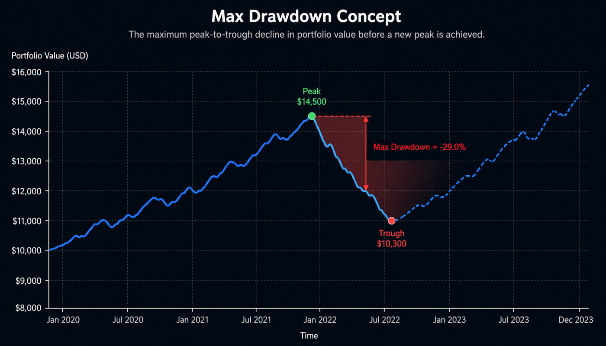
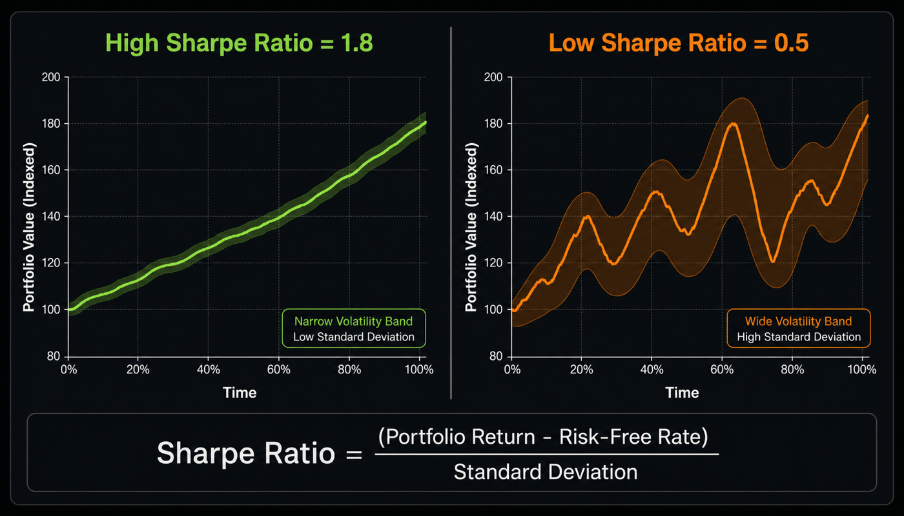
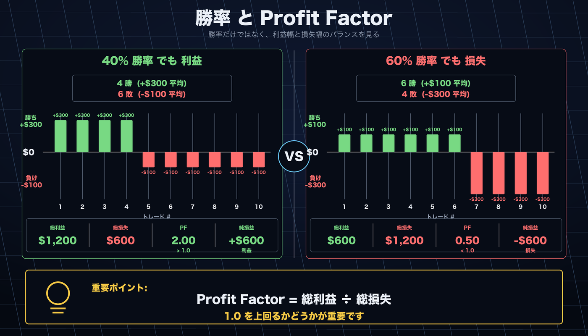

# はじめに

AlphaForge CLI のインストールから最初のバックテスト結果を読むまでをまとめた入門ガイドです。

- **Free プランだけで完結する 10 分体験**を冒頭に配置しています。ライセンス購入は不要です。
- その後ろに、**詳細なインストール手順・Whop ログイン認証・アンインストール・トラブルシューティング**を載せています。

---

## Free プランで 10 分の最初のバックテスト

!!! info "Free プランで試せる範囲"
    - バックテスト・最適化 ✅（データ上限: **2023-12-31** まで）
    - 最適化トライアル: **50 回**まで
    - Pine Script エクスポート ❌（有料プランが必要）

    上限の詳細は [フリーミアム制限](guides/freemium-limits.md) を参照してください。

### ステップ 1 — インストール（約 2 分）

=== "macOS / Linux"

    ```bash
    curl -sSL https://alforge-labs.github.io/install.sh | bash
    ```

    インストール後、**新しいターミナルを開いてから**次に進んでください。

=== "Windows"

    PowerShell で実行します（管理者権限不要）。

    ```powershell
    irm https://alforge-labs.github.io/install.ps1 | iex
    ```

    インストール後、**新しいターミナルを開いてから**次に進んでください。

インストールを確認します。

```bash
forge --version
```

```
AlphaForge CLI v1.x.x
```

バージョンが表示されれば完了です。手動インストールやインストール先のカスタマイズは、本ページ後半の「詳細インストール」セクションを参照してください。

### ステップ 2 — Whop でログインする（約 1 分）

AlphaForge は Whop アカウントによる OAuth 2.0 PKCE 認証を行います。次のコマンドでブラウザが自動で開きます。

```bash
forge auth login
```

ブラウザで認証を完了すると、認証情報が `$XDG_CONFIG_HOME/forge/credentials.json`（未設定時 `~/.config/forge/credentials.json`）に保存されます。

ログイン状態は次のコマンドで確認できます。

```bash
forge auth status
```

```
ユーザー ID      : user_abc123
アクセストークン: 2026-04-12 12:30 UTC（あと 45 分）
最終検証        : 2026-04-12 11:45 UTC（13 分前）
プラン          : annual
```

!!! tip "Free プランでも基本機能は利用できます"
    Pine Script エクスポートなど一部機能は有料プラン限定ですが、バックテスト・最適化・戦略管理など基本機能は Free プランでも利用可能です。

### ステップ 3 — 戦略ファイルを用意する（約 2 分）

`quickstart/` ディレクトリを作成し、サンプル戦略 JSON を保存します。

```bash
mkdir quickstart && cd quickstart
```

`sma_cross.json` という名前で以下を保存します。

```json
{
  "strategy_id": "sma_cross_qs",
  "name": "SMA Crossover Quickstart",
  "version": "1.0.0",
  "description": "SMA(10)/SMA(50) ゴールデンクロス戦略（クイックスタート用）",
  "target_symbols": ["SPY"],
  "asset_type": "stock",
  "timeframe": "1d",
  "indicators": [
    { "id": "sma_fast", "type": "SMA", "params": { "length": 10 }, "source": "close" },
    { "id": "sma_slow", "type": "SMA", "params": { "length": 50 }, "source": "close" }
  ],
  "entry_conditions": {
    "long": {
      "logic": "AND",
      "conditions": [{ "left": "sma_fast", "op": ">", "right": "sma_slow" }]
    }
  },
  "exit_conditions": {
    "long": {
      "logic": "AND",
      "conditions": [{ "left": "sma_fast", "op": "<", "right": "sma_slow" }]
    }
  },
  "risk_management": {
    "position_size_pct": 10.0,
    "position_sizing_method": "fixed",
    "max_positions": 1,
    "leverage": 1.0
  }
}
```

### ステップ 4 — バックテストを実行する（約 2 分）

Free プランの範囲（〜2023-12-31）でバックテストを実行します。

```bash
forge backtest run SPY \
  --strategy sma_cross_qs \
  --start 2019-01-01 \
  --end 2023-12-31
```

!!! note "データを自動取得"
    初回実行時は `forge data fetch SPY --start 2019-01-01 --end 2023-12-31` が自動的に走ります。数秒かかる場合があります。

### ステップ 5 — 結果を読む（約 3 分）

実行が完了すると以下のような出力が表示されます。

!!! warning "サンプル出力です"
    実際の数値はデータ取得タイミングにより異なります。

```
==> SPY 2019-01-01 → 2023-12-31 (1d)
   trades: 9   win_rate: 55.6%   profit_factor: 1.82
   total_return: +38.4%   cagr: +6.7%   sharpe: 0.88
   max_drawdown: -14.2%   exposure: 41.5%
   final_equity: $13,840  (initial: $10,000)
```

主要指標の見方は次のとおりです。指標の詳細な目安は本ページ後半の「結果の見方（詳細）」セクション、全指標一覧は [CLI リファレンス](cli-reference/index.md) を参照してください。

| 指標 | 今回の値 | 読み方 |
|------|----------|--------|
| **CAGR** | +6.7% | 年率リターン。S&P 500 の年平均（約 10%）と比較しましょう。 |
| **Sharpe** | 0.88 | リスク調整後リターン。**1.0 以上**が目安。もう一息です。 |
| **Max Drawdown** | -14.2% | 過去最大の資産の落ち込み。20% 以内なら運用継続しやすい水準。 |
| **Win Rate** | 55.6% | 勝ちトレードの割合。トレンドフォローでは 40〜60% が標準。 |
| **Profit Factor** | 1.82 | 総利益 ÷ 総損失。**1.5 以上**で良好。 |
| **Trades** | 9 | 期間中のトレード数。信頼性のために **30 件以上**が望ましい。 |

### ここまでできたら次のステップへ

| やりたいこと | 参照先 |
|-------------|--------|
| 自分の役割で次のページを選びたい | [目的別ユースケース](usecases/index.md) |
| パラメータを最適化したい | [optimize コマンド](cli-reference/optimize.md) |
| ウォークフォワードで過学習を検証したい | [エンドツーエンドワークフロー](guides/end-to-end-workflow.md) |
| 複合指標の戦略テンプレートを使いたい | [戦略テンプレート](templates.md) |
| TradingView と連携したい | [Pine Script 反映ガイド](guides/tradingview-pine-integration.md) |
| Free プランの制限を確認したい | [フリーミアム制限](guides/freemium-limits.md) |

---

## 詳細インストール

### 前提条件

- macOS 12 (Monterey) 以降 / Ubuntu 22.04 以降 / Windows 11
- インターネット接続（Whop ログイン時、または初回データ取得時）
- 有料プラン利用時のみ: 有効な AlphaForge ライセンスキー（[購入ページ](https://alforgelabs.com/ja/index.html#pricing)から入手）

### インストール手順

=== "macOS / Linux"

    ターミナルで以下のコマンドを実行してください。インストーラーが最新バイナリをダウンロードし、`/usr/local/bin` に配置します。

    ```bash
    curl -sSL https://alforge-labs.github.io/install.sh | bash
    ```

    !!! tip "インストール先のカスタマイズ"
        インストール先を変更したい場合は `INSTALL_DIR` 環境変数で指定できます。

        ```bash
        INSTALL_DIR=~/.local/bin curl -sSL https://alforge-labs.github.io/install.sh | bash
        ```

=== "Windows"

    PowerShell（管理者権限不要）で以下を実行してください。バイナリを `%USERPROFILE%\.forge\bin` にインストールし、PATH を自動設定します。

    ```powershell
    irm https://alforge-labs.github.io/install.ps1 | iex
    ```

    !!! tip "新しいターミナル"
        インストール後、新しいターミナルウィンドウを開いてから次の手順に進んでください。

=== "手動インストール"

    1. [GitHub Releases](https://github.com/alforge-labs/alforge-labs.github.io/releases/latest) から使用するプラットフォームのバイナリをダウンロードします。

    2. **macOS / Linux**: 実行権限を付与して PATH の通ったディレクトリに配置します。

        ```bash
        chmod +x forge-macos-arm64
        sudo mv forge-macos-arm64 /usr/local/bin/forge
        ```

    3. **Windows**: バイナリを任意のフォルダに配置し、そのフォルダを PATH に追加します。

---

## Whop ログイン認証

AlphaForge は Whop アカウントによる OAuth 2.0 PKCE 認証を行います。プランに関わらず初回起動時に一度ログインが必要です。

### 1. インストール確認

インストールが成功したことを確認します。

```bash
forge --version
```

### 2. Whop でログイン

ブラウザを起動して認証フローを実行します。

```bash
forge auth login
```

認証情報は `$XDG_CONFIG_HOME/forge/credentials.json`（未設定時 `~/.config/forge/credentials.json`）に保存されます。オンライン接続が必要です。

### 3. 認証状態の確認

ユーザー ID やトークン期限を確認できます。

```bash
forge auth status
```

### 4. コマンド利用可能性の確認

バックテストコマンドが利用可能なことを確認します。

```bash
forge backtest --help
```

---

## 結果の見方（詳細）

主要 6 指標の意味と目安です。指標の全リストは [CLI リファレンス](cli-reference/index.md) と [戦略テンプレート](templates.md) を参照してください。

| 指標 | 意味 | 目安 |
|------|------|------|
| **CAGR** | 年率リターン（複利ベース） | 市場ベンチマーク（S&P 500: 約 10%）と比較。プラスでも市場以下なら戦略の付加価値は限定的。 |
| **Sharpe Ratio** | リスク調整後リターン | 1.0 以上で「使える」、1.5 以上は優秀、2.0 超は上位戦略。負ならアウト。 |
| **Max Drawdown** | 過去最大の資産の落ち込み（ピークから） | 浅いほど良い。−20% を超えると心理的に運用継続が難しくなる目安。 |
| **Win Rate** | 勝ちトレードの割合 | 50% 前後が標準。トレンドフォローは 30–40%、平均回帰は 60–70% が典型。 |
| **Profit Factor** | 総利益 ÷ 総損失 | 1.5 以上で良好、2.0 超は優秀。1.0 未満は損失過剰。 |
| **Total Trades** | 期間中の総トレード数 | 統計的有意性のため最低 30 件以上は欲しい。少なすぎると過学習リスク。 |







!!! info "次に試すべきこと"
    - パラメータ最適化: [`forge optimize run`](cli-reference/optimize.md) で Optuna ベイズ最適化
    - ウォークフォワード検証: [`forge optimize walk-forward`](cli-reference/optimize.md) で過学習を検証
    - 戦略テンプレート: [HMM × BB × RSI など](templates.md)を試す

---

## アンインストール

=== "macOS / Linux"

    ```bash
    sudo rm /usr/local/bin/forge
    rm -rf ~/.forge
    ```

=== "Windows"

    ```powershell
    Remove-Item -Recurse $env:USERPROFILE\.forge
    # PATH から %USERPROFILE%\.forge\bin を手動で除去
    ```

---

## トラブルシューティング

| エラーメッセージ / 症状 | 原因と対処 |
|------------------------|-----------|
| `command not found: forge` | 新しいターミナルを開くか、`source ~/.bashrc` を実行してください。それでも出る場合は PATH を確認してください。 |
| `No data found for SPY` | `forge data fetch SPY --start 2019-01-01 --end 2023-12-31` を先に実行してください。 |
| `Free plan: date clipped to 2023-12-31` | 仕様どおりの動作です。Free プランの上限日以降のデータは自動的に除外されます。 |
| `Strategy not found: sma_cross_qs` | JSON の `strategy_id` が `sma_cross_qs` になっているか確認してください。 |
| 認証エラー | ネットワーク接続を確認のうえ `forge auth login` を再実行してください。Whop マイページでメンバーシップが有効か確認してください。 |
| macOS セキュリティ警告 | システム設定 → プライバシーとセキュリティ → 「forge を開く」を許可してください。 |

その他のトラブルや詳細な FAQ は [`/ja/install.html`](https://alforgelabs.com/ja/install.html) も参照してください。

- 使い方の質問や他のユーザーとの情報交換は [GitHub Discussions](https://github.com/alforge-labs/alforge-labs.github.io/discussions) をご活用ください。
- 個別のサポートが必要な場合は [support@alforgelabs.com](mailto:support@alforgelabs.com) までお問い合わせください。

---

## 次のステップ

- [目的別ユースケース](usecases/index.md) — 自分の役割（TradingView ユーザー / Python 開発者 / クオント / 自動売買検討者 / AI エージェント利用者）から最適な次ページを選ぶ
- [CLI リファレンス](cli-reference/index.md) — `forge` コマンドの全パラメータと出力形式
- [戦略テンプレート](templates.md) — HMM × BB × RSI などの複合戦略例
- [AI 駆動の戦略探索ワークフロー](guides/ai-exploration-workflow.md) — Claude Code / Codex × AlphaForge による自律探索

---

<!-- 同期元: `ja/install.html`（インストール・Whop ログイン・トラブルシューティング部分）。バックテスト実行例は alpha-forge の戦略 JSON スキーマ（`spy_sma_crossover_v1.json` を参考）に基づく。issue #117 で旧 `quickstart.md` を本ページに統合。 -->
