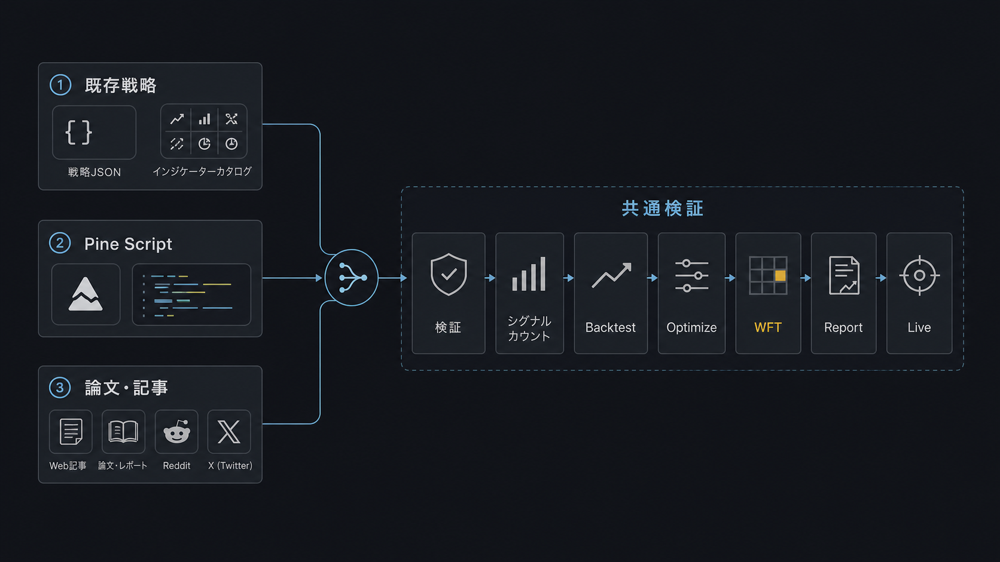
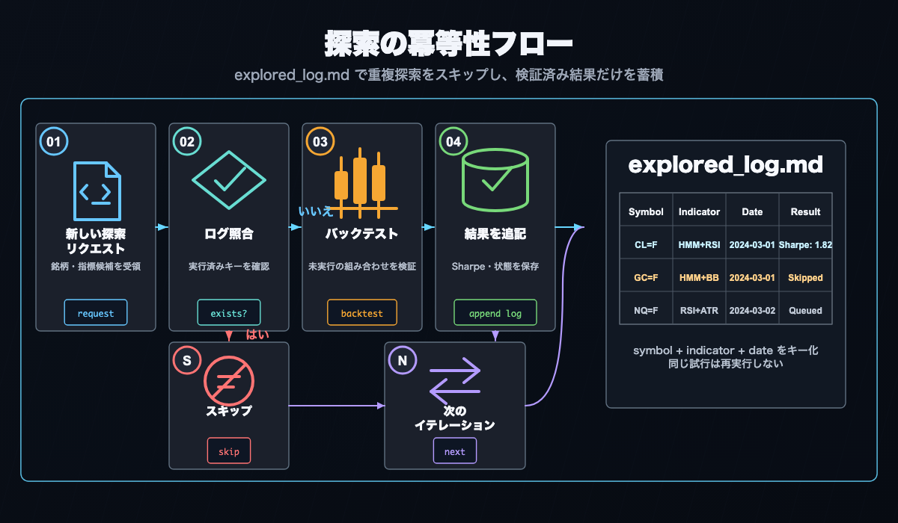

# AI 駆動の戦略探索ワークフロー

Claude Code・Codex などの AI コーディングエージェントを「頭脳」として AlphaForge と組み合わせると、戦略の **着想 → 実装 → バックテスト → 最適化 → 検証 → 運用調整** を自律的に進められます。

!!! info "前提"
    本ページのコマンド例とフローは `alpha-trade` モノレポ（`alpha-forge` + `alpha-strategies` の組み合わせ）における運用パターンです。**バイナリ版** ユーザーは `op run --env-file=...` などの内部コマンドを `forge` に読み替えてください。

## なぜ AI エージェント × AlphaForge か

AlphaForge は **すべての設定・戦略・実行が JSON / YAML / CLI で完結する** ように設計されています。これにより：

- AI エージェントが戦略 JSON を **生成・編集・検証** できる
- バックテスト・最適化の結果が **構造化データで返る** ため、エージェントが解析・改善案を出せる
- スラッシュコマンドで **同じワークフロー** を冪等に何度でも回せる
- レートリミットや人間の作業時間に依存せず、**夜間に自律探索** を回せる

結果として、人間は「方向性の指示」「合否判定」に集中し、面倒な探索とパラメータ調整は AI に任せるという分業が可能になります。

## 手動フローとの使い分け

| 目的 | 推奨フロー |
|------|-----------|
| AlphaForge の全ステップを理解したい | [エンドツーエンド戦略開発ワークフロー](end-to-end-workflow.md)（手動 CLI） |
| 新しい指標・銘柄の組み合わせを素早く探索したい | 本ページ（AI 駆動の自律探索） |
| すでに有望な戦略があり、詰めたい | Step 3 の [`/grid-tune`](#step-3-grid-tune) から始める |
| 実運用中の戦略の乖離を監視したい | Step 4 の [`/tune-live-strategies`](#step-4-tune-live-strategies) |

## 推奨コーディングエージェント

2026 年 4 月時点で alpha-forge と相性の良いエージェントの比較：

| エージェント | 強み | レート/料金（目安） | スラッシュコマンド対応 |
|------------|------|------------------|----------------------|
| **Claude Code**（推奨） | ファイル編集の精度、長時間タスク、Sonnet/Opus の使い分け | サブスクリプション or API 従量 | ✅ `.claude/commands/*.md` をネイティブサポート |
| **Codex CLI** | 高い基礎性能、OpenAI モデル | API 従量（GPT-5 等） | △ 設定経由でカスタムプロンプト |
| **Cursor** | IDE 統合、対話的に効率良い | サブスクリプション | △ Composer / Rules で代替 |
| **Aider** | OSS、複数モデルに対応、git 統合 | モデル料金のみ | △ `/<command>` 風 alias は手動設定 |

本ページでは **Claude Code** を前提に書きます。他エージェントを使う場合は `.claude/commands/*.md` の手順を読み込ませて同等のフローを実行できます。

---

## Claude Code 無人実行の設定 {#unattended-setup}

`/explore-strategies --runs 0` のような長時間の連続ランを途中確認なしに完走させるには、Claude Code の許可リストに必要な操作を事前登録する必要があります。未登録の操作が発生するたびに確認プロンプトが表示され、無人運転が止まります。

`.claude/settings.local.json`（個人設定・gitignore 対象）の `permissions.allow` に以下のパターンを追加してください。

```json
{
  "permissions": {
    "allow": [
      "Write(alpha-strategies/data/strategies/*.json)",
      "Bash(uv --directory alpha-forge run forge *)",
      "Bash(FORGE_CONFIG=* uv --directory alpha-forge run forge *)",
      "Bash(git -C */alpha-strategies add data/)",
      "Bash(git -C */alpha-strategies commit *)",
      "Bash(git -C */alpha-strategies push)",
      "Bash(rm */alpha-strategies/data/strategies/*.json)",
      "Bash(rm */data/strategies/*.json)"
    ]
  }
}
```

パスはすべて `alpha-trade/` を作業ルートとした相対パスです。

| パターン | 許可される操作 |
|---------|--------------|
| `Write(alpha-strategies/data/strategies/*.json)` | 戦略 JSON の一時ファイル生成（1 戦略ごと） |
| `Bash(uv --directory alpha-forge run forge *)` | forge コマンド直接実行 |
| `Bash(FORGE_CONFIG=* uv --directory alpha-forge run forge *)` | 相対パスなど任意の FORGE_CONFIG での forge コマンド |
| `Bash(git -C */alpha-strategies add data/)` | 探索結果の git ステージング |
| `Bash(git -C */alpha-strategies commit *)` | 探索結果のコミット |
| `Bash(git -C */alpha-strategies push)` | alpha-strategies へのプッシュ |
| `Bash(rm */alpha-strategies/data/strategies/*.json)` | 不合格戦略の一時ファイル削除 |
| `Bash(rm */data/strategies/*.json)` | 同上（作業ディレクトリの違いに対応） |

!!! note "settings.local.json について"
    `settings.local.json` はプロジェクトの `.gitignore` に登録されている個人設定ファイルです。チームメンバーと共有されないため、各自の環境で設定してください。`settings.json`（git 管理あり）には記載しないこと。

!!! tip "既存の permissions.allow がある場合"
    ファイルに既存のエントリがある場合は、配列に追記してください。ファイル全体を上書きすると既存の許可設定が失われます。

!!! info "1Password を使用している場合"
    `op run` 経由で forge を実行している場合は、以下のパターンも追加してください。
    ```json
    "Bash(op run --env-file=alpha-forge/.env.op -- uv --directory alpha-forge run forge *)",
    "Bash(FORCE_COLOR=* FORGE_CONFIG=* op run * uv --directory alpha-forge run forge explore run *)",
    "Bash(FORGE_CONFIG=* op run * uv --directory alpha-forge run forge strategy *)",
    "Bash(FORGE_CONFIG=* op run * uv --directory alpha-forge run forge data fetch *)",
    "Bash(FORGE_CONFIG=* op run * uv --directory alpha-forge run forge explore *)"
    ```

!!! warning "FORCE_COLOR=1 プレフィックスが必須"
    `/explore-strategies` スキルでは進捗バー表示のため `forge backtest run` / `forge optimize run` / `forge optimize walk-forward` / `forge explore run` の先頭に `FORCE_COLOR=1` を付ける運用が必須要件として定められています（[alpha-forge issue #410](https://github.com/ysakae/alpha-forge/issues/410)）。コマンド先頭が `FORCE_COLOR=1 ` で始まるため、`FORGE_CONFIG=...` から始まる既存パターンにマッチせずパーミッションプロンプトでブロックされる場合があります。以下のパターンを追加してください。
    ```json
    "Bash(FORCE_COLOR=1 FORGE_CONFIG=* op run *)",
    "Bash(FORCE_COLOR=1 FORGE_CONFIG=* uv --directory alpha-forge run forge *)",
    "Bash(FORCE_COLOR=1 uv --directory alpha-forge run forge *)"
    ```

### 1Password セッション切れの早期検出（無人運転） {#op-session-precheck}

無人運転（夜間バッチ等）で `op` セッションが切れると、以降のすべての `op run` 配下コマンドが認証エラーで失敗します。`/explore-strategies` スキルは各ループ反復の冒頭で `forge system auth check op` を実行し、セッションが無効な場合は exit code 2 を返してループを停止します（[alpha-forge issue #411](https://github.com/ysakae/alpha-forge/issues/411)）。

```bash
# セッション有効性の検証
uv --directory alpha-forge run forge system auth check op
echo "exit: $?"   # 0 = 有効、2 = セッション切れ・op 不在・タイムアウト等
```

| 終了コード | 意味 | 推奨動作 |
|-----------|------|---------|
| `0` | セッション有効 | ループ続行 |
| `2` | 認証エラー（セッション切れ・op CLI 不在等） | ループ即停止、`<goal_dir>/explored_log.md` に記録、対話型 `op signin` を促す |

スキル経由ではこのチェックが自動で行われるため、追加設定は不要です。手動で長時間ループを組む場合は同等のチェックを各反復の先頭に挿入してください。

## Codex CLI 無人実行の設定 {#codex-unattended-setup}

Codex CLI で同じように長時間ランを止めずに実行する場合は、Claude Code の `permissions.allow` のようなコマンド単位の許可リストではなく、**承認ポリシー** と **サンドボックス範囲** で制御します。

まず `~/.codex/config.toml` に無人実行用プロファイルを追加します。

```toml
[profiles.alforge-labs-unattended]
approval_policy = "never"
sandbox_mode = "workspace-write"
```

このプロファイルで `codex exec` を起動し、作業ルートと必要な追加書き込みディレクトリを明示します。

```bash
codex exec \
  --profile alforge-labs-unattended \
  --cd /絶対パス/alpha-trade \
  --add-dir /絶対パス/alpha-trade/alpha-strategies \
  "explore-strategies スキルを使って、デフォルトゴールを --runs 0 相当で探索してください。"
```

`/絶対パス/` は実環境のパス（例: `/Users/yourname/dev/alpha-trade`）に置き換えてください。`--cd` を `alpha-trade` モノレポのルートにする場合、多くの操作はその配下に収まります。`--add-dir` は、別ワークツリーや外部の `alpha-strategies` に戦略 JSON を書く構成のときに追加してください。

| 設定 / オプション | 役割 |
|------------------|------|
| `approval_policy = "never"` | 実行中に承認プロンプトを出さず、失敗はそのまま Codex に返す |
| `sandbox_mode = "workspace-write"` | 作業ディレクトリと追加許可ディレクトリへの書き込みに限定する |
| `--cd /.../alpha-trade` | Codex の作業ルートをモノレポに固定する |
| `--add-dir /.../alpha-strategies` | 作業ルート外の戦略 JSON 保存先を追加で書き込み許可する |

!!! warning "完全バイパスは通常使わない"
    `--dangerously-bypass-approvals-and-sandbox` は承認とサンドボックスを両方無効化します。外部で十分に隔離された一時環境を用意している場合を除き、通常のローカル探索では使わないでください。

!!! tip "データ取得は先に済ませる"
    Codex の `workspace-write` サンドボックスでは、環境によってネットワークアクセスが制限されます。`forge data fetch` / `forge data update` が必要な銘柄は、無人ランの前に `/update-market-data` または手動の `forge data fetch <SYMBOL>` で取得しておくと安定します。

---

## 全体フロー

```
準備: /update-market-data でデータを最新化
  ↓
起点を決める（3 つの探索シナリオから選択）
  ↓
Step 1: /explore-strategies [--goal <name>] [--runs N]
  └─ 銘柄×指標を組み合わせてバックテスト→最適化→WFT を自動実行
     初期フィルタ: Sharpe ≥ 1.0 かつ MaxDD ≤ 25%
  ↓
Step 2: /analyze-exploration
  └─ 全探索ログを集計し、次に深掘りすべき候補を recommendations.yaml に出力
  ↓
Step 3: /grid-tune
  └─ 有望な戦略を網羅的グリッドサーチで詰める + WFT 再検証
  ↓
Step 4: /tune-live-strategies
  └─ 実運用後の乖離分析・再チューニング
```

---

## 準備: ヒストリカルデータ取得

探索を始める前に、対象銘柄のデータが最新化されているか確認します。

```bash
# 保存済みデータの一括差分更新（バイナリ版では forge data update <SYMBOL>）
> /update-market-data
```

`/update-market-data` は `forge data list` で登録済みシンボルを確認し、各シンボルに対して `forge data update` を実行します。新しい銘柄を追加する場合は先に `forge data fetch <SYMBOL>` を手動実行してください。

---

## 3 つの探索シナリオ

AI エージェント × AlphaForge の使い方は、**起点となる材料** で大きく 3 つに分類できます。



### シナリオ 1: 既存戦略・指標の組み合わせ

**起点**: 手元の戦略 JSON、`forge analyze indicator list` の指標カタログ

**典型フロー**:

1. Claude Code に「`forge strategy show multi_asset_hmm_bb_rsi_v1_qqq` の戦略をベースに、MACD を追加した派生版を作って」と指示
2. AI が JSON を編集して `multi_asset_hmm_bb_rsi_macd_v1_qqq.json` を生成
3. `forge strategy validate` → `forge strategy save` → `forge backtest run`
4. 結果を見て、Sharpe が改善していれば `forge optimize run` で詰める

**ポイント**: `/explore-strategies` を使えば、AI に組み合わせ選定からレポートまで完全に任せられます。

### シナリオ 2: TradingView Pine Script を起点とした応用

**起点**: TradingView の公開戦略・インジケータ（`.pine` ファイル）

**典型フロー**:

1. TradingView で気になる戦略を見つけたら、Pine Script をローカルに保存（`tv_<name>.pine`）
2. **インポート**: `forge pine import tv_<name>.pine --id imported_v1`
3. AI に「この戦略の `parameters` と `indicators` を分かりやすく整理して、`optimizer_config` を追加して」と指示
4. AI が JSON を整形・補強し、最適化対象を明示
5. `forge backtest run` → `forge optimize run` で AlphaForge 流に検証
6. 良ければ `forge pine generate` で逆方向に書き戻し、TradingView でも動作確認

**ポイント**: Pine Script のロジックを **JSON ベース** に持ち込むことで、最適化・WFT・Monte Carlo など AlphaForge の解析機能をすべて使えるようになります。

### シナリオ 3: 投資掲示板・論文を起点としたインターネット探索

**起点**: X (旧 Twitter)、Reddit `/r/algotrading`、SSRN の論文、QuantConnect・QuantStart の記事

**典型フロー**:

1. Claude Code に **URL や論文 PDF を渡して** 「この戦略の核心ロジックを抽出して、`indicators` と `entry_conditions` のリストにして」と指示
2. AI が記事を要約し、戦略 JSON のドラフトを生成
3. `forge strategy validate` で論理エラーをチェック → 修正
4. `forge backtest signal-count` でシグナル件数を確認（条件が厳しすぎないか）
5. `forge backtest run` → 結果に応じて `forge optimize run`
6. 元記事の主張する結果と実バックテスト結果を比較（**多くの場合、再現できない**）

**ポイント**: 論文の戦略は「データ期間」「銘柄」「取引コスト」が異なると再現性がないことが多い。AI が「論文の主張」と「実バックテスト結果」のギャップを **冷静に評価** することで、フィルタリング機能を果たします。

---

## Step 1: 探索フェーズ（`/explore-strategies`） {#step-1-explore}

**目的**: `goals/<goal_name>/goals.yaml` で指定した目標指標（例: Sharpe ≥ 1.5）を満たす戦略を **未試行の指標×銘柄組み合わせ** から探す。

### 実行ステップ（要約）

1. **事前確認**: `goals/<goal_name>/goals.yaml`、`goals/<goal_name>/explored_log.md`、既存戦略 JSON を読み、未試行の組み合わせを把握
2. **戦略生成**: 未試行の指標×銘柄を 1 つ選び、`forge strategy scaffold --save` で戦略を直接 DB 登録（JSON ファイル不要）
3. **パイプライン一括実行**: `forge explore run <SYMBOL> --strategy <name> --goal <goal_name>`
   バリデーション → データ自動取得 → シグナルチェック → バックテスト → 最適化 → WFT → coverage 更新 → DB 登録を 1 コマンドで完結
4. **合否確認**: exit code で判断。exit code 1 の場合は `forge explore result show <name> --goal <goal_name> --json` で DB から詳細を取得し、`goals/<goal_name>/reports/YYYY-MM-DD.md` に追記。`cleanup_done: true` の場合、戦略 JSON / 結果 JSON は自動削除済み

```
> /explore-strategies                          # 1 ラン実行（デフォルトゴール）
> /explore-strategies --goal stocks            # ゴールを指定
> /explore-strategies --runs 3                 # 3 ラン連続実行
> /explore-strategies --goal crypto --runs 0   # レートリミットまたは全組み合わせ消化まで連続実行
```

### 合否基準

| フェーズ | 基準 |
|---------|------|
| 初期フィルタ | Sharpe ≥ 1.0 **かつ** MaxDD ≤ 25% |
| WFT 最終合格 | WFT 全ウィンドウ平均 Sharpe ≥ `goals/<goal_name>/goals.yaml` の `target_metrics.sharpe_ratio` |

### 任意: 合格戦略への TradingView MCP 添付（issue #582）

`forge.yaml` の `tv_mcp.pine_verify.enabled: true` で MCP server が起動済みのとき、`/explore-strategies` スキルは合格戦略 1 件あたり以下を自動実行して `goals/<goal_name>/reports/<strategy_id>/` に **TV 整合性チェック** と **チャート PNG** を残します（fail-soft：MCP 接続失敗・metrics 取得失敗は warning ログを出すだけで、戦略の合格判定や coverage 登録は変更しません）：

- `forge pine verify --check-mode metrics --auto-backtest --mcp-server-flavor vinicius --output reports/<id>/verify.md`
- `forge journal report --with-chart --symbol <SYM> --interval D --output reports/<id>/journal.md`

MCP server が起動していない・`tv_mcp.pine_verify.enabled: false` の goal ではこのステップはスキップされ、既存ループの挙動は変わりません。詳細は [TradingView Pine 連携ガイド](tradingview-pine-integration.md) を参照してください。

### 冪等性のポイント

`goals/<goal_name>/explored_log.md` がチェックポイントになるため、同じゴール内で同じ組み合わせを重複探索しません。中断・再開は安全です。



### 連続ランとレートリミット対策

`--runs 0` を指定するとレートリミット到達または全組み合わせ消化まで繰り返し実行されます。

| エージェント | 主な制限 | 対策 |
|------------|---------|------|
| Claude Code | 5 時間ウィンドウのトークン制限（プラン依存） | 夜間 → 朝 → 昼で 3 ウィンドウに分けて回す |
| Codex | RPM / TPM（モデル別） | 並列度を下げて 1 イテレーション直列化 |
| Cursor | 月 / 日のリクエスト制限 | Composer Agent は重いので戦略生成に絞る |

!!! tip "複数ゴールによる並列実行"
    ゴールはそれぞれ独立しており、`goals/<name>/` 配下に専用の `explored_log.md` を持ちます。異なるゴールを別々の Claude Code セッションで同時実行しても競合しません。バックテスト結果は `exploration.db` を通じて全ゴールで共有されるため、同一の銘柄×指標の組み合わせが重複してバックテストされることもありません。

### scaffold の対応指標と動作（issue #427 対応後）

`forge strategy scaffold` は以下の指標をサポートしています：

- **mean-reversion**: BB（必須）、RSI、MACD、ADX、SUPERTREND、STOCH、HMM、SMA（長期トレンドフィルター）、EMA（中期トレンドフィルター）
- **trend-following**: EMA（必須）、ADX、MACD、RSI、SUPERTREND、STOCH、HMM、BB（ボラティリティ／トレンド確認フィルター）、SMA（長期 bull/bear フィルター）
- ATR は全タイプで自動追加（`--no-atr` フラグで無効化可能）

戦略タイプと互換性のない指標を要求すると ValueError で明示的にエラーを返します（silently 削除されません）。詳細は [alpha-forge issue #427](https://github.com/ysakae/alpha-forge/issues/427) を参照。

### long / short 両方向の自動生成（issue #469）

scaffold は **long と short の両方** の `entry_conditions` / `exit_conditions` を生成します。FX 等の対称市場では取引機会が 2 倍になり、長下げ局面でも収益機会を取り込めます。

| 戦略タイプ | long | short |
|-----------|------|-------|
| mean-reversion | BB 下タッチ → bb_mid クロス上で利確 | BB 上タッチ → bb_mid クロス下で利確 |
| trend-following | EMA fast クロス上 → クロス下で exit | EMA fast クロス下 → クロス上で exit |

各フィルタも対称適用：
- RSI: oversold → overbought（long）／overbought → oversold（short）
- MACD hist: < 0 → > 0（long と short が反転）
- ADX: 同条件（レンジ判定は方向に依存しない）
- SuperTrend / SMA / EMA: 価格が指標上 → 下（long と short が反転）

HMM 適用時は range レジーム（mean-reversion state 1）または高リターン状態（trend-following state 0）で long/short 両方向のエントリーを許可します。stock 系で long-only にしたい場合は scaffold 後に `entry_conditions.short` を削除してください。

### 反転確認バー（issue #470）

mean-reversion で `--confirm-bars 1` を指定すると、BB タッチの**次バーで陽線（または陰線）が確認できたとき**のみエントリーするように変わります。BB を割った瞬間の「ナイフキャッチ」問題を回避します。

| confirm_bars | long entry |
|--------------|-----------|
| 0（既定） | `close < bb_lower`（瞬間） |
| 1 | `close.shift(1) < bb_lower.shift(1) & close > open`（前バー BB 下抜け + 現バー陽線） |

short も対称（前バー BB 上抜け + 現バー陰線）。`goals.yaml.exploration.scaffold_defaults.confirm_bars: 1` で goal ごとの既定値も指定可能。

**confirm_bars=2/3（issue #473）**: 2 / 3 バー連続反転確認に拡張。**wick_ratio** オプションでピンバー的反転（下髭/上髭が body の N 倍以上）も要求可能：

```bash
forge strategy scaffold --symbol GBPUSD=X --indicators BB,EMA,ADX \
  --type mean-reversion --confirm-bars 2 --wick-ratio 1.0 --save
```

`goals.yaml.scaffold_defaults.wick_ratio: 1.0` で goal 別既定値。**実測効果（GBPUSD BB+EMA+ADX 1h）**: confirm_bars=2 + wick_ratio=1.0 で **trades 140→7 / MDD 87% → 8.84% / CAGR -55% → +3.40%**（MDD 1/10、CAGR プラス転換）。trades 確保には wick_ratio=0.5 等で調整可能。

### ゴール別 scaffold デフォルト（issue #461）

`goals.yaml` の `exploration.scaffold_defaults` セクションでゴール別のレバレッジ・ポジションサイズ・ストップを指定し、`forge strategy scaffold --goal <name>` で自動適用できます。さらに `exploration.initial_capital` で `forge.yaml` の想定資金を override できます。

```yaml
# 例: oanda_gold/goals.yaml
exploration:
  initial_capital: 6800              # USD 換算想定資金（forge.yaml override）
  scaffold_defaults:
    position_size_pct: 100
    leverage: 5
    type_overrides:
      mean-reversion:
        stop_loss_pct: 1.5
        take_profit_pct: 3.0
      trend-following:
        stop_loss_pct: null          # null = scaffold の既存デフォルト維持
```

CLI:

```bash
# ゴール参照
forge strategy scaffold --symbol USDJPY=X --indicators BB,RSI \
  --type mean-reversion --strategy-id usdjpy_bb_rsi_v1 \
  --goal oanda_gold --save

# 個別フラグ（オーバーライド）
forge strategy scaffold ... \
  --position-size-pct 100 --leverage 5 \
  --stop-loss-pct 1.5 --take-profit-pct 3.0 --save
```

**優先順位**: 明示 CLI フラグ > `goals.yaml.scaffold_defaults` (+ `type_overrides`) > 既存デフォルト

`forge backtest run --goal <name>` および `forge explore run --goal <name>` 実行時にも `goals.yaml.exploration.initial_capital` が読まれ、その値で BacktestConfig が override されます（forge.yaml を直接編集する必要はありません）。

**典型的な用途**:

- `oanda_gold`（OANDA Gold 維持）: 100万円口座（6,800 USD）× レバ 5 倍
- `commodities`: 先物のレバ 5〜10 倍
- `default`/`stocks`: ノーレバ・10〜15% サイジング（既存デフォルトのまま）

### ゴール別 timeframe / backtest_period（issue #463）

短い時間足（1h 等）対応のため、`goals.yaml` の `exploration.timeframe` と `exploration.backtest_period` でゴール別デフォルトを指定できます。

```yaml
# 例: oanda_gold/goals.yaml（高頻度 FX 戦略想定）
exploration:
  timeframe: "1h"           # scaffold が生成する戦略の timeframe（既定: "1d"）
  backtest_period: "2y"     # explore run のデータ取得 period（既定: "5y"）
```

`forge strategy scaffold --goal <name>` で生成される戦略の `timeframe` と、`forge explore run --goal <name>` のデータ取得 period に反映されます。CLI で個別指定したい場合は `--timeframe` を使えます：

```bash
forge strategy scaffold --symbol USDJPY=X --indicators BB,RSI \
  --type mean-reversion --strategy-id usdjpy_bb_rsi_1h_v1 \
  --timeframe 1h --save
```

**優先順位**: 明示 `--timeframe` > `goals.yaml.exploration.timeframe` > 既存デフォルト `"1d"`

**yfinance の制約**: yfinance プロバイダーは Yahoo Finance API の 730 日制限により、**1h × 5y は取得不可**です（実測: 1h × 2y は約 12,000 bars）。1h を使う場合は `backtest_period: "2y"` のように短縮するか、Dukascopy / OANDA 等の別プロバイダーを使用してください。

### ゴール別 backtest_period と data_provider_override（長期データ用 / issue #674）

WFT の `min_oos_trades_per_window` を満たすには 5 年では不足する低頻度戦略（HMM トレンドフォロー等）が多く（issue #670）、長期データでの探索が有効です。実機検証の結果、**yfinance で 20y × 1d を 5030 行取得できる**ことを確認しています（「yfinance ~5y 制約」は 1h timeframe の 730 日上限の話で、1d/1w/1mo では 20y 以上問題なく取得できます）。

```yaml
# 例: long-term-stocks/goals.yaml（実装済みテンプレート）
exploration:
  backtest_period: "20y"        # 20 年データ（yfinance 1d で取得可能）
  assets:
    - SPY
    - QQQ
    - NVDA
    - AAPL
    - MSFT
    - GOOGL
```

`/explore-strategies` ループ開始前に手動で長期キャッシュを作成しておくのが安全です（無人ラン中の rate limit を避けるため）：

```bash
for sym in SPY QQQ NVDA AAPL MSFT GOOGL; do
  forge data fetch $sym --provider yfinance --period 20y --interval 1d
done
```

**実証結果（NVDA EMA+MACD+SuperTrend, 20y）**:

| Window | OOS Sharpe | OOS Trades | min_oos_trades(=3) |
|--------|-----------|-----------|----------|
| 1 | -0.01 | 3 | ✅ |
| 2 | 0.97 | 3 | ✅ |
| 3 | — | 0 | ❌ |
| 4 | -1.68 | 6 | ✅ |
| 5 | -0.12 | 5 | ✅ |

→ **5 ウィンドウ中 4 で min_oos_trades_per_window=3 を達成**。default goal (5y) では構造的に不可能だったウィンドウあたり trades 確保が、20y データで現実的に可能になりました。

#### data_provider_override（goal 単位のプロバイダー上書き）

`goals.yaml` の `exploration.data_provider_override.{stock|fx}` で `forge.yaml` の `stock_provider` / `fx_provider` をゴール単位で上書きできます。例えば特定 goal だけ `oanda` や `dukascopy` に切り替えたい場合に便利です：

```yaml
exploration:
  data_provider_override:
    stock: tv_mcp     # 例: 短期チャート系の用途で TradingView MCP に切替
    fx: oanda         # 例: FX のみ OANDA に切替
```

> ⚠️ **TV MCP は長期 fetch には使用不可**（issue #683）  
> tradesdontlie / vinicius 系の MCP server の `chart_scroll_to_date` が `"evaluate is not defined"` エラーで動作せず、TV Desktop に過去データをロードできません。`data_get_ohlcv` は現在チャートに表示されている bars のみ返すため、`forge data fetch <SYM> --provider tv_mcp --period 20y` を呼んでも最新 ~14 ヶ月分しか取れません。長期データは **yfinance を推奨**します。  
> TV MCP は引き続き Pine 検証 (`forge pine verify --check-mode metrics`) や チャート PNG 取得 (`forge tv chart`) には有用です。

#### `/explore-strategies` の TV MCP 事前確認

`exploration.data_provider_override.{stock|fx}: tv_mcp` が設定された goal でループを開始すると、スキル冒頭で `forge data tv-mcp check --json` が自動実行されます：

- 終了コード `0`: 続行
- 終了コード `2`: endpoint 未設定 / TV Desktop 未起動 / MCP server 接続失敗 → ループ停止 + `<goal_dir>/explored_log.md` に記録（自動起動・再試行なし）

### pre_filter min_trades による早期足切り（issue #429）

`goals.yaml` の `pre_filter` に `min_trades` を設定すると、バックテスト直後に取引数が閾値未満の戦略は即座に `pre_filter_failed` で打ち切られ、Optuna 最適化（数十秒〜数分）と WFT の実行をスキップして計算リソースを節約します。

```yaml
pre_filter:
  sharpe_ratio:        ">= 1.0"
  max_drawdown:        "<= 25%"
  min_trades:          ">= 15"          # issue #429: 推奨は target_metrics.min_trades の半分程度
  monthly_volume_usd:  ">= 500000"
```

**動作**:

- バックテスト後の `total_trades` が `pre_filter.min_trades` 未満なら `pre_filter_pass=false` となり、`status="pre_filter_failed"` で打ち切り
- `pre_filter_diagnostics.failed_criteria` に `"trades"` が含まれ、`trades.threshold` が `goals.yaml` の値と一致
- `min_trades` 未指定（または `>= 0`）のときは取引数チェックは無効（後方互換性維持）
- 真に有望な戦略（Sharpe>1.0 だが trades 不足）は、続いて説明する **自動緩和バリアント生成（#428）** でパラメータを広げて救済する設計

### pre_filter.near_pass 救済ゾーン（issue #452 / #456）

「あと一歩で pre_filter 通過」の戦略を optimizer に進めるための救済機構。`goals.yaml` の `pre_filter.near_pass` セクションで設定し、3 段階評価で eligibility を判定します。

```yaml
pre_filter:
  sharpe_ratio: ">= 1.0"
  max_drawdown: "<= 30%"
  near_pass:
    # 段階 1: factors（独立係数評価 / issue #452）
    sharpe_ratio: 0.9
    max_drawdown: 1.1
    min_trades: 0.8

    # 段階 2: cross_compensation（クロス補完救済 / issue #456）
    cross_compensation:
      max_drawdown_floor: 0.1     # MDD <= 30% × 0.1 = 3% なら sharpe 緩和発動
      sharpe_relax_factor: 0.7    # sharpe を 1.0 × 0.7 = 0.7 まで許容
      # 任意: min_trades_floor: 5.0  # trades >= 30 × 5 = 150 でも発動

    # 段階 3: composite（複合スコア救済 / issue #456）
    composite:
      calmar_ratio: 5.0           # CAGR/MDD >= 5.0 なら sharpe 不足を救済
```

**判定順**: factors → cross_compensation → composite。いずれかで eligible になれば救済され optimizer が走ります。`cross_compensation` と `composite` は **sharpe 単独不足のみ**に適用（複数 metric 同時不足は救済対象外）。

DB の `pre_filter_diagnostics.near_pass` に `eligible_via`（`factors`/`cross_compensation`/`composite`/`null`）と `compensation_evidence`（救済根拠）が記録され、観測可能です。

**典型的な救済ケース** (issue #456):

- QQQ ADX+EMA+SuperTrend: sharpe 0.771 / MDD 0.91% / trades 705 → MDD が閾値の 1/33 で大幅余裕 → cross_compensation で救済
- CL=F BB+RSI: sharpe 0.758 / MDD 1.84% / trades 36 → 同パターンで救済

### pre_filter.monthly_volume_usd の判定（issue #459）

`monthly_volume_usd` は `MetricsCalculator._calc_monthly_volume_usd` で月平均取引量（USD 換算）として計算済みです。`pre_filter.monthly_volume_usd >= N` を `goals.yaml` に設定すると pre_filter で実評価され、未達の戦略は `failed_criteria` に `monthly_volume_usd` が追加されます。

OANDA Gold ステータスの維持ライン（月間取引量 50万 USD）の強制に使えます：

```yaml
pre_filter:
  monthly_volume_usd: ">= 500000"
```

未指定または `>= 0` のときは従来通り評価 skip（後方互換）。

### target_metrics 任意 metric 評価（issue #458）

`goals.yaml` の `target_metrics` セクションには次の任意 metric を記述できます。`forge explore run` の Step 5 で全 metric が照合され、結果は DB の `target_metrics_diagnostics` に構造化保存されます。

| metric 名 | 意味 | 評価ソース |
|----------|------|-----------|
| `sharpe_ratio` | Sharpe 比 | **WFT 平均**（既存仕様） |
| `max_drawdown` | 最大ドローダウン (%) | backtest |
| `cagr` | 年率リターン (%) | backtest |
| `win_rate_pct` | 取引勝率 (%) | backtest |
| `profit_factor` | 利益÷損失 | backtest |
| `min_trades` | 取引数下限 | backtest |
| `calmar_ratio` | CAGR / MDD | backtest |
| `positive_months_ratio` | 月別勝率（0〜1） | backtest |
| `worst_month_pnl_pct` | 最悪月の P&L (%) | backtest |
| `best_month_pnl_pct` | 最高月の P&L (%) | backtest |
| `consecutive_negative_months` | 連続マイナス月の最大長 | backtest |

「ほぼ確実に毎月プラス」を表現する例：

```yaml
target_metrics:
  positive_months_ratio: ">= 0.9"
  worst_month_pnl_pct: ">= -1.5"
  consecutive_negative_months: "<= 2"
  max_drawdown: "<= 5%"
  profit_factor: ">= 1.3"
```

未対応の metric 名や未サポート operator は warning + skip（戦略は失格扱いにしない）。

### 自動緩和バリアント生成（issue #428）

`forge explore run` は、pre_filter は通過したが WFT で不合格となった戦略（`status="wft_failed"`）に対して、**緩和バリアント JSON v(N+1) を自動生成**し `recommendations.yaml` の rank: 1 に登録します。エージェントが手動で v(N+1) を作る必要はありません。

**緩和トリガー**: `status="wft_failed"` （`skip_reason` が `wft_insufficient_oos_data` / `wft_no_valid_oos_windows` / `wft_failed` のいずれか）かつ pre_filter を通過していること。

**適用ルール**（最大 2 個まで、優先度順）:

| パラメータ名のパターン | 変更内容 |
|---|---|
| `rsi*_th` / `rsi*entry*` / `rsi2_entry_th` | `max += 10`（エントリー閾値を緩める） |
| `adx_threshold` | `min -= 5`（ADX フィルタを緩める） |
| `*length` / `*period` | `max *= 0.7`（期間短縮で取引増） |

CLI 出力例:

```
❌ SPY / spy_atr_ema_macd_v1 — 不合格 (wft_insufficient_oos_data)
  ✓ Sharpe=1.17 で品質は良好。緩和バリアント spy_atr_ema_macd_v2 を自動生成しました（rsi_th.max=80→90）
  ✓ recommendations.yaml に rank: 1 として登録
```

`forge explore result show <name> --json` の `auto_relax` フィールドで結果を確認できます。`skipped_reason="duplicate_id"` は既に同名のバリアントが存在することを、`"no_relaxable_params"` は緩和対象パラメータが見つからなかったことを示します。`forge explore run --no-auto-relax` で機能を無効化できます。

### ヘルスチェックゲート（連続失敗の自動エスカレーション）

`--runs 0` の無人運転では、scaffold バグや goals.yaml の不整合により全試行が失敗するループに入る可能性があります。これを早期検知するために、`/explore-strategies` は各ラン冒頭で `forge explore health --strict` を呼び出し、直近 5 件の試行から品質低下を判定します（alpha-forge issue #408）。

判定条件と挙動:

- 直近 5 件すべて不合格 **かつ** scaffold 変換率が 50% 以上 → `escalation: true`（`escalation_type: "scaffold_degradation"`）→ 即停止
- 直近 5 件すべての `indicator_combo` が同一 →
  - scaffold 変換率が 10% 以下 → `warning: true` / `escalation: false`（`escalation_type: "agent_selection_bias"`、エージェントが意図的に同じ組み合わせを連続選択している） — **loop 続行可能**（issue #467）
  - 中間域（変換率 10〜50%）→ 保守的に `escalation: true` / `"scaffold_degradation"` として扱う
- DB 件数が 5 件未満（履歴が浅い）→ 観測のみ（ブロックしない）

`escalation: true` を検出するとコマンドは exit code `1` を返し、スキル側はループを停止して `recommended_actions` を人間に提示します。`warning: true`（agent_selection_bias）の場合は exit code `0` のまま `recommended_actions` を表示するに留め、エージェントは次のラン以降で **支配的になっている組み合わせ以外の指標** を選んで続行します（`recent_selections` 多様性ガードで自動解消）。`escalation_type` で原因を区別することで、scaffold 修正（alpha-forge 側の調査）とエージェント側プロンプト調整のどちらが必要かを判断できます（alpha-forge issue #436 / #467）。詳細は [`forge explore health` リファレンス](../cli-reference/other.md#forge-explore-health) を参照してください。

---

## Step 2: 分析・絞り込み（`/analyze-exploration`） {#step-2-analyze}

**目的**: 過去のすべての探索ログを集計・分析し、次に試すべき組み合わせを **科学的に推薦** する。

```
> /analyze-exploration
```

### 処理内容

1. `goals/*/explored_log.md` + `goals/*/reports/*.md` を全読み込み
2. **銘柄別パフォーマンス表**（試行数、最高/平均 Sharpe、最低 MaxDD、合格数）を生成
3. **指標組み合わせ別パフォーマンス表**（試行回数、平均/最高 Sharpe、合格率）を生成
4. **未試行組み合わせのスコアリング**（0–10 点）：
    - 類似指標の既存平均 Sharpe（+0–4）
    - 銘柄の試行回数の少なさ（+0–2）
    - 指標の新規性（+0–2）
    - 直前ランの推奨候補にあったか（+2）
5. 分析レポートを `data/explorer/analysis/YYYY-MM-DD_HH-MM.md` に保存
6. **`recommendations.yaml` に上位 5 件を出力**（次の `/explore-strategies` が参照）

### 出力例（recommendations.yaml）

```yaml
candidates:
  - rank: 1
    asset: QQQ
    indicators: [HMM, BBANDS, RSI, MACD]
    score: 8.5
    rationale: "HMM × BBANDS の平均 Sharpe が高く、QQQ は試行少。MACD 追加で新規性 +"
    basis_sharpe: 1.32
    basis_maxdd: 18.4
    variant_of: multi_asset_hmm_bb_rsi_v1_qqq
```

---

## Step 3: 精密チューニング（`/grid-tune`） {#step-3-grid-tune}

**目的**: Step 1 で合格した戦略について、`optimizer_config.param_ranges` を **Cartesian Grid に展開して網羅探索**、合格すれば自動で `<name>_optimized` として保存。

```
> /grid-tune <strategy_name> <SYMBOL>
```

### 実行ステップ

1. 戦略確認: `forge strategy show <strategy_name>` で `param_ranges` の存在と Grid 総数を確認
2. シグナル件数チェック（必須）: `forge backtest signal-count`
3. ベースライン取得: `forge backtest run` で元戦略の Sharpe を控える
4. **Grid 網羅探索**: `forge optimize grid <symbol> --strategy <name> --metric sharpe_ratio --top-k 20 --chunk-size 100 --max-memory-mb 4096 --min-trades 30 --save --save-format csv --yes`
5. Top-20 レビュー（過学習の疑い、上位 trial の近傍集中を確認）
6. ベスト適用: `forge optimize grid ... --top-k 1 --apply --yes`
7. **WFT 検証**: `forge optimize walk-forward <symbol> --strategy <name>_optimized --windows 5`
8. **合否判定**: WFT 全ウィンドウ平均 Sharpe が **元戦略の Sharpe を超えていれば合格**
    - 合格 → `forge journal verdict <name>_optimized <run_id> pass`
    - 不合格 → `forge strategy delete <name>_optimized --force` + 元戦略の Journal に `note` 追加

### メモリ・OOM の目安

- 1 シンボル × 5 年分 × 1,000 通り Grid → `--chunk-size 100 --max-memory-mb 4096` で OOM なく完走
- それ以上 → `--chunk-size 50 --max-memory-mb 2048` などに下げる
- `param_ranges` の `step` を粗くして総数を絞ることも有効

---

## Step 4: 実運用監視（`/tune-live-strategies`） {#step-4-tune-live-strategies}

**目的**: 実運用中の戦略について、ライブ成績がバックテストから乖離しているものを検出し、**自動的に再最適化** する。

```
> /tune-live-strategies
```

### 実行ステップ

1. **乖離検出**: `forge live list` → 各戦略 ID で `forge live compare <strategy_id>` を実行し、`goals/<goal_name>/goals.yaml` の `live_tuning.sharpe_drift_threshold` を超えたものを抽出
2. **再最適化**: 乖離が大きい戦略ごとに：
    - `forge optimize run <SYMBOL> --strategy <name> --metric sharpe_ratio --save`
    - `forge optimize walk-forward <SYMBOL> --strategy <name> --windows 5`
3. **採用判定**: WFT の全ウィンドウ平均 Sharpe が **改善している場合のみ** `<name>_optimized.json` を更新。改悪なら現状維持
4. レポートを `data/explorer/reports/tuning-YYYY-MM-DD.md` に追記

週次の定期実行か、乖離が気になったときの手動実行で十分です。乖離が連続 N 週続く場合は戦略の根本見直し（指標差し替え、別シナリオへの転換）を検討してください。

---

## キーファイルの役割

```text
alpha-strategies/data/explorer/
├── goals/
│   ├── default/                       # デフォルトゴール（--goal 省略時に使用）
│   │   ├── goals.yaml                 # 目標指標と探索範囲を定義
│   │   ├── explored_log.md            # このゴールの冪等チェックポイント
│   │   └── reports/
│   │       ├── YYYY-MM-DD.md          # /explore-strategies の日次レポート
│   │       └── tuning-YYYY-MM-DD.md   # /tune-live-strategies のレポート
│   ├── stocks/                        # 米国株・ETF ゴール
│   │   ├── goals.yaml
│   │   ├── explored_log.md
│   │   └── reports/
│   ├── commodities/                   # コモディティゴール
│   │   └── ...
│   └── crypto/                        # 暗号資産ゴール
│       └── ...
├── exploration.db                     # 全ゴール共有のバックテスト結果キャッシュ
├── recommendations.yaml               # /analyze-exploration が出力する次回推奨候補
└── analysis/
    └── YYYY-MM-DD_HH-MM.md           # /analyze-exploration の出力
```

**`goals/<goal_name>/goals.yaml`**: 目標 Sharpe・MaxDD・探索対象の銘柄・指標セット・`strategies_per_run` などをゴールごとに定義します。`/explore-strategies --goal <name>` でゴールを指定し、省略時は `goals/default/` を使用します。

**`goals/<goal_name>/explored_log.md`**: ゴール内で試行済みの組み合わせを記録するチェックポイント。このファイルが存在する限り、同じゴール内で同じ組み合わせが重複探索されることはありません。

**`exploration.db`**: 全ゴールで共有する SQLite キャッシュ。同じ銘柄×指標の組み合わせがいずれかのゴールで既にバックテスト済みの場合、結果を再利用します（重複実行なし）。

**`recommendations.yaml`**: `/analyze-exploration` が生成する次回推奨候補。`/explore-strategies` はこのファイルを読み、スコアの高い組み合わせを優先的に選択します。

---

## なぜ最適化後に WFT を実施するか

各ステップで **Walk-Forward Test（WFT）** を必須としているのは、過学習（オーバーフィッティング）を防ぐためです。

In-Sample データ（最適化に使った期間）だけで評価すると、パラメータがそのデータに過適合している可能性があります。WFT は：

1. 全期間を複数ウィンドウに分割
2. 各ウィンドウで「最適化 → Out-of-Sample 検証」を実施
3. **OOS 期間での平均 Sharpe** を最終評価に使う

これにより「過去データには強いが将来には機能しない」戦略を弾く設計になっています。

---

## ワンサイクル実例（探索 → 最適化 → 検証 → 運用）

「QQQ で HMM × BB × RSI に MACD を加えるアイデア」を検証 → 採用するまでの実例です。

```bash
# 1. アイデアを記録（任意、後でリンク可能）
forge idea add "QQQ HMM×BB×RSI に MACD を追加" \
  --type improvement --tag hmm --tag qqq

# 2. /explore-strategies で 1 サイクル試す（Claude Code 内）
> /explore-strategies
# → 戦略 JSON 自動生成、validate、signal-count、backtest を実施
# → Sharpe=0.95 で pre-filter 落ち（Sharpe ≥ 1.0 が条件）

# 3. 派生版で再挑戦（パラメータを変えてみる、AI に依頼）
> 上記戦略の HMM の n_components を 2 に減らして再試行して
# → AI が修正版 JSON を生成・登録 → backtest（Sharpe=1.18 で pre-filter 通過）
# → 自動で optimize run + walk-forward 実行
# → WFT 平均 Sharpe=1.32 で合格

# 4. /grid-tune で網羅最適化
> /grid-tune multi_asset_hmm_bb_rsi_macd_v1_qqq QQQ
# → Grid Top-1 → apply → WFT 検証で 1.45 達成
# → forge journal verdict pass で記録

# 5. 過学習ロバスト性チェック
forge optimize sensitivity \
  /path/to/data/results/optimize_multi_asset_hmm_bb_rsi_macd_v1_qqq_optimized_20260415_103021.json
# → overall_robustness_score=0.82（合格）

# 6. ジャーナルに最終承認を記録
forge journal verdict multi_asset_hmm_bb_rsi_macd_v1_qqq_optimized <run_id> pass
forge journal note multi_asset_hmm_bb_rsi_macd_v1_qqq_optimized "OOS pass + sensitivity 0.82。本番投入候補。"

# 7. TradingView 用 Pine Script を生成
forge pine generate --strategy multi_asset_hmm_bb_rsi_macd_v1_qqq_optimized --with-training-data

# 8. ライブ運用開始（VPS に発注エンジンを配置、本ドキュメント範囲外）

# 9. 1 週間後、ライブ成績を比較
forge live import-events multi_asset_hmm_bb_rsi_macd_v1_qqq_optimized
forge live compare multi_asset_hmm_bb_rsi_macd_v1_qqq_optimized

# 10. 乖離が大きければ /tune-live-strategies で自動再チューニング
> /tune-live-strategies
```

このフロー全体のうち、**人間が判断するのは 3 箇所だけ** です：

1. アイデアの方向性（HMM × BB × RSI に MACD を加える）
2. Grid-tune の Top-20 レビュー（過学習の疑いを確認）
3. ライブ運用開始の意思決定

それ以外は全部 AI が自動で進めます。

---

## 関連ドキュメント

- [エンドツーエンド戦略開発ワークフロー](end-to-end-workflow.md) — 手動 CLI による全ステップの詳細
- [はじめに](../getting-started.md) — 初回バックテストまでのチュートリアル
- [CLI リファレンス](../cli-reference/index.md) — `forge` コマンドの全パラメータ
- [戦略テンプレート](../templates.md) — HMM × BB × RSI 等の同梱戦略

---

<!-- 同期元: `alpha-trade/.claude/commands/{explore-strategies,analyze-exploration,grid-tune,tune-live-strategies,update-market-data}.md` のスラッシュコマンド定義。エージェント比較は 2026 年 4 月時点。 -->
