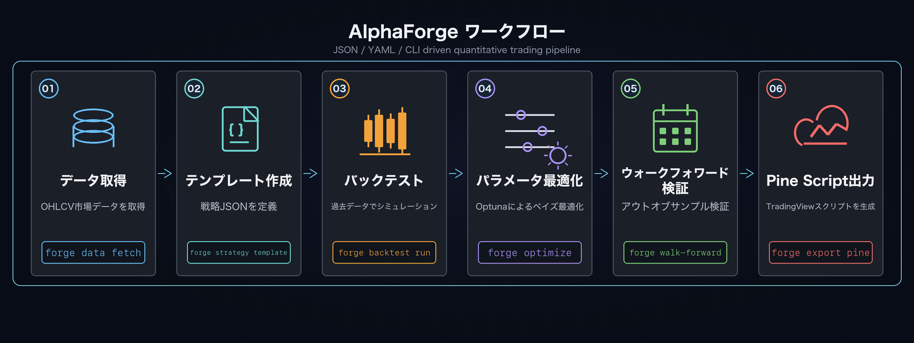

# エンドツーエンド戦略開発ワークフロー

ヒストリカルデータの取得から自動発注までの典型的な開発フロー。Claude Code などのコーディングエージェントと組み合わせると、各ステップの自動化やパラメータ探索を高速化できます。



!!! note "前提"
    本ページは [はじめに](../getting-started.md) で `alpha-forge` をインストール済み（バイナリ版）かつ、作業ディレクトリで `alpha-forge system init` を実行済み（`forge.yaml` ・`data/` 等が存在）であることを前提とします。コマンドはすべて作業ディレクトリのカレントで `alpha-forge` を直接呼ぶ形で記載しています。

    開発者向けの alpha-trade モノレポで作業している場合は、各 `forge ...` を `FORGE_CONFIG=forge.yaml uv --directory alpha-forge run alpha-forge ...` に読み替えてください。

## 1. データ取得

対象シンボルのヒストリカルデータをローカルに保存します。

```bash
alpha-forge data fetch 'USDJPY=X'
```

!!! warning "FX / 先物 / 暗号資産のシンボル命名"
    yfinance（既定プロバイダー）では資産クラスごとに固定のサフィックスが必要です。

    | 資産クラス | 例 |
    |---|---|
    | 米国株 / ETF | `SPY`, `AAPL`, `QQQ` |
    | FX | `USDJPY=X`, `EURUSD=X`, `GBPJPY=X`（必ず `=X`） |
    | 先物 | `CL=F`（WTI 原油）, `GC=F`（金）, `ES=F`（S&P 先物） |
    | 暗号資産 | `BTC-USD`, `ETH-USD`（ハイフン） |

    シェルでシングルクォートが必要なシンボル（`USDJPY=X` 等）はクォートで囲んでください。

## 2. 戦略テンプレート作成

テンプレートから戦略 JSON の雛形を生成し、パラメータを編集してから登録します。

!!! info "利用可能なテンプレート一覧を確認する方法（F-005）"
    `alpha-forge strategy template list` のような専用コマンドは現時点では存在しません。
    代わりに次のいずれかでテンプレート ID を確認してください。

    1. **エラーメッセージを利用する**（最も手早い）— 適当な存在しない名前を指定すると、
       エラーで利用可能テンプレート一覧が表示されます。

        ```bash
        $ alpha-forge strategy create --template _unknown_ --out /tmp/dummy.json
        ❌ 未知のテンプレート名です: _unknown_。利用可能:
          sma_crossover_v1, rsi_reversion_v1, macd_crossover_v1,
          bbands_breakout_v1, grid_bot_template, hmm_bb_pipeline_v1,
          donchian_turtle_v1
        ```

    2. **ドキュメントを参照する** — 各テンプレートの詳細（指標構成・対象市場・推奨用途）
       は [戦略テンプレート集](../templates.md) に一覧があります。

```bash
alpha-forge strategy create --template sma_crossover_v1 \
  --out data/strategies/usdjpy_sma_v1.json
```

!!! info "JSON で必ず編集すべき 3 項目"
    生成された JSON はテンプレート名そのままのため、最低限以下を編集してから登録してください。

    1. `strategy_id`: テンプレート名 (`sma_crossover_v1`) のままだと既存テンプレートと衝突するので、`usdjpy_sma_v1` のようにユニークなものに変更
    2. `name`: 人が読んで分かる名前
    3. `target_symbols`: 既定は `[]`。対象シンボル（例: `["USDJPY=X"]`）を入れるか、`alpha-forge backtest run <SYMBOL>` で都度指定

    最適化を予定している場合は `optimizer_config.param_ranges` も埋めてください（未指定でもデフォルト範囲で動きますが、明示する方が再現性が高くなります）。

編集後、戦略 DB に登録します。

```bash
alpha-forge strategy save data/strategies/usdjpy_sma_v1.json
```

!!! tip "DB 登録を省きたい場合 (`--strategy-file`)"
    `alpha-forge backtest run` / `alpha-forge optimize run` には `--strategy-file <path>` オプションがあり、JSON を直接指定できます（DB 登録不要）。試行錯誤段階では便利です。

## 3. バックテスト実行

定義した戦略のパフォーマンスを過去データで検証します。

```bash
alpha-forge backtest run 'USDJPY=X' --strategy usdjpy_sma_v1

# 結果のチャート URL を表示してブラウザで開く
alpha-forge backtest chart usdjpy_sma_v1 --open
```

!!! tip "ブラウザで結果を可視化（alpha-visualizer）"
    `alpha-forge backtest run` の末尾に出る `📊 チャートは alpha-vis serve で確認できます` は、独立 OSS パッケージ [alpha-visualizer](../alpha-visualizer/index.md) への誘導です。`alpha-vis serve` を起動するとブラウザで Equity / Drawdown / 取引履歴・指標を確認できます（[インストール](../alpha-visualizer/installation.md)）。

## 4. パラメータ最適化

Optuna のベイズ最適化（TPE）で最適なパラメータを探索します。

```bash
alpha-forge optimize run 'USDJPY=X' --strategy usdjpy_sma_v1 \
  --metric sharpe_ratio --trials 300 --save

# 保存された結果ファイル（optimize_usdjpy_sma_v1_<timestamp>.json）を新しい戦略として適用
alpha-forge optimize apply data/results/optimize_usdjpy_sma_v1_<timestamp>.json \
  --to-strategy usdjpy_sma_v1_optimized
```

!!! note "ベストスコアが `-inf` になったとき"
    全 trial が NaN を返した状態です。多くは「最適化対象パラメータの探索範囲が狭すぎる」「対象期間で取引数が極端に少ない」が原因。`optimizer_config.param_ranges` を見直すか、データ期間を広げて再実行してください。

!!! tip "最適化結果をブラウザで可視化（alpha-visualizer）"
    `--save` で保存した最適化結果は [alpha-visualizer](../alpha-visualizer/index.md) の Optimize 画面で **Grid ヒートマップ / 感度プロット / Top trial の Equity** として確認できます。`alpha-vis serve` を `quickstart/` などの作業ディレクトリで起動してください。

## 5. ウォークフォワード検証

過学習を検出するため、訓練期間とテスト期間を分けた検証を行います。

!!! abstract "WFT（Walk-Forward Test）とは何か（F-006）"
    `alpha-forge optimize run` だけだと **全期間でパラメータを最適化** してしまい、最適化に
    使ったデータに過剰適合（オーバーフィット）した「カーブフィッティング戦略」を
    本物の好成績と誤認しがちです。

    WFT は「期間を等間隔のウィンドウに区切り、**学習期間（In-Sample / IS）で
    最適化したパラメータを、未学習のテスト期間（Out-of-Sample / OOS）で評価する**」
    という検証手法です。OOS の成績が IS と乖離していなければ、その戦略は
    時系列を跨いで頑健（ロバスト）と判断できます。

    | 用語 | 意味 |
    |------|------|
    | IS (In-Sample) | 学習期間。Optuna が最適化に使うウィンドウ前半 |
    | OOS (Out-of-Sample) | テスト期間。最適化結果をぶつける未来データ（ウィンドウ後半） |
    | ウィンドウ | 期間を等分割した 1 区間。`--windows 5` なら全期間を 5 分割 |
    | IS/OOS ペア | 各ウィンドウの IS スコアと OOS スコアの組 |

    判定の目安: OOS の Sharpe が IS の **半分以上** あればロバスト寄り、
    IS だけ突出して OOS が大幅劣化するならカーブフィット疑い。詳細なオプションは
    [`alpha-forge optimize walk-forward` CLI リファレンス](../cli-reference/optimize.md) を参照。


```bash
alpha-forge optimize walk-forward 'USDJPY=X' \
  --strategy usdjpy_sma_v1_optimized --windows 5

# 感度分析（最適化結果 JSON ファイルを指定）
alpha-forge optimize sensitivity data/results/optimize_usdjpy_sma_v1_<timestamp>.json
```

!!! warning "WFT が全ウィンドウ「OOS 0 件」になるとき"
    データ期間が短いと各ウィンドウで取引が発生せずスキップされます。FX / 1d データなら 5 年（約 1,250 行）以上を推奨。`alpha-forge data fetch '<SYM>' --period 5y` のように長期データを先に揃えるか、`--windows 2` で粗くしてください。

!!! tip "WFT 結果をブラウザで可視化（alpha-visualizer）"
    [alpha-visualizer](../alpha-visualizer/index.md) の Optimize 画面では **WFO 合成エクイティカーブ（IS / OOS を連結したライン）** と **IS/OOS の安定性ヒートマップ** を確認できます。`alpha-vis serve` で起動してください。

## 6. Pine Script 生成

TradingView 用のアラートスクリプトを自動生成します。

```bash
alpha-forge pine generate --strategy usdjpy_sma_v1_optimized
```

出力先: `output/pinescript/usdjpy_sma_v1_optimized.pine`

!!! tip "関連コマンド"
    各サブコマンドの完全なオプション一覧は [CLI リファレンス](../cli-reference/index.md) を参照してください。次のステップは [TradingView への Pine Script 反映](tradingview-pine-integration.md) です。

!!! tip "実際の出力サンプルを確認するには"
    各コマンドの出力フォーマットや、equity curve・最適化結果・Pine Script の具体例は [実行結果と成果物サンプル](output-examples.md) を参照してください。
