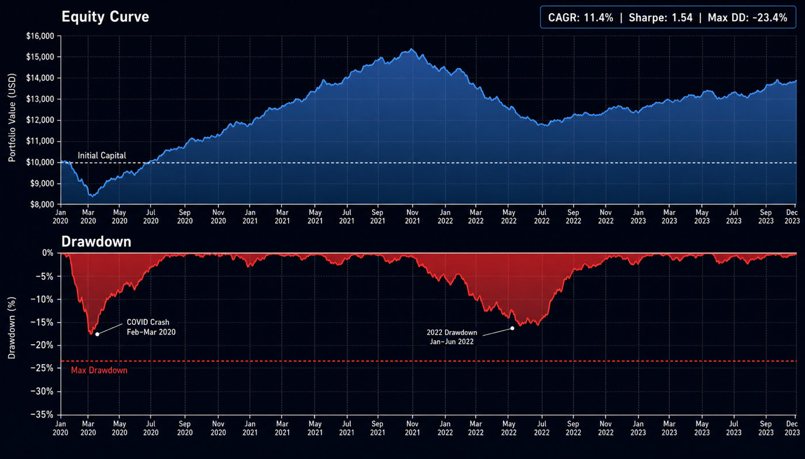
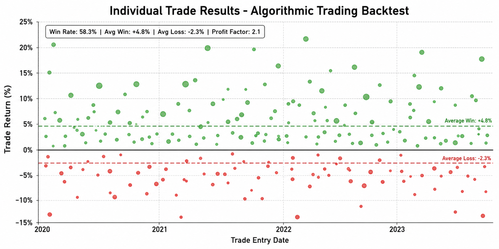

# 実行結果と成果物サンプル

AlphaForge CLI を実行すると何が得られるか、代表的なコマンドと出力を示します。

!!! info "サンプル出力について"
    本ページの数値は `alpha-forge` ソースから取得したフォーマットを元にしたサンプルです。実際の値はデータと戦略によって異なります。

---

## バックテスト実行結果

### コマンド

```bash
forge backtest run SPY --strategy sma_crossover_v1 --start 2019-01-01 --end 2023-12-31
```

### テキスト出力

```text
バックテストを実行中: SPY x sma_crossover_v1
✅ バックテスト完了  信号品質スコア: 0.78/1.0
総リターン: +52.30%  CAGR: 5.40%
SR: 0.92  Sortino: 1.15  Calmar: 0.32
MDD: -16.80%  期間: 187日  回復: 92日
PF: 1.74  Win%: 50.0%  avg勝: 4.20%  avg負: -2.40%
取引数: 14  平均保有: 28.5日(28bar)  最大: 65.0日(65bar)  連勝: 4  連敗: 3
勝率CI(90%): 35.2% - 64.8%
```

### 主な指標の見方

| 指標 | 値 | 意味 |
|------|-----|------|
| CAGR | 5.40% | 年平均成長率 |
| Sharpe Ratio | 0.92 | リスク調整後リターン（1.0以上が目安） |
| Max Drawdown | -16.80% | 最大損失幅（回復まで187日） |
| Profit Factor | 1.74 | 総利益 ÷ 総損失（1.3以上が目安） |
| Win Rate | 50.0% | 勝ちトレードの割合 |

### JSON 出力（`--json` フラグ付き）

```bash
forge backtest run SPY --strategy sma_crossover_v1 --start 2019-01-01 --end 2023-12-31 --json
```

```json
{
  "total_return_pct": 52.30,
  "cagr_pct": 5.40,
  "sharpe_ratio": 0.92,
  "sortino_ratio": 1.15,
  "calmar_ratio": 0.32,
  "max_drawdown_pct": -16.80,
  "max_drawdown_duration_days": 187,
  "max_drawdown_recovery_days": 92,
  "profit_factor": 1.74,
  "win_rate_pct": 50.0,
  "total_trades": 14,
  "avg_holding_days": 28.5,
  "pre_filter_pass": false,
  "pre_filter": { "sharpe_min": 1.0, "max_dd_max": 25.0 },
  "warnings": []
}
```

---

## 詳細レポート（保存済み結果の確認）

```bash
forge backtest report sma_crossover_v1
```

```text
=== sma_crossover_v1 / SPY (2026-04-15T10:30:21) ===
総リターン: 52.30%  CAGR: 5.40%
SR: 0.92  Sortino: 1.15  Calmar: 0.32
MDD: -16.80%  PF: 1.74  Win%: 50.0%
取引数: 14  平均保有: 28.5日(28bar)  最大: 65.0日(65bar)
トレードログ: 14件 (--json で全体を確認可能)
```

完全なトレードログは `--json` で出力できます:

```bash
forge backtest report sma_crossover_v1 --json
```

---

## Equity Curve とダッシュボード

バックテスト実行後、ローカルダッシュボードで損益曲線・ドローダウン・個別トレードを視覚的に確認できます。

```bash
# チャート URL を表示
forge backtest chart sma_crossover_v1

# ブラウザで直接開く（forge dashboard が起動中の場合）
forge backtest chart sma_crossover_v1 --open
```

```text
📊 チャートを表示するには `forge dashboard` を起動してください:
   http://localhost:8000/?run_id=sma_crossover_v1_20260415_103021
```

ダッシュボード（`forge dashboard`）では以下のタブを確認できます:

| タブ | 表示内容 |
|------|---------|
| Equity Curve | 損益曲線・Buy & Hold 比較・月次リターン棒グラフ |
| Drawdown | 最大ドローダウン期間・回復曲線・ドローダウン分布 |
| Trades | 個別トレード一覧（参入日・決済日・損益・保有期間） |
| Statistics | 年次・月次統計・主要リスク指標 |





---

## バッチバックテスト（複数戦略を一括比較）

```bash
forge backtest batch SPY --strategy-dir data/strategies/ --workers 3
```

```text
バッチバックテスト開始: SPY × 3戦略 (workers=3)
  ✅ sma_crossover_v1: Sharpe=1.32  MaxDD=-12.4%  CAGR=8.2%  trades=18
  ❌ rsi_reversion_v1: Sharpe=0.61  MaxDD=-22.1%  CAGR=4.1%  trades=24
  ✅ macd_trend_v1:    Sharpe=1.18  MaxDD=-15.6%  CAGR=7.0%  trades=15

合格戦略: 2/3件
  ✅ sma_crossover_v1: Sharpe=1.32  MaxDD=-12.4%
  ✅ macd_trend_v1:    Sharpe=1.18  MaxDD=-15.6%
```

---

## パラメータ最適化結果

```bash
forge optimize run SPY --strategy sma_crossover_v1 --metric sharpe_ratio --trials 300 --save
```

```text
✅ 最適化完了
ベストスコア (sharpe_ratio): 1.32
ベストパラメータ: {'fast_period': 12, 'slow_period': 50}
DB 保存: run_id=opt_20260415_103021
✅ 最適化結果を保存しました: data/results/optimize_sma_crossover_v1_20260415_103021.json
```

`--json` フラグで機械可読な形式での出力:

```bash
forge optimize run SPY --strategy sma_crossover_v1 --metric sharpe_ratio --trials 300 --json
```

```json
{
  "best_metric": 1.32,
  "best_params": { "fast_period": 12, "slow_period": 50 }
}
```

### 最適化済みパラメータを戦略に適用

```bash
forge optimize apply data/results/optimize_sma_crossover_v1_20260415_103021.json \
  --to-strategy sma_crossover_v1_optimized
```

---

## 戦略 JSON の検証

```bash
# 戦略を登録して検証
forge strategy save data/strategies/sma_crossover_v1.json
forge strategy validate sma_crossover_v1
```

```text
✅ 戦略 JSON のフォーマットが正常です: sma_crossover_v1
```

---

## Pine Script 生成（有料プラン）

!!! warning "有料プラン限定"
    `forge pine generate` は **Lifetime / Annual / Monthly プラン** のみ利用できます。Free プランでは利用できません。詳しくは [フリーミアム制限](freemium-limits.md) を参照してください。

```bash
forge pine generate --strategy sma_crossover_v1
```

```text
✅ Pine Script が保存されました: output/pinescript/sma_crossover_v1.pine
```

生成される Pine Script の例（SMA クロスオーバー戦略）:

```pine
//@version=6
strategy("sma_crossover_v1", overlay=true,
         default_qty_type=strategy.percent_of_equity, default_qty_value=100)

// === パラメータ ===
fast_period = input.int(12, "Fast Period", minval=1, maxval=200)
slow_period = input.int(50, "Slow Period", minval=1, maxval=500)

// === インジケータ計算 ===
sma_fast = ta.sma(close, fast_period)
sma_slow = ta.sma(close, slow_period)

// === シグナル ===
long_entry = ta.crossover(sma_fast, sma_slow)
long_exit  = ta.crossunder(sma_fast, sma_slow)

// === ポジション管理 ===
if long_entry
    strategy.entry("Long", strategy.long)
if long_exit
    strategy.close("Long")

// === プロット ===
plot(sma_fast, color=color.blue, title="SMA Fast")
plot(sma_slow, color=color.red,  title="SMA Slow")
```

### TradingView への反映手順

1. TradingView の「Pine エディタ」を開く
2. 生成された `.pine` ファイルの内容を貼り付けて「保存」→「チャートに追加」
3. アラートを設定し、シグナルを alpha-strike に転送する（[連携ガイドを見る](tradingview-alpha-strike.md)）

詳細は [TradingView への Pine Script 反映](tradingview-pine-integration.md) を参照してください。

---

## 次のステップ

- [エンドツーエンド戦略開発ワークフロー](end-to-end-workflow.md) — 戦略開発の全フローを順を追って確認
- [CLI リファレンス: backtest](../cli-reference/backtest.md) — 全コマンドと引数の詳細
- [CLI リファレンス: optimize](../cli-reference/optimize.md) — 最適化の詳細オプション
- [戦略実例ギャラリー](../strategy-gallery.md) — 実際の戦略 JSON とコマンド例
