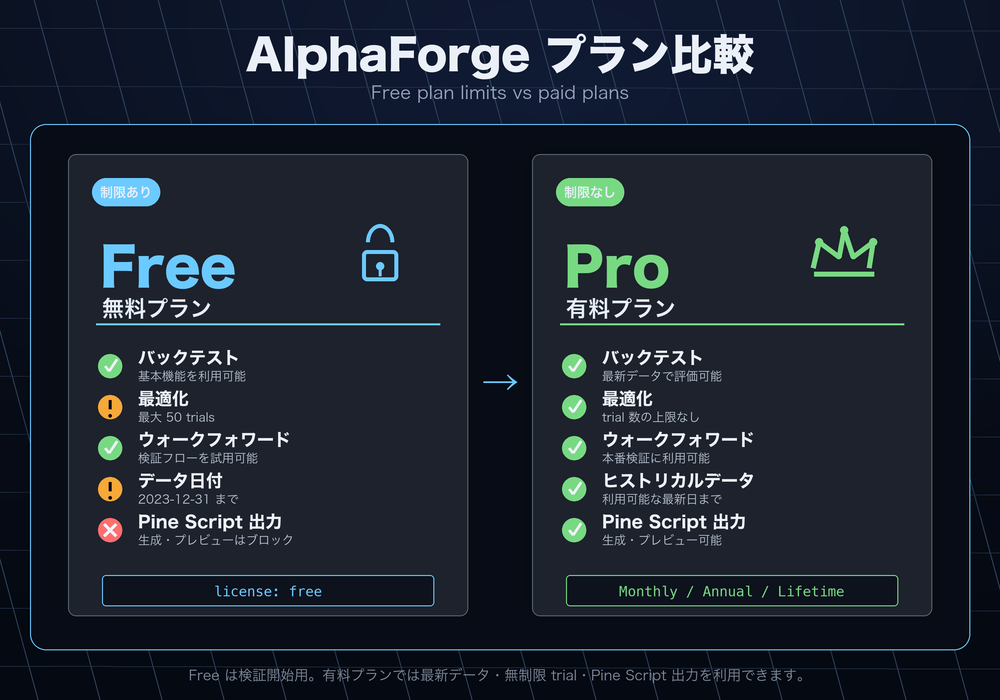

# Trial 制限

AlphaForge は **Trial プラン**（Whop 未登録、期限なし）と **有料プラン**（Whop で購入する **Lifetime / Annual / Monthly** のいずれか）の 2 ティアで動作します。Trial プランは無料で恒久的に利用でき、評価エンジン（バックテスト・最適化）に渡せるデータ日付の上限が **2023-12-31** に制限され、最適化のトライアル数が **50 回** に制限され、Pine Script エクスポートが**ハードブロック**されます。本ページでは、その挙動と確認方法を整理します。

!!! note "対象コマンド"
    制限は以下の経路で適用されます。

    - **データ取得**: `forge data fetch` / `forge data update` / `forge pine generate --with-training-data` / 戦略の外部シンボル自動取得（`merge_external_symbols`）
    - **評価エンジン入口**: `forge backtest run` / `forge optimize`（`run` / `grid` / `walk-forward` / `cross-symbol`）
    - **最適化 trial 数**: `forge optimize run` / `cross-symbol` / `portfolio` / `multi-portfolio` / `walk-forward` / `grid`
    - **Pine Script エクスポート（ハードブロック）**: `forge pine generate` / `forge pine preview`（`forge pine import` は対象外）

    取得時にも評価時にも **2023-12-31** をキャップとして共有し、最適化系コマンドは **50 trials** をキャップとして共有しています。Pine Script エクスポートは Trial プランでは**完全にブロック**されます。

## プラン構成

| プラン | Whop 登録 | データ取得・評価の日付制限 | 最適化 trial 数 | Pine Script | 補足 |
|---|---|---|---|---|---|
| **Trial** | **不要** | 2023-12-31 まで | 50 trials まで | **完全ブロック** | インストール後ただちに利用可能。期限なし。`forge` をそのまま実行 |
| **Lifetime**（買い切り） | 必須（買い切り購入） | 制限なし | 制限なし | 利用可 | Whop で買い切り。`forge system auth login` で認証 |
| **Annual**（年額） | 必須（年額サブスク） | 制限なし | 制限なし | 利用可 | Whop で年額サブスクリプション。常に最新バージョン |
| **Monthly**（月額） | 必須（月額サブスク） | 制限なし | 制限なし | 利用可 | Whop で月額サブスクリプション。必要な期間だけ利用可 |



プラン構成や価格はランディングページの最新情報を参照してください。Lifetime / Annual / Monthly のいずれを購入しても、機能制限は同一です（最新データ取得・無制限 trial・Pine Script エクスポートのすべてが解放されます）。

!!! info "JSON フィールド名について"
    `--json` 出力では構造化通知が `freemium_limit_notices` という名前で含まれ、各 notice の `code` も `free_tier_*` のままです。これは v0.3.x までの後方互換性を保つための実装上の歴史的理由で、**意味的には「Trial プランの制限」**を指します。将来的にフィールド名を `trial_limit_notices` 等にリネームする可能性がありますが、その際は CHANGELOG で告知します。

## 挙動

### Trial プラン

#### データ取得時（`forge data fetch` / `forge data update` / `forge pine generate --with-training-data` / 外部シンボル自動取得）


- `end` 引数（明示指定または `today` のフォールバック）が 2023-12-31 を超える場合、強制的に 2023-12-31 にキャップして取得します。
- `forge data update` で保有最終日が 2023-12-31 以降のアイテムは「Trial プラン制限により」スキップされます。
- CLI 通常出力には黄色の Panel で警告が表示され、有料プランでの解除誘導が表示されます。
- `--json` 出力には `freemium_limit_notices` 構造化フィールドが含まれます（`code = "free_tier_data_fetch_clipped"`）。

#### 評価エンジン入口（`forge backtest run` / `forge optimize`）
- 入力データに 2023-12-31 より新しい行が含まれる場合、評価直前に自動で切り捨てられます。これは外部 CSV を直接持ち込んだ場合の保険として機能します（取得経路で既にカットされているはずのため通常は発動しません）。
- CLI 通常出力には黄色の Panel で警告が表示されます。
- `--json` 出力の `freemium_limit_notices` の `code` は `free_tier_evaluation_date_clipped`。

取得時の `freemium_limit_notices` 例:
```json
{
  "freemium_limit_notices": [
    {
      "code": "free_tier_data_fetch_clipped",
      "message": "Trialプランでは2023-12-31までのデータのみ取得できます。最新データを取得するには有料プラン（Lifetime / Annual / Monthly）が必要です。",
      "original_value": "2025-06-30",
      "applied_value": "2023-12-31"
    }
  ]
}
```

評価時の `freemium_limit_notices` 例:
```json
{
  "freemium_limit_notices": [
    {
      "code": "free_tier_evaluation_date_clipped",
      "message": "Trialプランでは2023-12-31までのデータのみ評価できます。最新データで評価するには有料プラン（Lifetime / Annual / Monthly）が必要です。",
      "original_value": "2025-01-15",
      "applied_value": "2023-12-31"
    }
  ]
}
```

#### 最適化 trial 数（`forge optimize` 系コマンド）
- `forge optimize run / cross-symbol / portfolio / multi-portfolio / walk-forward / grid` のいずれも、Trial プランでは trial 数が **50 回** にキャップされます。エラー終了せずキャップ後の値で実行を続行します。
- `forge optimize grid` は組合せが 50 を超える場合、固定 seed（再現性あり）で 50 件にランダムサンプリングして実行します。先頭スライスではないため、探索空間の代表性が保たれます。
- `forge optimize walk-forward` は内部で各ウィンドウごとに最適化を呼び出しますが、Notice は CLI で 1 件にまとめて表示されます。
- `forge optimize multi-portfolio` は CLI 表示のトライアル数も effective 値（50）に揃います。
- `forge optimize apply` / `history` / `sensitivity` は trial 概念が異なるため対象外です。
- CLI 通常出力には黄色の Panel で警告が表示されます。
- `--json` 出力の `freemium_limit_notices` の `code` は `free_tier_optimization_trial_capped`。grid の場合は JSON に `total_trials`（全組合せ数）と `executed_trials`（実行件数 = 50）が並んで含まれます。

最適化 trial 上限の `freemium_limit_notices` 例:
```json
{
  "freemium_limit_notices": [
    {
      "code": "free_tier_optimization_trial_capped",
      "message": "Trialプランでは最適化のトライアル数が50回に制限されています。無制限の最適化を行うには有料プラン（Lifetime / Annual / Monthly）が必要です。",
      "original_value": 1000,
      "applied_value": 50
    }
  ]
}
```

#### Pine Script エクスポート（`forge pine generate` / `forge pine preview`）

- Trial プランでは **ハードブロック**：いずれのコマンドも実行直後に完全停止し、ファイル出力も標準出力も行われません。
- 終了コードは `1` で、赤枠の Panel と購入ページ URL（[https://alforgelabs.com/en/index.html#pricing](https://alforgelabs.com/en/index.html#pricing)）が表示されます。
- 構造化通知 `freemium_limit_notices` の `code` は `free_tier_pine_export_blocked`（`original_value` / `applied_value` は `null`）。
- `forge pine import` はインポート機能のため対象外で、Trial プランでも継続して利用できます。

Pine Script エクスポートのハードブロック表示例（Trial プラン・CLI）：
```text
╭───────────────── 🔒 有料プラン限定機能 ─────────────────╮
│ Pine Script エクスポートは有料プラン（Lifetime / Annual / │
│ Monthly）のみ利用できます。                              │
│ TradingView でのシームレスな運用を行うにはライセンスを    │
│ アップグレードしてください。                              │
│ アップグレード: https://alforgelabs.com/en/index.html#pricing │
╰─────────────────────────────────────────────────────────╯
```

Pine Script ハードブロック時の `freemium_limit_notices` 例:
```json
{
  "freemium_limit_notices": [
    {
      "code": "free_tier_pine_export_blocked",
      "message": "Pine Script エクスポートは有料プラン（Lifetime / Annual / Monthly）のみ利用できます。",
      "original_value": null,
      "applied_value": null
    }
  ]
}
```

### 有料プラン（Lifetime / Annual / Monthly）

制限は一切発動せず、最新データ・無制限 trial で取得・評価でき、Pine Script エクスポートも完全に解放されます。出力にも `freemium_limit_notices` の警告は載りません。Lifetime / Annual / Monthly のいずれを購入しても解放範囲は同一です。

## 制限の解除方法

制限を解除するには **有料プラン**（Lifetime / Annual / Monthly のいずれか）の購入が必要です。なお、CSV を手動で 2023-12-31 までに切り詰めて再実行しても結果は変わりません（評価エンジン側で必ず切り捨てが適用されるため）。

- 有料プランの購入: AlphaForge の販売ページから Lifetime / Annual / Monthly のいずれかを購入してください。
- 購入後は `forge system auth login` を実行してブラウザで Whop OAuth 認証してください。
- 認証キャッシュに反映されないときは、再度 `forge system auth login` を実行してください。

## 関連ページ

- [信頼・安全・制限](../legal/trust-safety-limits.md)
- [免責事項](../legal/disclaimers.md)
- [プライバシーポリシー](../legal/privacy.md)
