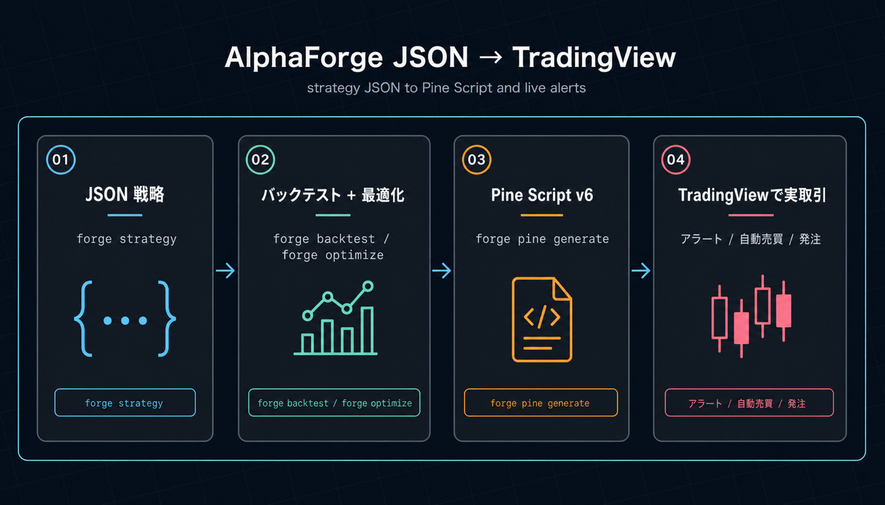
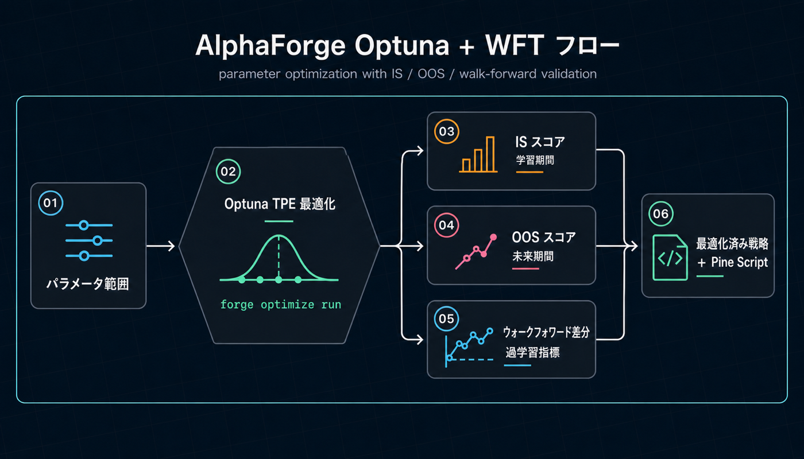

# AlphaForge ドキュメント

**AlphaForge は、JSON で書いた戦略を Pine Script v6 に自動変換して TradingView でそのまま動かせる、ローカル CLI のクオンツ研究ツールです。** Optuna TPE による自動最適化とウォークフォワード検証で過学習を抑え、戦略データ・取引履歴・API キーをすべて自分のマシンに留めたまま、研究から実取引（TradingView 経由）まで一本のパイプラインで回せます。

本ドキュメントでは、インストールから戦略開発、AI コーディングエージェントとの連携までを順を追って解説します。

## AlphaForge が他と違う 2 つの強み

### 1. JSON 戦略 → ワンコマンドで Pine Script v6 → TradingView で実取引へ

戦略は JSON で定義し、`alpha-forge pine generate` で **TradingView の Pine Script v6** に自動変換します。Web UI 統合型プラットフォームのように特定のサーバや取引所アダプタに縛られず、ユーザーはすでに使い慣れた TradingView 上でアラート・自動売買・チャート可視化までシームレスに利用できます。

{ loading=lazy }

### 2. Optuna TPE + ウォークフォワード検証で「過学習しない」最適化

`alpha-forge optimize run` 一発で Optuna ベイズ最適化（TPE）を実行し、`--split` でウォークフォワード分析（WFT）を同時にかけて IS（学習期間）/ OOS（検証期間）の性能差を可視化します。Web UI 型プラットフォームに不足しがちな最適化と汎化性能検証を、CLI で素早く回せます。

{ loading=lazy }

## 他のクオンツツールとの比較

| 観点 | **AlphaForge** | Web UI 統合プラットフォーム型 | フレームワーク型（vectorbt / Backtrader 等） |
|---|---|---|---|
| 戦略の書き方 | **JSON DSL**（バージョン管理しやすい） | Python クラス（UI 内エディタ） | Python クラス |
| TradingView 連携 | **Pine Script v6 を自動出力** | 基本なし | 基本なし |
| 自動最適化 | **Optuna TPE + WFT が標準** | 弱い／手動が中心 | ライブラリ追加で実装 |
| データ・鍵の所在 | **完全ローカル** | サーバ常駐 | ローカル |
| 動作形態 | バイナリ CLI（数百MB / 1ファイル） | Docker / SaaS スタック | Python スクリプト |
| AI エージェント連携 | Claude Code / Codex 用スキル同梱 | 一部対応 | 自前実装が必要 |
| 実取引の経路 | **TradingView 経由**（取引所中立） | 取引所・ブローカー直接 | 自前で実装 |

## こんな方に向いています

- **TradingView をすでに使っていて**、信頼できるバックテスト・最適化を経た Pine Script を投入したい方
- バックテストフレームワーク（Backtrader、vectorbt 等）の代替を探しているエンジニア・クオンツリサーチャー
- 戦略 JSON を **コードとしてバージョン管理** したい開発者
- Claude Code や Codex などの AI エージェントと組み合わせて、戦略を **自律的に探索・最適化** したいユーザー
- ベイズ最適化・ウォークフォワード検証を **ワンコマンド** で済ませたい方

## 主な話題

- [はじめに](getting-started.md) — Whop 登録不要のインストール、最初のバックテスト（Trial プランで 10 分体験まで）、有料プラン購入後の認証
- [目的別ユースケース](usecases/index.md) — 自分の役割（TradingView ユーザー / Python 開発者 / クオンツ / 自動売買検討者 / AI エージェント利用者）から最適な次ページを選ぶ
- [CLI リファレンス](cli-reference/index.md) — `alpha-forge` コマンドの全パラメータと出力例
- [戦略テンプレート](templates.md) — HMM × BB × RSI などの組み合わせ戦略を実 JSON 付きで紹介
- [AI 駆動の戦略探索ワークフロー](guides/ai-exploration-workflow.md) — Claude Code / Codex × AlphaForge による自律戦略開発の HOWTO
- [利用規約と免責事項](legal/disclaimers.md) — 免責事項・EULA・プライバシーポリシー

## 関連リンク

- [Alforge Labs 公式サイト](https://alforgelabs.com/ja/index.html) — 製品紹介とインストールガイド
- [チュートリアル](https://alforgelabs.com/ja/tutorial-strategy.html) — 戦略 JSON を作って動かす入門
- [GitHub Discussions](https://github.com/alforge-labs/alforge-labs.github.io/discussions) — 質問・アイデア・戦略共有のコミュニティ
- [サポート](mailto:support@alforgelabs.com) — 技術的なお問い合わせ
