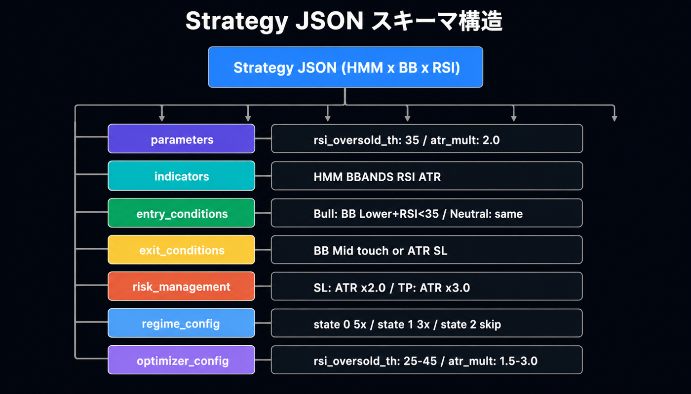
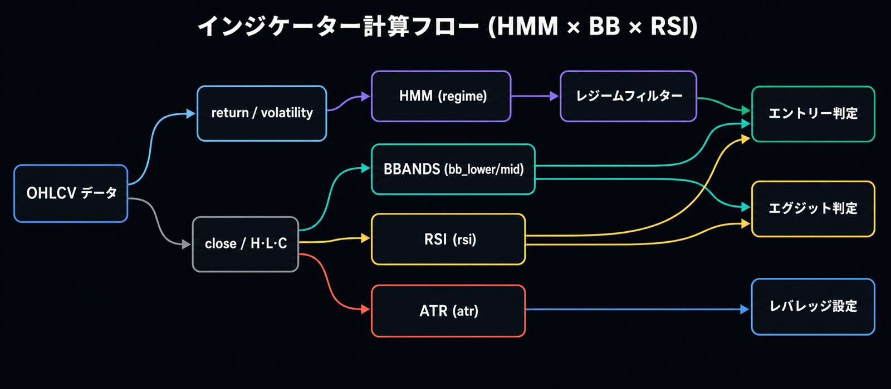
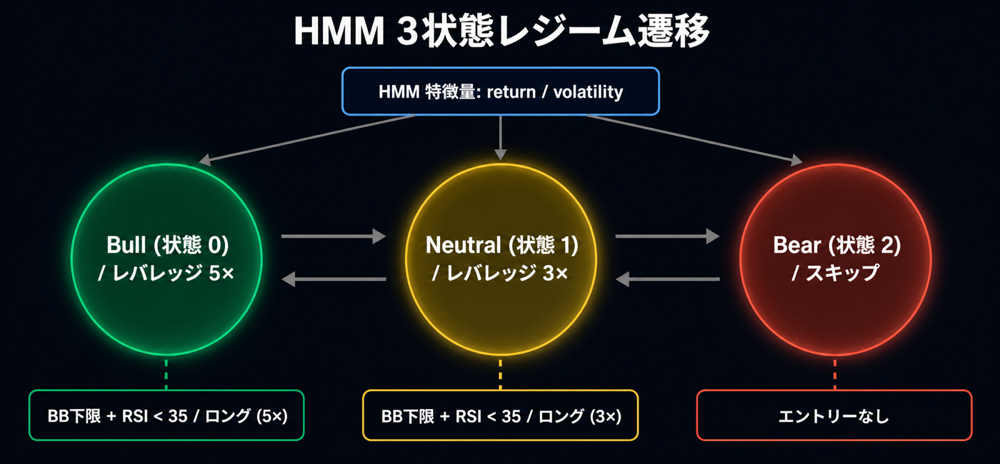

# 戦略テンプレート

AlphaForge で使われる代表的な戦略パターンを 3 種類紹介します。**戦略 JSON は完全コピペ可能**で、`forge strategy save` でそのまま登録できます。

!!! info "サンプル出力について"
    バックテスト結果の数値はサンプルです。実際の数値はデータと環境（取得期間、プロバイダー、設定）によって変わります。

## このページで扱うテンプレート

| テンプレート | 戦略タイプ | 主要指標 |
|------------|----------|----------|
| [HMM × BB × RSI](#hmm-bb-rsi) | レジーム適応 + 平均回帰 | HMM・BBANDS・RSI |
| [レジーム切り替え](#regime-switching) | レジーム別の戦略切替 | HMM・SUPERTREND・BBANDS・RSI |
| [マルチタイムフレーム](#multi-timeframe) | 上位足トレンド × 日足エントリー | SMA（週足）・RSI・ATR |

## 戦略 JSON の基本構造

すべての戦略は同じ Pydantic スキーマに従います。詳細は [`forge analyze indicator list`](cli-reference/other.md#analyze-indicator) で確認できます。

```text
{
  "strategy_id": "...",
  "name": "...",
  "target_symbols": [...],
  "asset_type": "stock",
  "timeframe": "1d",
  "parameters": {...},          // 最適化対象の上位パラメータ
  "indicators": [...],          // 計算するインジケータ群（30+ 種類）
  "variables": [...],           // 中間ブール変数（任意）
  "entry_conditions": {...},    // エントリー条件
  "exit_conditions": {...},     // 決済条件
  "risk_management": {...},     // ポジションサイズ・SL/TP
  "regime_config": {...},       // レジーム適応（任意）
  "optimizer_config": {...}     // 最適化パラメータ範囲
}
```



主要概念の詳細：

- **`indicators[].lock_on_entry: true`** — エントリーバーの値で固定（SL/TP 価格用）
- **`indicators[].timeframe: "1w"`** — 上位足を取り込む（マルチタイムフレーム）
- **`EXPR` 指標** — 任意の pandas 式（例: `"close * 0.98"`）
- **`HMM` 指標** — 隠れマルコフモデルでレジーム検出
- **`regime_config`** — HMM 出力をキーにレジーム別の `entry/exit/risk_override` を切替



---

## HMM × BB × RSI

### 概要

**3 状態の HMM レジーム検出** で相場をフィルタしつつ、**ボリンジャーバンド下限 + RSI 過売** を起点とした平均回帰エントリー。Bull/Neutral/Bear の 3 つを区別し、Bull は強気のレバレッジ（5x）、Neutral は控えめ（3x）、Bear はスキップという構造です。

このテンプレートの強みは、**1 つの戦略 JSON で 3 つのレジームを同時に管理** できる点にあります。レンジ相場で機能する平均回帰戦略を、トレンドが強すぎたり弱すぎたりする局面では自動的に控えめに（または完全に休止）するため、ドローダウンを抑えやすくなります。



### 適用シナリオ

- **対象銘柄**: 米国大型株 ETF（QQQ、SPY）、グロース株（NVDA）、長期で取引コストが低いもの
- **市場環境**: トレンド・レンジが入れ替わる中長期相場（2018-2025 のような変動局面）
- **想定保有期間**: 数日〜2 週間
- **リスク特性**: レバレッジ前提（5x まで）、HMM が誤検出するとドローダウン拡大

### 戦略 JSON 全文

```json
{
  "strategy_id": "multi_asset_hmm_bb_rsi_v1_qqq",
  "name": "マルチアセット HMM×BB+RSI v1 (QQQ)",
  "version": "1.0.0",
  "description": "HMM 3状態レジームフィルター × BB+RSI 平均回帰。Bull(state=0): BB下限+RSI過売でロング(leverage=3)。Neutral(state=1): 同条件でロング(leverage=1.5)。Bear(state=2): スキップ。日足ベース。",
  "target_symbols": ["QQQ"],
  "asset_type": "stock",
  "timeframe": "1d",
  "parameters": {
    "rsi_oversold_th": 35,
    "atr_mult": 2.0
  },
  "indicators": [
    { "id": "regime",   "type": "HMM",     "params": { "n_components": 3, "features": ["return", "volatility"] } },
    { "id": "bb_lower", "type": "BBANDS",  "params": { "length": 20, "std": 2.0, "line": "lower" } },
    { "id": "bb_mid",   "type": "BBANDS",  "params": { "length": 20, "std": 2.0, "line": "mid" } },
    { "id": "rsi",      "type": "RSI",     "params": { "length": 7 } },
    { "id": "atr",      "type": "ATR",     "params": { "length": 14 } },
    { "id": "sl_dist",  "type": "EXPR",    "params": { "expr": "atr * atr_mult" }, "lock_on_entry": true }
  ],
  "variables": [],
  "entry_conditions": { "long": { "logic": "AND", "conditions": [] } },
  "exit_conditions":  { "long": { "logic": "OR",  "conditions": [] } },
  "risk_management": {
    "leverage": 5.0,
    "position_sizing_method": "fixed",
    "position_size_pct": 100.0,
    "stop_loss_indicator": "sl_dist",
    "max_positions": 1
  },
  "regime_config": {
    "indicator_id": "regime",
    "default_action": "skip",
    "states": {
      "0": {
        "entry_conditions": { "long": { "logic": "AND", "conditions": [
          { "left": "close", "op": "<", "right": "bb_lower" },
          { "left": "rsi",   "op": "<", "right": "rsi_oversold_th" }
        ]}},
        "exit_conditions":  { "long": { "logic": "OR",  "conditions": [
          { "left": "close", "op": ">", "right": "bb_mid" }
        ]}},
        "risk_override": { "leverage": 5.0, "position_sizing_method": "fixed", "position_size_pct": 100.0 }
      },
      "1": {
        "entry_conditions": { "long": { "logic": "AND", "conditions": [
          { "left": "close", "op": "<", "right": "bb_lower" },
          { "left": "rsi",   "op": "<", "right": "rsi_oversold_th" }
        ]}},
        "exit_conditions":  { "long": { "logic": "OR",  "conditions": [
          { "left": "close", "op": ">", "right": "bb_mid" }
        ]}},
        "risk_override": { "leverage": 3.0, "position_sizing_method": "fixed", "position_size_pct": 100.0 }
      },
      "2": {}
    }
  },
  "backtest_config": {
    "regime_analysis": {
      "method": "hmm",
      "hmm_indicator_id": "regime",
      "label_names": { "0": "Bull", "1": "Neutral", "2": "Bear" }
    }
  },
  "optimizer_config": {
    "param_ranges": {
      "bb_lower.length": { "min": 15,  "max": 25,  "step": 1 },
      "bb_lower.std":    { "min": 1.8, "max": 2.5, "step": 0.1 },
      "rsi.length":      { "min": 5,   "max": 14,  "step": 1 },
      "rsi_oversold_th": { "min": 25,  "max": 45,  "step": 5 },
      "atr_mult":        { "min": 1.5, "max": 3.0, "step": 0.5 }
    },
    "constraints": { "min_trades": 20 },
    "metric": "sharpe_ratio"
  },
  "tags": ["hmm", "bb", "rsi", "mean-reversion", "leverage", "nas100"]
}
```

### 主要パラメータの意味

| パラメータ | 役割 | 推奨値・範囲 |
|----------|------|-------------|
| `regime.n_components` | HMM の状態数 | `3`（Bull/Neutral/Bear） |
| `regime.features` | HMM の入力特徴量 | `["return", "volatility"]` |
| `bb_lower.length` / `std` | BB の期間と標準偏差倍率 | 期間 `15-25`、std `1.8-2.5` |
| `rsi.length` | RSI 期間 | `5-14`（短期ほど敏感） |
| `rsi_oversold_th` | エントリー閾値 | `25-45`（小さいほど絞り込み） |
| `atr_mult` | ATR ベース SL 倍率 | `1.5-3.0` |
| `risk_override.leverage` | レジーム別レバレッジ | Bull `5.0` / Neutral `3.0` / Bear `0`（skip） |

### バックテスト結果サンプル

!!! warning "サンプル出力です"
    実際の数値はデータと環境に依存します。

```text
==> QQQ 2018-01-01 → 2025-12-31 (1d)
   trades: 38   win_rate: 65.8%   profit_factor: 2.15
   total_return: +124.5%   cagr: +10.7%   sharpe: 1.42
   max_drawdown: -18.4%   exposure: 24.3%
   final_equity: $22,450  (initial: $10,000)
```

### カスタマイズのポイント

- **対象銘柄を変える**: `target_symbols` を `["SPY"]`、`["NVDA"]`、`["GC=F"]` 等に差し替え
- **状態数を変える**: `regime.n_components: 2`（Bull/Bear）に減らすと判定が単純化、`4` で精緻化（要データ量）
- **エントリー条件を強化**: `regime_config.states["0"].entry_conditions` に `volume > sma_volume_20` などを追加
- **最適化対象**: `forge optimize run QQQ --strategy multi_asset_hmm_bb_rsi_v1_qqq --metric sharpe_ratio --save`

---

## レジーム切り替え（regime-switching）

### 概要

HMM 出力をキーに **レジームごとに別の戦略を適用** するパターン。1 つの戦略 JSON 内で、Bull レジームではトレンドフォロー、Bear/Range レジームでは平均回帰、というように **戦略そのものを切り替え** ます。

`regime_config.states` でレジーム ID（HMM 出力の整数）ごとに `entry_conditions` と `exit_conditions` を完全に独立して定義できるのが、HMM × BB × RSI との大きな違いです。

### 適用シナリオ

- **対象銘柄**: 商品先物（CL=F、GC=F、NG=F）、ボラティリティが高く、トレンドとレンジが明確に切り替わる商品
- **市場環境**: 商品市場特有のトレンド/逆張りの両方を捉えたい
- **想定保有期間**: 数日〜1 ヶ月
- **リスク特性**: 高レバレッジ（10x）+ ATR ベース SL、商品先物の証拠金取引前提

### 戦略 JSON 全文

```json
{
  "strategy_id": "commodity_hmm_regime_v1",
  "name": "Commodity HMM Regime v1",
  "version": "1.0.0",
  "description": "商品CFD向けレジーム適応型: HMM 2状態でBull/Bearを判定。Bull=Supertrendロング、Bear=BB+RSI逆張り。leverage=10。",
  "target_symbols": ["GC=F", "SI=F", "CL=F", "BZ=F", "NG=F", "ZC=F", "ZS=F", "ZW=F", "HG=F"],
  "asset_type": "stock",
  "timeframe": "1d",
  "parameters": {
    "adx_threshold": 20,
    "rsi_threshold": 35,
    "atr_mult": 2.0
  },
  "indicators": [
    { "id": "regime",         "type": "HMM",        "params": { "n_components": 2, "features": ["return", "volatility"], "volatility_window": 10 } },
    { "id": "supertrend_val", "type": "SUPERTREND", "params": { "length": 9, "multiplier": 3.0 } },
    { "id": "adx_val",        "type": "ADX",        "params": { "length": 14 } },
    { "id": "bb_lower",       "type": "BBANDS",     "params": { "length": 20, "std": 2.0, "line": "lower" } },
    { "id": "bb_mid",         "type": "BBANDS",     "params": { "length": 20, "std": 2.0, "line": "mid" } },
    { "id": "rsi",            "type": "RSI",        "params": { "length": 14 } },
    { "id": "atr",            "type": "ATR",        "params": { "length": 14 } },
    { "id": "sl_dist",        "type": "EXPR",       "params": { "expr": "atr * atr_mult" }, "lock_on_entry": true }
  ],
  "variables": [],
  "entry_conditions": { "long": { "logic": "AND", "conditions": [] } },
  "exit_conditions":  { "long": { "logic": "OR",  "conditions": [] } },
  "risk_management": {
    "leverage": 10.0,
    "position_sizing_method": "risk_based",
    "risk_per_trade_pct": 1.5,
    "stop_loss_indicator": "sl_dist",
    "max_positions": 1
  },
  "regime_config": {
    "indicator_id": "regime",
    "states": {
      "0": {
        "entry_conditions": { "long": { "logic": "AND", "conditions": [
          { "left": "close",   "op": "crosses_above", "right": "supertrend_val" },
          { "left": "adx_val", "op": ">",             "right": "adx_threshold" }
        ]}},
        "exit_conditions":  { "long": { "logic": "OR",  "conditions": [
          { "left": "close", "op": "crosses_below", "right": "supertrend_val" }
        ]}}
      },
      "1": {
        "entry_conditions": { "long": { "logic": "AND", "conditions": [
          { "left": "close", "op": "<", "right": "bb_lower" },
          { "left": "rsi",   "op": "<", "right": "rsi_threshold" }
        ]}},
        "exit_conditions":  { "long": { "logic": "OR",  "conditions": [
          { "left": "close", "op": ">", "right": "bb_mid" }
        ]}}
      }
    }
  },
  "optimizer_config": {
    "param_ranges": {
      "supertrend_val.multiplier": { "min": 2.0, "max": 4.0, "step": 0.5 },
      "adx_threshold":             { "min": 15,  "max": 30,  "step": 5 },
      "rsi_threshold":             { "min": 25,  "max": 45,  "step": 5 },
      "atr_mult":                  { "min": 1.5, "max": 3.0, "step": 0.5 }
    },
    "constraints": { "min_trades": 15 },
    "metric": "sharpe_ratio"
  },
  "tags": ["hmm", "regime", "adaptive", "commodity", "leverage-10"]
}
```

### 主要パラメータの意味

| パラメータ | 役割 | 推奨値・範囲 |
|----------|------|-------------|
| `regime.n_components` | HMM 状態数 | `2`（Bull/Bear のシンプル切替） |
| `regime.volatility_window` | ボラティリティ計算窓 | `10`（短期）〜`30`（中期） |
| `supertrend_val.multiplier` | SuperTrend の幅 | `2.0-4.0`（小さいほど敏感） |
| `adx_threshold` | トレンド強度の閾値 | `15-30`（25 以上で強トレンド） |
| `rsi_threshold` | 逆張りの過売閾値 | `25-45` |
| `risk_per_trade_pct` | 1 トレードのリスク % | `1.5`（保守的） |
| `leverage` | 商品先物のレバレッジ | `10`（証拠金取引前提） |

### バックテスト結果サンプル

!!! warning "サンプル出力です"

```text
==> CL=F 2018-01-01 → 2025-12-31 (1d)
   trades: 27   win_rate: 51.9%   profit_factor: 1.82
   total_return: +88.3%   cagr: +8.4%   sharpe: 1.21
   max_drawdown: -22.1%   exposure: 31.5%
   regime_breakdown: state=0 (Bull): 14 trades, sharpe 1.45  /  state=1 (Bear): 13 trades, sharpe 0.92
```

### カスタマイズのポイント

- **状態数を増やす**: `n_components: 3` にすると Bull/Range/Bear の 3 区分に。`states["2"]` を追加
- **対象を株式に**: `target_symbols` を株式銘柄に変えて `risk_management.leverage` を `1.0-2.0` へ下げる
- **取引機会を増やす**: 各レジームの `entry_conditions` を緩める（例: `adx_threshold: 15`、`rsi_threshold: 45`）
- **クロスシンボル最適化**: `forge optimize cross-symbol GC=F SI=F CL=F --strategy commodity_hmm_regime_v1 --aggregation min --save`

---

## マルチタイムフレーム（multi-timeframe）

### 概要

`indicators[].timeframe` フィールドを使って **上位足の指標を取り込み**、下位足でエントリーする戦略。週足の SMA で長期トレンドを判定し、日足の RSI で押し目買いタイミングを取る、というパターンです。

!!! info "教材としての例"
    本セクションの戦略 JSON は `indicators[].timeframe` 機能の使用例として書き起こしたものです。実運用前に [`forge strategy validate`](cli-reference/strategy.md#forge-strategy-validate) と [`forge backtest run`](cli-reference/backtest.md#forge-backtest-run) で動作を確認してください。

### 適用シナリオ

- **対象銘柄**: 米国大型株 / ETF（SPY、QQQ、AAPL）
- **市場環境**: 長期上昇トレンドの中での短期押し目買い
- **想定保有期間**: 1 日〜2 週間
- **リスク特性**: トレンドフォロー型なので、**トレンド転換時のドローダウン**に注意。週足が下落トレンドに転じたら一切エントリーしない設計

### 戦略 JSON 全文

```json
{
  "strategy_id": "spy_mtf_trend_pullback_v1",
  "name": "SPY マルチタイムフレーム トレンド押し目買い v1",
  "version": "1.0.0",
  "description": "週足 SMA でトレンド方向を判定し、日足 RSI 過売で押し目買いするマルチタイムフレーム戦略。",
  "target_symbols": ["SPY"],
  "asset_type": "stock",
  "timeframe": "1d",
  "parameters": {
    "rsi_oversold_th": 35,
    "atr_mult": 2.0
  },
  "indicators": [
    {
      "id": "weekly_sma",
      "type": "SMA",
      "params": { "length": 20 },
      "source": "close",
      "timeframe": "1w"
    },
    {
      "id": "weekly_close",
      "type": "EXPR",
      "params": { "expr": "close" },
      "timeframe": "1w"
    },
    { "id": "rsi", "type": "RSI", "params": { "length": 7 } },
    { "id": "sma_50", "type": "SMA", "params": { "length": 50 } },
    { "id": "atr", "type": "ATR", "params": { "length": 14 } },
    { "id": "sl_dist", "type": "EXPR", "params": { "expr": "atr * atr_mult" }, "lock_on_entry": true }
  ],
  "variables": [
    {
      "id": "weekly_uptrend",
      "logic": "AND",
      "conditions": [
        { "left": "weekly_close", "op": ">", "right": "weekly_sma" }
      ]
    }
  ],
  "entry_conditions": {
    "long": {
      "logic": "AND",
      "conditions": [
        { "left": "weekly_uptrend", "op": "==", "right": true },
        { "left": "close", "op": ">", "right": "sma_50" },
        { "left": "rsi",   "op": "<", "right": "rsi_oversold_th" }
      ]
    }
  },
  "exit_conditions": {
    "long": {
      "logic": "OR",
      "conditions": [
        { "left": "rsi", "op": ">", "right": 60 },
        { "left": "close", "op": "<", "right": "sma_50" }
      ]
    }
  },
  "risk_management": {
    "leverage": 1.0,
    "position_sizing_method": "fixed",
    "position_size_pct": 25.0,
    "stop_loss_indicator": "sl_dist",
    "max_positions": 1
  },
  "regime_config": null,
  "optimizer_config": {
    "param_ranges": {
      "weekly_sma.length": { "min": 10, "max": 30, "step": 5 },
      "rsi.length":        { "min": 5,  "max": 14, "step": 1 },
      "rsi_oversold_th":   { "min": 25, "max": 45, "step": 5 },
      "atr_mult":          { "min": 1.5, "max": 3.0, "step": 0.5 }
    },
    "constraints": { "min_trades": 20 },
    "metric": "sharpe_ratio"
  },
  "tags": ["multi-timeframe", "trend-following", "pullback", "weekly", "spy"]
}
```

### 主要パラメータの意味

| パラメータ | 役割 | 推奨値・範囲 |
|----------|------|-------------|
| `weekly_sma.timeframe: "1w"` | 上位足を週足に指定 | `"1w"` 固定（4h、1mo も可） |
| `weekly_sma.length` | 週足 SMA 期間 | `10-30`（中長期トレンド） |
| `rsi.length` | 日足 RSI 期間 | `5-14`（短期ほど敏感） |
| `rsi_oversold_th` | 押し目判定閾値 | `25-45` |
| `sma_50` | 日足の中期トレンドフィルタ | 固定 `50` |
| `position_size_pct` | 1 ポジションのサイズ | `25%` 程度（保守的） |

`indicators[].timeframe` フィールドは、その指標だけを別の時間足で計算します。日足のメイン時間軸（`timeframe: "1d"`）から週足の指標を参照するときは、自動的に同じ日付の週足値が ffill（前方埋め）で揃えられます。

### バックテスト結果サンプル

!!! warning "サンプル出力です"

```text
==> SPY 2018-01-01 → 2025-12-31 (1d)
   trades: 32   win_rate: 62.5%   profit_factor: 1.95
   total_return: +68.2%   cagr: +6.7%   sharpe: 1.18
   max_drawdown: -14.3%   exposure: 28.7%
```

### カスタマイズのポイント

- **上位足を変える**: `weekly_sma.timeframe` を `"4h"` にすると当日内マルチタイムフレーム、`"1mo"` で月足主導
- **複数の上位足を組み合わせる**: 月足 SMA と週足 SMA の両方をクリアした場合のみエントリー
- **対象銘柄を増やす**: `target_symbols: ["SPY", "QQQ", "DIA"]` に拡張し、`forge optimize cross-symbol` で頑健なパラメータを探索
- **空売りを追加**: `entry_conditions.short` に「週足下落トレンド + 日足 RSI 過買」を定義

---

## カスタマイズと派生（共通の応用パターン）

### パラメータ最適化

すべてのテンプレートに `optimizer_config.param_ranges` が含まれているため、以下のコマンドで Optuna ベイズ最適化が走ります：

```bash
forge optimize run <SYMBOL> --strategy <STRATEGY_ID> --metric sharpe_ratio --save
```

詳細は [`forge optimize run`](cli-reference/optimize.md#forge-optimize-run) を参照。

### ウォークフォワード検証で過学習を防ぐ

```bash
forge optimize walk-forward <SYMBOL> --strategy <STRATEGY_ID> --windows 5
```

各ウィンドウで IS（イン・サンプル）最適化 → OOS（アウト・オブ・サンプル）評価を繰り返し、`overfitting_score` を確認します。

### 感度分析でロバスト性を計測

```bash
forge optimize sensitivity <RESULT_FILE>
```

最適化済みパラメータの周辺をスイープし、わずかな変動でメトリクスがどれだけ変わるかを評価します。`overall_robustness_score` が `0.7` 以下なら過学習を疑いましょう。

### ライブとの比較

実運用記録（trade records）が蓄積したら、バックテストとの乖離を確認できます：

```bash
forge live compare <STRATEGY_ID>
```

詳細は [`forge live compare`](cli-reference/live.md#forge-live-compare) を参照。

---

## 関連ドキュメント

- [はじめに](getting-started.md) — シンプルな SMA クロス戦略から始める
- [CLI リファレンス](cli-reference/index.md) — `forge` コマンドの全パラメータ
- [AI 駆動の戦略探索ワークフロー](guides/ai-exploration-workflow.md) — Claude Code / Codex で戦略を自動生成

---

<!-- 同期元: `alpha-strategies/data/strategies/multi_asset_hmm_bb_rsi_v1_qqq.json` および `commodity_hmm_regime_v1.json`。マルチタイムフレーム戦略は `indicators[].timeframe` フィールドの使用例として書き起こしたもの。 -->
