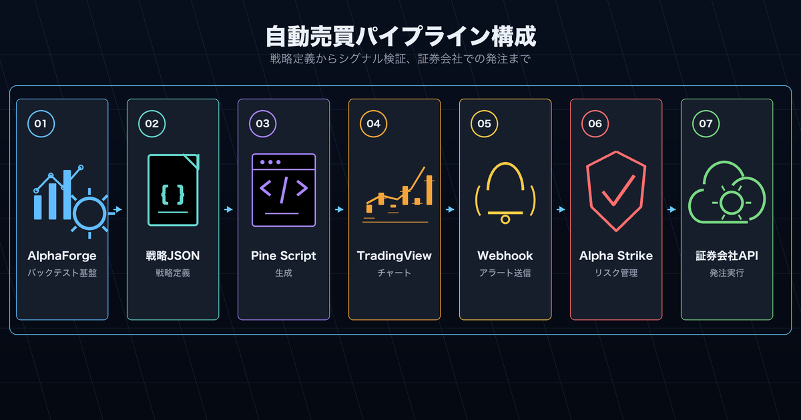
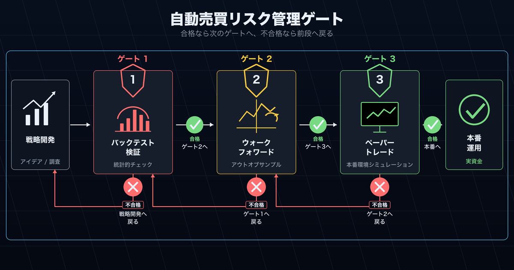

# 自動売買検討者向け

バックテストで有望な戦略を見つけた後、実際の自動発注まで一貫した環境を構築したい方向けです。

## エンドツーエンドのシステム構成



```
AlphaForge（戦略開発・検証）
      ↓  Pine Script生成
TradingView（アラート発火）
      ↓  Webhook
Alpha Strike（発注処理）
      ↓
証券会社API（実際の注文）
```

## 各コンポーネントの役割

| コンポーネント | 役割 |
|-------------|------|
| **AlphaForge** | 戦略のバックテスト・最適化・ウォークフォワード検証 |
| **Pine Script** | TradingViewでのリアルタイムシグナル生成 |
| **TradingViewアラート** | シグナル発火時にWebhookを送信 |
| **Alpha Strike** | Webhookを受信して証券会社APIに発注 |

## 実運用前のチェックリスト



!!! warning "本番稼働前に必ず確認"
    - [ ] ウォークフォワード検証でIS/OOS劣化率が許容範囲内（目安：50%以下）
    - [ ] 最大ドローダウンが許容できる水準か確認
    - [ ] 証拠金・ポジションサイズのリスク管理設定を確認
    - [ ] 小さいサイズでのペーパートレード期間を設ける

## はじめの一歩

```bash
# 1. バックテストで戦略を確定
forge backtest run QQQ --strategy my_strategy

# 2. Pine Scriptを生成
forge pine generate my_strategy --output my_strategy.pine

# 3. TradingViewにインポートしてアラート設定
# （TradingView UIで実施）

# 4. Alpha Strike経由で発注テスト
# （Alpha Strike設定ガイドを参照）
```

## 関連ドキュメント

- [TradingView × Alpha Strike 統合ガイド](../guides/tradingview-alpha-strike.md) — Webhookから発注までの接続方法
- [TradingView × Pine Script 統合ガイド](../guides/tradingview-pine-integration.md) — Pine Script生成と調整方法
- [エンドツーエンド戦略開発ワークフロー](../guides/end-to-end-workflow.md) — 開発から発注までの全体像
- [Trial 制限について](../guides/trial-limits.md) — Trial プランでできること・できないこと
