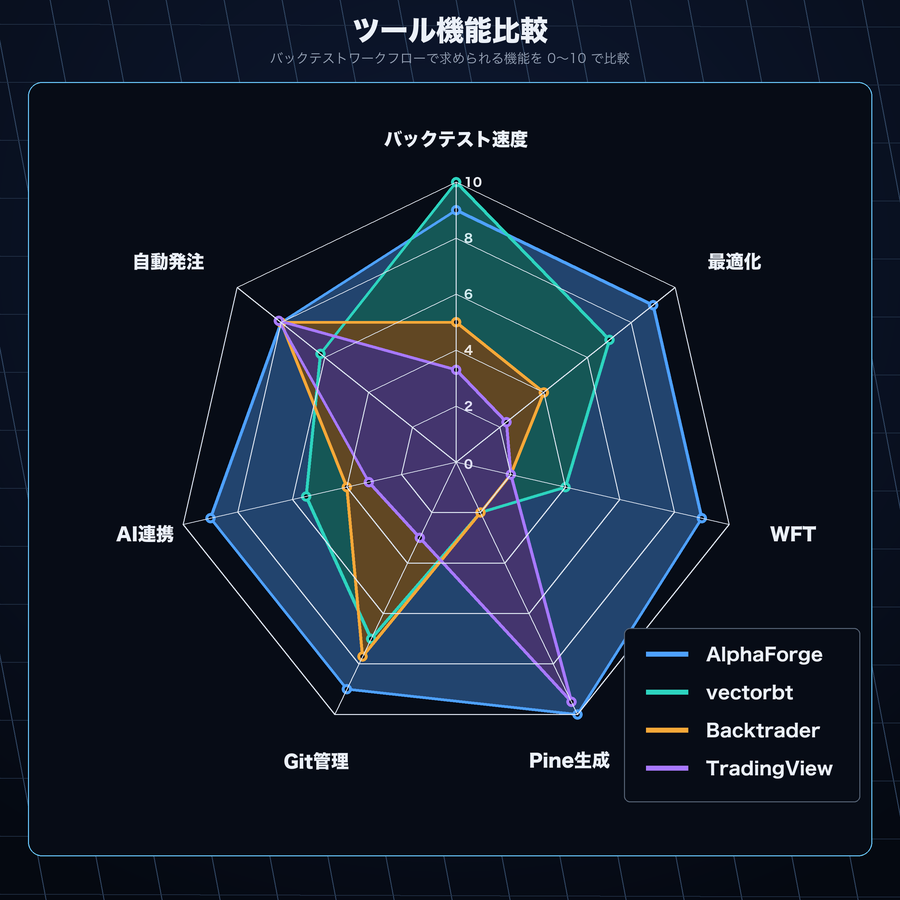
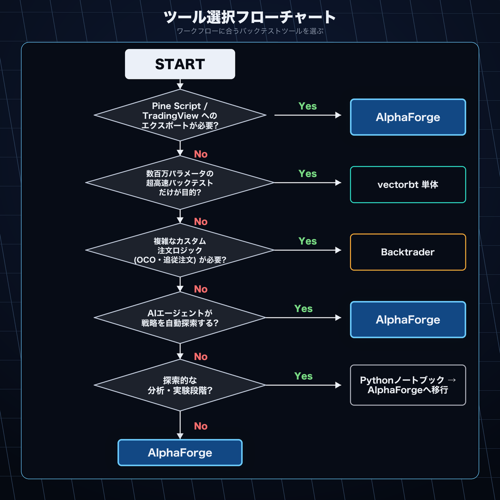

# 他ツールとの比較

このページでは AlphaForge と既存ツールを率直に比較します。AlphaForge が得意なことだけでなく、向いていない場面も正直に記載しています。ツール選択の意思決定に役立ててください。

## クイック比較表

| 観点 | AlphaForge | Backtrader | vectorbt | TradingView | Python ノートブック |
|------|-----------|-----------|---------|------------|-----------------|
| **バックテスト速度** | 高速（vectorbt ベース） | 低速（イベント駆動） | 最高速 | 普通 | 実装次第 |
| **パラメータ最適化** | Optuna（ベイズ） | 手動 / グリッド | 基本的なスキャン | なし | 手動 |
| **ウォークフォワード検証** | 標準搭載 | 手動実装が必要 | 手動実装が必要 | なし | 手動実装が必要 |
| **Pine Script 生成** | 自動生成 | なし | なし | 手書き | なし |
| **再現性（Git 管理）** | JSON で完全再現 | コード依存 | コード依存 | 限定的 | 難しい |
| **AI エージェント連携** | 標準対応（JSON 駆動） | 難しい | 難しい | 難しい | 可能（ただし手動） |
| **自動発注連携** | TradingView → AlphaStrike | 個別実装が必要 | 個別実装が必要 | アラート経由 | 個別実装が必要 |
| **学習コスト** | CLI + JSON | Python クラス | Python + numpy | Pine Script | Python |



---

## AlphaForge vs Backtrader

### Backtrader の強み

Backtrader はイベント駆動型の成熟したバックテストフレームワークです。

- **カスタマイズ性が高い** — 複雑な注文ロジック（OCO、トレーリングストップ等）を Python で柔軟に実装できる
- **ライブトレーディング対応** — Interactive Brokers など複数のブローカーに直接接続できる
- **コミュニティと実績** — 長年の利用実績があり、サンプルコードが豊富

### Backtrader の制限

- シミュレーションがイベント駆動（1 バーずつ処理）のため、vectorbt に比べて大幅に遅い
- Bayesian 最適化やウォークフォワード検証は標準搭載されておらず、自前実装が必要
- Pine Script 生成機能はなく、TradingView との連携は別途実装が必要
- AI エージェントとの連携を想定した設計になっていない

### 使い分け指針

| AlphaForge を選ぶ | Backtrader を選ぶ |
|----------------|----------------|
| 高速な最適化サイクルを回したい | 複雑な注文ロジック（OCO・追従注文等）が必要 |
| ウォークフォワード検証を体系的に行いたい | Interactive Brokers など特定ブローカーへの直接接続が必要 |
| TradingView アラートと自動発注を連携させたい | Backtrader の既存コードベースを持っている |
| Claude Code などで戦略探索を自動化したい | イベント駆動の粒度でロジックを精密に制御したい |

---

## AlphaForge vs vectorbt 単体

### vectorbt について

AlphaForge は **内部的に vectorbt を使用しています**。つまり vectorbt は競合ではなく、AlphaForge の基盤コンポーネントです。

vectorbt 単体で使う場合の強み：

- **最高速のバックテスト** — NumPy ベースのベクトル計算で大量データを瞬時に処理
- **高い柔軟性** — カスタムインジケーターや複雑な条件を Python で自由に記述
- **分析ライブラリとの統合** — Pandas、Matplotlib などとシームレスに使える

### AlphaForge が vectorbt に加えるもの

| vectorbt 単体 | AlphaForge（vectorbt + 統合レイヤー） |
|-------------|-------------------------------------|
| Python コードで戦略を記述 | JSON 宣言で戦略を定義（Git 管理しやすい） |
| 最適化は手動実装 | Optuna による Bayesian 最適化を CLI 1コマンドで実行 |
| WFT は手動実装 | ウォークフォワード検証が標準搭載 |
| Pine Script 生成機能なし | 最適化済みパラメータから Pine Script v6 を自動生成 |
| Journal 機能なし | 実験結果を JSON/CSV で自動記録 |
| AI エージェント連携は非標準 | JSON 駆動で Claude Code 等が読み書きしやすい |

### 使い分け指針

vectorbt の生の Python API を直接使う場合は、カスタム指標開発や exploratory analysis に最適です。AlphaForge は「バックテスト → 最適化 → WFT → Pine Script 生成」の一連のパイプラインを繰り返し回したいときに力を発揮します。

---

## AlphaForge vs TradingView 単体

### TradingView の強み

TradingView はチャートとコミュニティのプラットフォームとして卓越しています。

- **リアルタイムチャートと豊富な指標** — 世界中のトレーダーが使う業界標準のビジュアル環境
- **Pine Script コミュニティ** — 数千の公開スクリプトを即座に活用・改変できる
- **アラートと Webhook** — 条件成立時に Webhook で自動通知を送れる
- **使いやすさ** — プログラミング経験がなくてもチャート分析が可能

### TradingView 単体の制限

- Pine Script のバックテストは基本的な機能に留まり、Bayesian 最適化や WFT は非搭載
- パラメータ探索（多数の組み合わせを試す）はブラウザ上では現実的でない
- 実験の再現性管理（どのパラメータで何を試したか）が難しい

### AlphaForge と TradingView は補完関係

AlphaForge と TradingView は **競合ではなく連携するツール**です。

```
AlphaForge でバックテスト・最適化
  ↓
alpha-forge コマンドで Pine Script v6 を自動生成
  ↓
TradingView に貼り付けてリアルタイムモニタリング
  ↓
条件成立 → TradingView アラート → AlphaStrike が自動発注
```

TradingView ユーザーにとって AlphaForge は「Pine Script を科学的に作る工場」として機能します。詳しくは [TradingViewユーザー向けガイド](tradingview.md) を参照してください。

---

## AlphaForge vs 手作業の Python ノートブック

### Python ノートブックの強み

Jupyter Notebook や Google Colab は探索的な分析において非常に優れています。

- **即座のフィードバック** — セル単位で実行しながらアイデアを素早く検証できる
- **可視化** — Matplotlib、Plotly 等でリッチなグラフをインラインで表示
- **自由度** — どんなライブラリでも組み合わせられる

### 手作業のノートブックの課題

| 課題 | 詳細 |
|-----|------|
| **再現性** | セルの実行順序や変数の状態が変わると結果が変わる |
| **パラメータ管理** | 「どの設定で良い結果が出たか」を追跡するのが難しい |
| **自動化の壁** | ノートブックを夜間自動実行する仕組みは別途必要 |
| **Git 管理の難しさ** | .ipynb ファイルの diff は読みづらく、レビューが困難 |
| **AI エージェント連携** | Claude Code がノートブックの状態を読み書きするのは非効率 |

### AlphaForge との使い分け

ノートブックはアイデアの **最初の探索段階**に向いています。アイデアが固まり「体系的に最適化・検証・再現したい」段階になったら、JSON 戦略として AlphaForge に移行することで管理と自動化が容易になります。

---

## CLI + JSON 戦略を採用する理由

AlphaForge が戦略を Python コードではなく JSON で定義する理由を説明します。

### 理由 1：Git による完全な再現性

```json
{
  "strategy": "cl_hmm_bb_rsi_v1",
  "symbol": "CL=F",
  "params": {
    "hmm_states": 3,
    "bb_period": 20,
    "rsi_period": 14,
    "rsi_upper": 65
  },
  "seed": 42
}
```

この JSON をコミットすれば、誰でも・いつでも・どのマシンでも **完全に同じ結果** を再現できます。コードとパラメータが混在するノートブックでは難しい再現性を JSON が実現します。

### 理由 2：AI エージェントとの親和性

Claude Code などの AI エージェントは JSON ファイルを自然に読み書きできます。これにより：

- 戦略の作成・変更を AI が自律的に行える
- バックテスト結果を解析して次のパラメータを AI が提案できる
- 夜間に数百の戦略を自動で探索するループが実現できる

詳しくは [AIエージェント利用者向けガイド](ai-agents.md) を参照してください。

### 理由 3：ノイズと信号の分離

戦略のロジック（コード）とパラメータ（数値）を分離することで：

- パラメータ変更のレビューが容易になる（diff が読みやすい）
- A/B テスト（同じロジック・異なるパラメータ）を明示的に管理できる
- CI/CD パイプラインへの組み込みが簡単

---

## ウォークフォワード検証が必要な理由

### 過学習（カーブフィッティング）のリスク

バックテストでパラメータを最適化すると、**過去データに過剰適合（過学習）** するリスクがあります。

```
問題のある最適化フロー:
全期間データ → パラメータ最適化 → 同じ全期間でバックテスト
                                      ↑ 過去を「知った上で」最適化している
```

この方法では、実際には機能しないパラメータが「優秀」に見えてしまいます。

### ウォークフォワード検証とは

ウォークフォワード検証（WFT）は時系列データを **学習期間（IS）と検証期間（OOS）** に分けて評価します：

```
WFT の仕組み（5 分割の例）:
IS: 2018-2020  → 最適化 → OOS: 2021  で評価
IS: 2019-2021  → 最適化 → OOS: 2022  で評価
IS: 2020-2022  → 最適化 → OOS: 2023  で評価
IS: 2021-2023  → 最適化 → OOS: 2024  で評価
IS: 2022-2024  → 最適化 → OOS: 2025  で評価

→ 5 つの OOS 期間をまとめて評価 = 真の汎化性能
```

### AlphaForge での実行方法

```bash
# 5 分割のウォークフォワード検証を 1 コマンドで実行
alpha-forge optimize walk-forward CL=F --strategy cl_hmm_bb_rsi_v1 --folds 5
```

IS と OOS の Sharpe 比の乖離が大きい場合は過学習を疑います：

```
IS期間   OOS期間  Sharpe(IS)  Sharpe(OOS)  判定
2020-22  2023     1.8         1.4          22% 低下 → 許容範囲
2020-22  2023     2.5         0.3          88% 低下 → 過学習の疑い
```

詳しくは [クオンツ・研究者向けガイド](quants.md) を参照してください。

---

## まとめ：どのツールを選ぶべきか

| 状況 | 推奨 |
|-----|------|
| 複雑な注文ロジックを Python で精密に制御したい | Backtrader |
| NumPy レベルで高速計算を直接触りたい | vectorbt 単体 |
| リアルタイムチャートとコミュニティ戦略を活用したい | TradingView |
| アイデアを素早く試したい（探索段階） | Python ノートブック |
| バックテスト → 最適化 → WFT → Pine Script → 自動発注を一貫して管理したい | **AlphaForge** |
| AI エージェントで戦略探索を自動化したい | **AlphaForge** |
| TradingView を科学的なバックテストで補強したい | **AlphaForge + TradingView** |

AlphaForge は「何でもできる万能ツール」ではありません。複雑なイベント駆動ロジックや特定ブローカーへの直接接続が必要な場合は、他のツールとの組み合わせを検討してください。



## 関連ドキュメント

- [はじめに](../getting-started.md) — インストールと最初のバックテスト
- [TradingViewユーザー向け](tradingview.md) — TradingView との連携ワークフロー
- [クオンツ・研究者向け](quants.md) — 最適化とウォークフォワード検証の詳細
- [AIエージェント利用者向け](ai-agents.md) — Claude Code との自動化ループ
- [エンドツーエンド戦略開発ワークフロー](../guides/end-to-end-workflow.md) — 全体像
